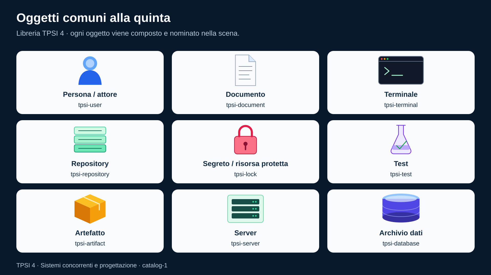
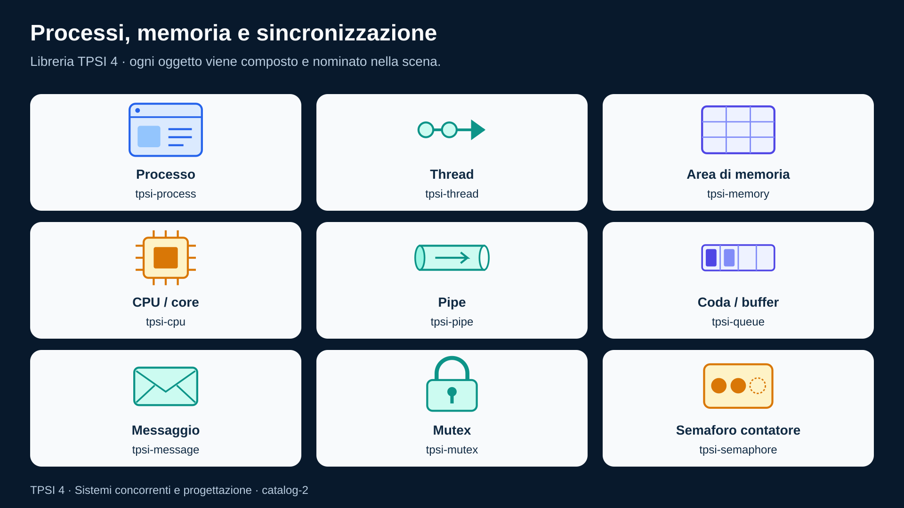
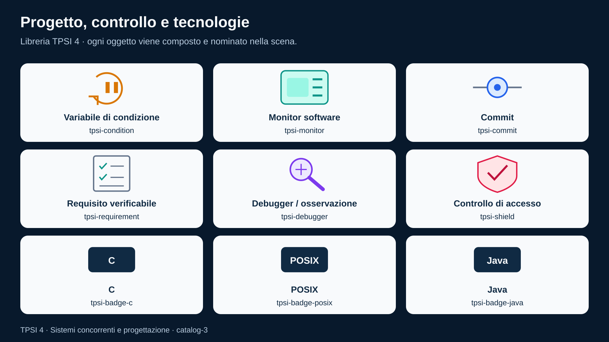

# TPSI quarto — Visual System

Libreria vettoriale del corso, derivata dal sistema della quinta e adattata a processi, concorrenza e progettazione. [Audit e collocazioni](../../../doc/VISUAL_AUDIT.md).

## Cataloghi degli oggetti

Aprire le tavole per scegliere un oggetto e leggere il suo ID:







## Sorgenti e file generati

| File | Ruolo |
|---|---|
| [components.svg](components.svg) | 27 simboli; modificare qui la forma degli oggetti. |
| [tokens.json](tokens.json) | Palette, tipografia e dimensioni di riferimento. |
| [component-inventory.json](component-inventory.json) | Nomi e origine degli oggetti. |
| [scenes/](scenes/) | Scene SVG sorgente: posizioni, testi e relazioni. |
| [figure-index.json](figure-index.json) | Registro delle 22 figure e delle collocazioni nelle dispense. |
| [catalog/](catalog/) | Tre tavole generate; non modificarle a mano. |
| [Generatore](../../../scripts/build_course_diagrams.py) | Incorpora i simboli e risolve i token in SVG autonomi. |

Gli SVG finali sono in `assets/tpsi4/*.svg`. Non richiedono rete, font scaricati o collegamenti alla libreria durante la lettura. Le scene dichiarano `data-output` e contengono `<defs id="visual-kit-components"/>`, secondo il modello della quinta.

## Rigenerazione

Dalla root del repository, con Python 3.11 o successivo:

```bash
python scripts/build_course_diagrams.py
python scripts/build_course_diagrams.py --check
python -m unittest discover -s tests -p test_course_diagrams.py
```

La build controlla tutte le scene prima di scrivere. Rifiuta simboli inesistenti, ID duplicati, riferimenti esterni, output duplicati e destinazioni fuori dalle cartelle degli SVG generati. `--check` confronta i byte senza scrivere file.

## Grammatica visiva

- Canvas 1920 × 1080, margine di sicurezza 64 px, fondo blu scuro, pannelli chiari.
- Testi in italiano; titolo 48 px, etichette generalmente 28–32 px, note almeno 24 px.
- Blu: processi; turchese: thread e comunicazione; indaco: memoria/dati; ambra: attesa e disponibilità; viola: test; rosso: accesso protetto.
- Il colore accompagna sempre un'etichetta. Un mutex turchese e un lucchetto di sicurezza rosso hanno significati diversi.
- Freccia: flusso o transizione, con verbo o legenda quando il significato non è evidente. Linea senza punta: associazione. Tratteggio: relazione indiretta da spiegare.
- Ogni figura ha `title`, `desc`, `role="img"` e un alt nel Markdown. La didascalia esplicita la relazione centrale.
- Programma ≠ processo; processo ≠ thread; monitor software ≠ schermo. Non usare icone ambigue per queste distinzioni.

## Comporre una nuova figura

1. Cercare prima l'oggetto nei cataloghi. Padre e figlio sono varianti etichettate dello stesso processo.
2. Creare una scena `*.scene.svg` copiando la struttura di una scena vicina; usare `<use href="#tpsi-process" x="…" y="…" width="…" height="…"/>`.
3. Mantenere una relazione didattica principale; dividere una scena troppo densa.
4. Usare token come `{{canvas}}`, `{{surface}}`, `{{ink}}` e `{{family}}` nelle nuove scene. Le coordinate restano decisioni della composizione.
5. Aggiungere il record in `figure-index.json`, con sezione esatta, alt, didascalia e componenti.
6. Inserire la figura nella dispensa secondo la [guida editoriale](../../../content/tpsi_quarto/STYLE_GUIDE.md).
7. Rigenerare, aprire gli SVG e controllare leggibilità, etichette, frecce e corrispondenza con la spiegazione.
8. Eseguire i controlli e aggiornare l'audit. Il controllo strutturale non sostituisce la revisione didattica.

Per un nuovo oggetto: aggiungere il symbol in `components.svg`, registrarlo nell'inventario e inserirlo in una scena catalogo. I badge C, POSIX e Java sono etichette didattiche, non loghi ufficiali.

## Provenienza

Riferimento letto il 14 settembre 2026: [Visual System TPSI5](https://github.com/TheBitPoets/tpsi-quinto-docente/tree/main/assets/tpsi5/visual-system). Riutilizzati i simboli user, document, terminal, repository, lock, test, artifact, server e database. I restanti 18 simboli e tutte le scene della quarta sono nuovi. Il generatore riprende il contratto scene/defs della quinta con controlli aggiuntivi.

L'[audit](../../../doc/VISUAL_AUDIT.md) distingue le fonti consultate dal confronto ancora pendente con le immagini interne del libro bSmart.
