# Processi, thread e concorrenza

<!--
content_id: tpsi4-content-processi-concorrenza
status: draft
curriculum_reference: tpsi4-curriculum-hoepli-volume-2
technical_sources:
  - tpsi4-source-linux-programming
transformation: original-course-material
-->

## In questa unità impareremo

<!-- visual-orientation -->
<table align="center">
<tr>
<td>
<details>
<summary>&#129517; <strong>Orientamento della sezione</strong></summary>

<p align="justify">
<strong><span style="font-size: 1.15em;">&#128506;</span> Contesto:</strong>
Costruisce il modello concettuale di processo, thread, risorsa, concorrenza e parallelismo, collegandolo alle sezioni operative della dispensa Linux.
</p>

<p align="justify">
<strong><span style="font-size: 1.15em;">&#128736;</span> Prerequisiti:</strong>
C intermedio, compilazione, memoria, funzioni e puntatori di base.
</p>

<p align="justify">
<strong><span style="font-size: 1.15em;">&#127919;</span> Obiettivi:</strong>
Distinguere programma/processo/thread, descrivere ciclo di vita e risorse, usare fork/exec/wait in esempi controllati e confrontare POSIX e Java.
</p>

<p align="justify">
<strong><span style="font-size: 1.15em;">&#128257;</span> Richiamo:</strong>
Riprendere processo di compilazione, spazio di memoria e gestione degli errori.
</p>

<p align="justify">
<strong><span style="font-size: 1.15em;">&#128064;</span> Anticipazione:</strong>
Prepara IPC, race condition, mutex, semafori, condition e problemi classici.
</p>

<p align="justify">
<strong><span style="font-size: 1.15em;">&#10145;</span> Prossimo passo:</strong>
Svolgere esercizi A-D e avviare il laboratorio fork/pipe.
</p>

<p align="justify">
<strong><span style="font-size: 1.15em;">&#128279;</span> Rimando:</strong>
Modulo originale e sezioni pertinenti della <a href="https://github.com/TheBitPoets/2cornot2c/blob/main/LINUX_PROGRAMMING.md#linux-programming">dispensa Linux di 2cornot2c</a>, esclusa Controllo dei processi. <a href="#fonti-e-note-di-revisione">Fonti e note della lezione</a>; <a href="COVERAGE.md">matrice di copertura</a>.
</p>

</details>
</td>
</tr>
</table>

<p align="justify">Al termine dell'unità lo studente dovrà saper:</p>

<ul>
  <li>distinguere programma, processo e thread;</li>
  <li>descrivere lo stato essenziale di un processo;</li>
  <li>spiegare che cosa sono gli otto elementi associati a un processo, come sono organizzati e perché servono;</li>
  <li>riconoscere risorse private e risorse condivise;</li>
  <li>distinguere esecuzione sequenziale, concorrente e parallela;</li>
  <li>leggere una semplice gerarchia padre-figlio;</li>
  <li>spiegare il ruolo di <code>fork</code>, <code>exec</code> e <code>wait</code> in un sistema POSIX;</li>
  <li>confrontare processi Linux, thread POSIX e thread Java;</li>
  <li>descrivere una computazione concorrente attraverso eventi, possibili interleaving e invarianti;</li>
  <li>individuare i primi rischi dovuti alla condivisione dello stato.</li>
</ul>

## Prerequisiti

<p align="justify">Sono richiesti:</p>

<ul>
  <li>funzioni e passaggio di parametri in C;</li>
  <li>array, stringhe e strutture;</li>
  <li>puntatori di base;</li>
  <li>compilazione ed esecuzione da terminale;</li>
  <li>valore di ritorno di <code>main</code>;</li>
  <li>concetti essenziali di sistema operativo, memoria e file.</li>
</ul>

<p align="justify">Per la traccia Java sono utili classi, metodi, oggetti e gestione delle eccezioni.</p>

## Problema iniziale: una sola attività o più attività coordinate?

<p align="justify">Immaginiamo una stazione che misura la temperatura di un'aula. L'applicazione deve <strong>leggere un sensore</strong>, <strong>inviare le misure a un server attraverso un socket</strong> e <strong>aggiornare una schermata</strong> con temperatura, orario e pulsanti.</p>

<!-- definition -->
<table align="center">
<tr><td>
&#10071; <strong>Importante</strong>
<p align="justify">Un <strong>socket</strong> è un punto di comunicazione usato dal programma per scambiare dati sulla rete.</p>
</td></tr>
</table>
<!-- /definition -->

<p align="justify">L'utente si aspetta che i comandi rispondano anche quando il sensore o la rete sono lenti.</p>

### Una sola attività: prima leggi, poi invia, poi aggiorna

<p align="justify">La soluzione iniziale usa un solo <strong>thread</strong>, cioè un unico flusso di esecuzione: legge una misura, la invia, aggiorna la schermata e ricomincia. Supponiamo che lettura e invio siano <strong>bloccanti</strong>: se l'operazione non può proseguire subito, il thread aspetta al suo interno e non esegue ancora le istruzioni successive.</p>

<!-- figure:01-io-sequenziale -->
<p align="center">
  
</p>
<p align="center"><em>Con un solo thread e I/O bloccante, le attese del sensore e della rete rinviano il lavoro successivo. Tempi inventati per mostrare l’effetto.</em></p>

<p align="justify"><strong>Segui l'animazione:</strong> il pulsante viene premuto ogni due secondi. I clic arrivano, ma il thread può gestirli soltanto dopo la lettura e l'invio. I tempi sono rallentati e diversi da quelli della figura statica, per rendere visibili le attese.</p>

<!-- figure:01-io-sequenziale-animazione -->
<p align="center">
  
</p>
<p align="center"><em>Osserva i clic in attesa e l&#x27;indicatore della GUI fermo. La misura arriva a t = 4 s, ma compare sullo schermo soltanto a t = 9 s, dopo l&#x27;invio. Tempi simulati; riproduzione ciclica.</em></p>

<p align="justify">Nella figura le due attese hanno cause diverse:</p>

<ul>
  <li><strong>Lettura del sensore:</strong> immaginiamo un sensore collegato attraverso un canale da cui il programma legge i campioni. Se un nuovo campione non è disponibile, la lettura bloccante può aspettare che arrivi. Non tutti i sensori funzionano così: questa è l'ipotesi del nostro esempio.</li>
  <li><strong>Invio via socket:</strong> il sistema conserva temporaneamente i dati da spedire in un <em>buffer</em>. Se questo spazio si riempie perché la rete o il destinatario non tengono il passo, un invio bloccante può aspettare che si liberi spazio. Un invio riuscito non significa, da solo, che il server abbia già elaborato la misura.</li>
</ul>

<p align="justify">Con le durate illustrative della figura, <strong>800 ms di attesa del sensore + 1200 ms di attesa della rete</strong> rinviano l'aggiornamento di circa due secondi, senza contare il resto del lavoro. Se l'utente preme un pulsante durante quelle attese, lo stesso thread non può ancora gestirlo. Anche la lettura della misura successiva viene ritardata dall'invio precedente.</p>

<table align="center">
<tr><td>
<p align="justify"><strong><span style="font-size: 1.15em;">&#128214;</span> Bloccato non significa che la CPU sta calcolando:</strong> il thread può essere sospeso dal sistema operativo finché l'I/O non consente di proseguire. La CPU può eseguire altre attività. In questo progetto è l'applicazione a sembrare ferma, perché tutto il suo lavoro, interfaccia compresa, dipende dall'unico thread in attesa.</p>
</td></tr>
</table>

### Attività concorrenti: separare le attese e scambiarsi i dati

<p align="justify">Una possibile soluzione usa tre thread: <strong>A acquisisce</strong>, <strong>B invia</strong>, <strong>C gestisce l'interfaccia</strong>. Non basta però disegnare tre frecce: dobbiamo stabilire come passano i dati e quali attività possono procedere senza aspettare le altre.</p>

<!-- figure:01-io-concorrente -->
<p align="center">
  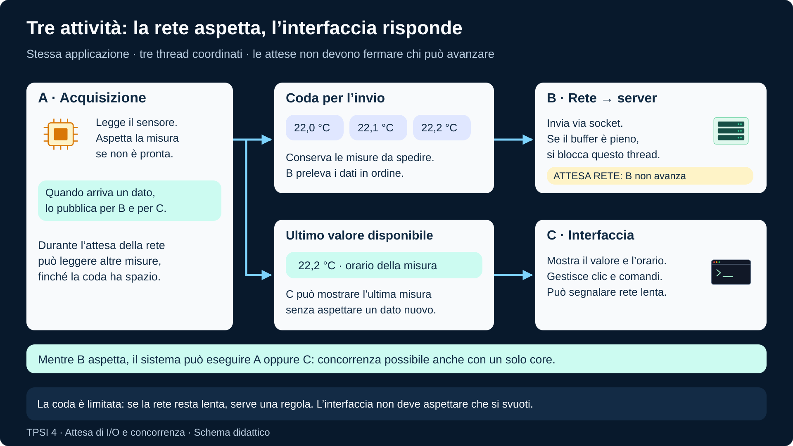
</p>
<p align="center"><em>Le attività scambiano dati attraverso strutture coordinate. Il blocco dell’invio non impedisce di gestire l’interfaccia; l’acquisizione può continuare finché c’è spazio in coda.</em></p>

<p align="justify"><strong>Segui l'animazione in tre momenti:</strong> prima il server lento ostacola l'invio e le misure riempiono la coda; poi il sensore smette temporaneamente di fornire dati; infine riparte. La GUI legge una copia dell'ultima misura acquisita, indipendente dalla coda di invio. Se manca un campione nuovo, mostra l'ultimo valore noto e il tempo trascorso: essere reattiva non significa avere sempre dati nuovi.</p>

<!-- figure:01-io-concorrente-animazione -->
<p align="center">
  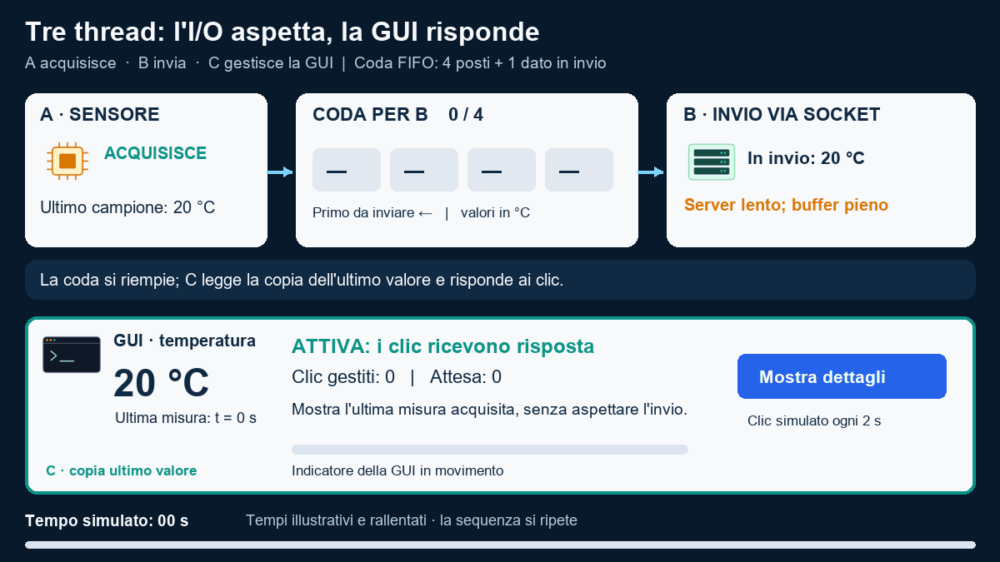
</p>
<p align="center"><em>Osserva insieme coda, ultimo valore e clic gestiti. La rete lenta fa crescere la coda; il sensore fermo lascia invariato il valore. In entrambi i casi la GUI risponde. Tempi simulati; riproduzione ciclica.</em></p>

<p align="justify">La coda ha quattro posti, oltre al dato già prelevato da B e ancora in invio. Qui raggiunge la capacità senza perdere misure; se arrivasse un altro dato prima che si liberi spazio, servirebbe la politica di gestione della coda piena descritta sotto. L'animazione assume che il rallentamento del server abbia già riempito i buffer di invio: un server lento non blocca immediatamente ogni chiamata al socket.</p>

<ol>
  <li><strong>A pubblica ogni misura:</strong> la inserisce in una coda per B e aggiorna una copia dell'ultimo valore per C. La coda è un contenitore ordinato di misure in attesa di invio.</li>
  <li><strong>B preleva e invia:</strong> se la rete lo blocca, le misure già acquisite restano in coda. A può continuare ad acquisire finché trova spazio.</li>
  <li><strong>C resta disponibile:</strong> mostra l'ultima misura con il suo orario e gestisce i comandi. Se A aspetta il sensore, C non inventa nuovi dati: può mostrare che il valore non è ancora aggiornato. Se B aspetta la rete, C può segnalare l'invio in ritardo.</li>
</ol>

<p align="justify">Questa è <strong>concorrenza</strong>: più attività possono avanzare nello stesso intervallo, anche alternandosi su un solo core. Durante l'attesa di B, il sistema può eseguire A o C. La concorrenza non rende più rapida la rete: permette alle attività che non dipendono dal suo completamento di fare altro lavoro utile.</p>

<p align="justify">La soluzione richiede coordinamento. La coda e l'ultimo valore devono essere letti e aggiornati in modo sicuro; una protezione condivisa non deve essere trattenuta durante una lunga attesa di rete, altrimenti bloccherebbe di nuovo gli altri thread. Inoltre la coda ha una capacità limitata: se le misure arrivano più rapidamente di quanto B le invii, prima o poi si riempie. Occorre scegliere se rallentare l'acquisizione, scartare alcune misure oppure conservarle altrove, mantenendo l'interfaccia disponibile.</p>

<p align="justify"><strong><span style="font-size: 1.15em;">&#10067;</span> Leggi le due figure:</strong> se l'invio rimane fermo per cinque secondi, chi può gestire un clic? Dove aspettano le misure già lette? Che cosa cambia quando la coda è piena? Queste domande introducono processi, thread, comunicazione e sincronizzazione.</p>

<p align="justify">Riferimenti tecnici sulle operazioni bloccanti: <a href="https://man7.org/linux/man-pages/man2/read.2.html">read(2)</a> e <a href="https://man7.org/linux/man-pages/man2/send.2.html">send(2)</a>. L'esempio illustra una soluzione a thread; la gestione dell'I/O non bloccante è un'altra possibilità, che qui non approfondiamo.</p>

## Dal programma al processo

<!-- definition -->
<table align="center">
<tr><td>
&#10071; <strong>Importante</strong>
<p align="justify">
Un <strong>programma</strong> è una descrizione passiva: un file eseguibile o un insieme di istruzioni memorizzate. Un <strong>processo</strong> è un'esecuzione attiva di quel programma, con uno stato che cambia nel tempo.</p>
</td></tr>
</table>
<!-- /definition -->

<p align="justify">Lo stesso programma può essere eseguito in più processi. Se apriamo due terminali e avviamo due volte lo stesso comando, il codice del programma è lo stesso, ma le due esecuzioni hanno identificatori, memoria e risorse proprie.</p>

<p align="justify">È il <strong>sistema operativo</strong> a gestire i processi: assegna loro tempo di <strong>CPU</strong> e <strong>memoria</strong>, controlla l'accesso a <strong>file e periferiche</strong> e tiene traccia delle risorse associate a ciascuna esecuzione. Deve sapere, per esempio, quale processo sta usando la CPU, quali aree di memoria può utilizzare e quali file ha aperto. Alcune risorse possono essere condivise: associarle a un processo non significa sempre riservarle esclusivamente a esso.</p>

<p align="justify">Per svolgere questo lavoro, il sistema operativo conserva <strong>informazioni su ciascun processo</strong> e le aggiorna mentre l'esecuzione avanza. Diremo quindi che <strong>il processo possiede</strong> un insieme di <strong>informazioni e risorse</strong> associate alla sua esecuzione. Le risorse sono i mezzi con cui lavora; le informazioni permettono al sistema operativo di identificarlo, controllarlo e gestirne l'avanzamento.</p>

<!-- definition -->
<table align="center">
<tr><td>
&#10071; <strong>Importante</strong>
<p align="justify">Pensiamo al <strong>multitasking</strong>: più attività avanzano nello stesso intervallo di tempo.</p>
</td></tr>
</table>
<!-- /definition -->

<p align="justify">Anche con una sola CPU logica, il sistema operativo può interrompere temporaneamente l'esecuzione di un processo e assegnare la CPU a un altro. Il primo processo non termina: dovrà poter riprendere più tardi dal punto in cui era stato sospeso. Per ora immaginiamo che ogni processo abbia un solo flusso di esecuzione.</p>

<p align="justify">Che cosa bisogna ricordare per riprenderlo? Almeno <strong>il punto raggiunto nel codice e i valori che la CPU stava usando</strong>, per esempio un risultato parziale o l'indirizzo di un dato. Queste informazioni fanno parte del <strong>contesto di esecuzione</strong>. Il contesto è quindi una parte delle informazioni associate al processo, non l'insieme di tutte le sue risorse.</p>

<!-- definition -->
<table align="center">
<tr><td>
&#10071; <strong>Importante</strong>
<p align="justify">Il passaggio da un'attività a un'altra richiede un <strong>cambio di contesto</strong>: il sistema conserva lo stato necessario dell'attività sospesa e ripristina quello dell'attività che deve proseguire.</p>
</td></tr>
</table>
<!-- /definition -->

<p align="justify">In questo modo la CPU può essere riutilizzata senza perdere il lavoro in corso. Nelle sezioni successive vedremo concretamente il ruolo dei registri e della memoria.</p>

<p align="justify">Per ciascun processo che sta gestendo, anche quando non sta usando la CPU, il sistema operativo deve dunque mantenere informazioni aggiornate per poter rispondere in ogni momento a queste <strong>otto domande</strong>. Le approfondiremo nella sezione <a href="#anatomia-di-un-processo">Anatomia di un processo</a>:</p>

<ul>
  <li><strong>Quale esecuzione?</strong> Un identificatore.</li>
  <li><strong>Da dove riprendere il lavoro?</strong> Un contesto di esecuzione.</li>
  <li><strong>Quali indirizzi di memoria può usare?</strong> Uno spazio di indirizzamento.</li>
  <li><strong>Dove conservare chiamate e dati dinamici?</strong> Stack e heap.</li>
  <li><strong>Quali risorse ha aperto?</strong> File e altri oggetti aperti.</li>
  <li><strong>Per conto di chi agisce e che cosa può fare?</strong> Credenziali e controlli dei permessi.</li>
  <li><strong>Può avanzare e quando riceverà la CPU?</strong> Stato di pianificazione.</li>
  <li><strong>Chi lo ha creato e con chi è collegato?</strong> Relazioni con altri processi.</li>
</ul>

<p align="justify">Nel modello Linux un processo è identificato da un <strong>PID</strong>. La relazione con il processo che lo ha creato è rappresentata dal <strong>PPID</strong>.</p>

<p align="justify">Collegamenti alla fonte tecnica:</p>

<ul>
  <li><a href="https://github.com/TheBitPoets/2cornot2c/blob/main/LINUX_PROGRAMMING.md#processi">Processi</a></li>
  <li><a href="https://github.com/TheBitPoets/2cornot2c/blob/main/LINUX_PROGRAMMING.md#process-ids">Process IDs</a></li>
  <li><a href="https://github.com/TheBitPoets/2cornot2c/blob/main/LINUX_PROGRAMMING.md#vedere-i-processi-attivi">Vedere i processi attivi</a></li>
</ul>

<!-- figure:01-programma-processi -->
<p align="center">
  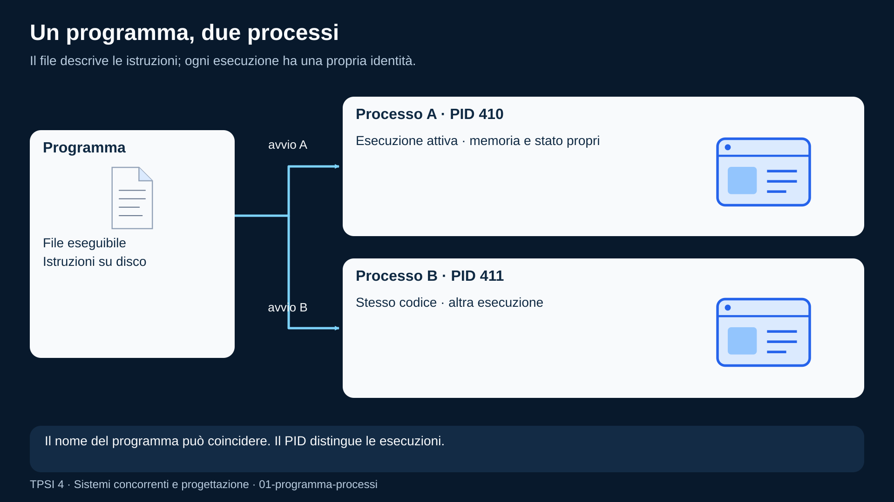
</p>
<p align="center"><em>Lo stesso eseguibile avvia due processi con PID diversi e spazi di memoria distinti.</em></p>

## Anatomia di un processo

<p align="justify">Seguiamo una sola esecuzione dell'applicazione iniziale: legge campioni da un sensore, calcola una media e salva i risultati in <code>misure.txt</code>. Mentre aspetta un campione, il computer deve poter eseguire anche altri programmi. Quando il campione arriva, l'applicazione deve riprendere con i propri dati, nel punto giusto e con il file ancora disponibile. Il solo file eseguibile non contiene queste informazioni: descrive le istruzioni, ma non la situazione raggiunta da questa particolare esecuzione.</p>

<!-- definition -->
<table align="center">
<tr><td>
&#10071; <strong>Importante</strong>
<p align="justify"><strong>Che cosa significa “il processo possiede”:</strong> significa che una risorsa o un'informazione è associata a quell'esecuzione. Non significa che tutto sia dentro la sua memoria o che ogni risorsa sia esclusivamente sua. Il <strong>kernel</strong>, la parte del sistema operativo che gestisce processi e risorse, conserva strutture di controllo con valori e riferimenti. I manuali chiamano spesso questo modello <strong>PCB</strong> (<em>Process Control Block</em>): una scheda di gestione del processo. In un sistema reale le informazioni possono essere distribuite fra più strutture collegate.</p>
</td></tr>
</table>
<!-- /definition -->

<p align="justify">Possiamo immaginare il <strong>PCB come una scheda strutturata</strong>, con campi numerici e collegamenti ad altre strutture. Il sistema operativo la usa per riconoscere il processo, decidere quando eseguirlo, sospenderlo e ritrovare le sue risorse. Nel modello didattico vi troviamo, direttamente o tramite riferimenti:</p>

<ul>
  <li><strong>Identificatori e relazioni:</strong> il PID, il padre e i collegamenti con altri processi.</li>
  <li><strong>Informazioni di pianificazione:</strong> lo stato, come pronto o in attesa, e informazioni come la priorità.</li>
  <li><strong>Contesto di esecuzione salvato:</strong> il punto del codice da cui riprendere e i valori dei registri necessari.</li>
  <li><strong>Credenziali:</strong> l'identità dell'utente e dei gruppi usata nei controlli di accesso.</li>
  <li><strong>Riferimenti alla memoria:</strong> le strutture che descrivono lo spazio virtuale e permettono di ritrovare le tabelle delle pagine.</li>
  <li><strong>Riferimenti alle risorse aperte:</strong> le strutture per gestire file, socket e altri oggetti usati dal processo.</li>
</ul>

<!-- figure:01-pcb -->
<p align="center">
  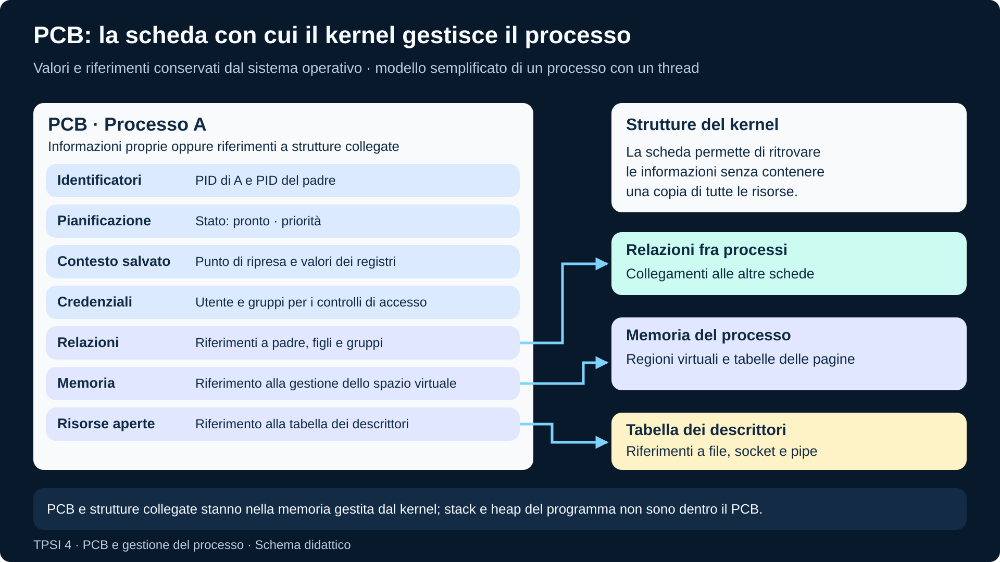
</p>
<p align="center"><em>Il PCB raccoglie informazioni di controllo e riferimenti. Le tabelle delle pagine e le altre strutture collegate restano distinte dai dati del programma.</em></p>

<p align="justify">Nella figura, le frecce indicano riferimenti: la scheda permette di raggiungere un'altra struttura, non contiene tutta quella struttura. <strong>Il PCB non contiene il programma, l'intero stack o l'intero heap.</strong> Questa è una rappresentazione concettuale, non la disposizione esatta dei campi in Linux; inoltre, con più thread, il contesto di ciascun thread va distinto dalle risorse comuni del processo. Le sezioni seguenti spiegano uno alla volta gli elementi della scheda.</p>

<p align="justify">Dove si trovano il codice, i dati e le informazioni necessarie a gestire l'esecuzione di un processo? Non sono tutti nel PCB. Per capire chi li usa e a cosa servono, distinguiamo <strong>tre sedi con ruoli diversi</strong>:</p>

<ul>
  <li><strong>La memoria accessibile al programma:</strong> contiene il codice da eseguire e i dati su cui lavora, comprese le aree di stack e heap.</li>
  <li><strong>Le strutture protette del kernel:</strong> conservano le informazioni con cui il sistema operativo gestisce il processo e le sue risorse, come il PCB e le tabelle delle pagine. Sono anch'esse in memoria, ma il programma non può modificarle direttamente.</li>
  <li><strong>I registri fisici della CPU:</strong> contengono i valori e gli indirizzi usati mentre le istruzioni vengono eseguite. Quando l'esecuzione viene sospesa, il sistema salva in memoria lo stato necessario per poterla riprendere.</li>
</ul>

<p align="justify">Per ora immaginiamo un processo con un solo flusso di esecuzione. Quando introdurremo i thread, distingueremo le risorse del processo dal contesto e dallo stack di ciascun thread.</p>

### 1. Identificatore: distinguere questa esecuzione

<p align="justify">Avviamo due copie dell'applicazione, una per il sensore dell'aula e una per quello del laboratorio. Hanno lo stesso nome e lo stesso codice: per indicare quale interrompere o osservare, il nome non basta.</p>

<!-- definition -->
<table align="center">
<tr><td>
&#10071; <strong>Importante</strong>
<p align="justify">Il <strong>PID</strong> (<em>Process ID</em>) è il numero con cui il sistema identifica un processo.</p>
</td></tr>
</table>
<!-- /definition -->

<p align="justify">Per esempio, le due esecuzioni potrebbero avere PID <code>4100</code> e <code>4101</code>; sono valori illustrativi, assegnati dal sistema e non scelti nel sorgente.</p>

<p align="justify">Il PID è registrato nelle strutture del kernel. Un programma Linux può conoscere il proprio con <code>getpid()</code>; gli strumenti di osservazione lo mostrano per collegare ogni riga a un'esecuzione precisa. È necessario perché richieste come “mostra lo stato” o “invia un segnale” devono avere un destinatario. Il numero può essere riutilizzato dopo che il vecchio processo è stato rimosso: non è un'identità permanente. In Linux l'unicità si riferisce allo spazio di identificatori, o <em>PID namespace</em>, in cui si osservano i processi.</p>

### 2. Contesto di esecuzione: riprendere senza ricominciare

<p align="justify">Supponiamo che l'applicazione venga sospesa mentre somma i campioni. Conservare soltanto l'array non basta: bisogna ricordare anche a quale istruzione è arrivata e quali valori intermedi sta usando.</p>

<!-- definition -->
<table align="center">
<tr><td>
&#10071; <strong>Importante</strong>
<p align="justify">Il <strong>contesto di esecuzione</strong> è l'insieme delle informazioni necessarie a riprendere quel flusso di istruzioni.</p>
<ul>
  <li>Il <strong>contatore di programma</strong>, detto anche <em>program counter</em> o <em>instruction pointer</em>, indica la posizione dell'esecuzione nel codice macchina. Non è il numero di riga del sorgente C: una riga può produrre più istruzioni o essere trasformata dal compilatore.</li>
  <li>I <strong>registri</strong> sono piccole memorie interne alla CPU: contengono operandi, indirizzi e risultati intermedi. Per esempio, durante una somma possono contenere un campione e il totale parziale.</li>
  <li>Lo <strong>stack pointer</strong> è un registro che individua la posizione corrente nello stack. Altri registri conservano informazioni di controllo, come gli esiti dei confronti.</li>
</ul>
</td></tr>
</table>
<!-- /definition -->

<p align="justify">I registri fisici appartengono alla CPU. Quando il kernel sospende un'esecuzione, salva i valori necessari in memoria; prima di riprenderla li ripristina. Il processo possiede dunque il proprio <strong>stato dei registri</strong>, non una CPU personale. Se ripristinassimo i valori dell'altra applicazione, potremmo sommare il campione sbagliato o tornare nel punto sbagliato. Questo è il motivo del cambio di contesto, che riprenderemo nella sezione sul ciclo di vita. Non comporta copiare tutta la memoria del processo a ogni passaggio.</p>

<p align="justify">Dopo aver chiarito spazio di indirizzamento, stack e heap, renderemo concreto questo modello con <a href="#registri-e-memoria-su-intel-x86-64">un percorso per immagini su Intel x86-64</a>. Vedremo i nomi dei registri e seguiremo una sospensione fra due istruzioni.</p>

### 3. Spazio di indirizzamento: gli indirizzi che il programma vede

<p align="justify">Il sistema operativo tiene traccia delle informazioni già introdotte attraverso il <strong>PCB e le strutture a esso collegate</strong>. Ma sapere quale processo sta eseguendo e da dove deve riprendere non basta: bisogna anche sapere <strong>dove si trovano i suoi dati in memoria</strong>.</p>

<!-- definition -->
<table align="center">
<tr><td>
&#10071; <strong>Importante</strong>
<p align="justify">Per questo, oltre alla scheda di controllo, il kernel mantiene per lo spazio di memoria del processo le <strong>tabelle delle pagine</strong>. Le ritrova attraverso i riferimenti alla gestione della memoria associati al processo. Sono strutture distinte dal PCB: registrano le corrispondenze che la MMU usa per tradurre gli indirizzi.</p>
</td></tr>
</table>
<!-- /definition -->

<!-- definition -->
<table align="center">
<tr><td>
&#10071; <strong>Importante</strong>
<p align="justify">Questa organizzazione della memoria in blocchi si chiama <strong>paginazione</strong>.</p>
</td></tr>
</table>
<!-- /definition -->

<p align="justify">Permette al programma di usare i propri indirizzi virtuali, mentre il sistema operativo colloca le pagine nei frame disponibili della RAM. Vediamo nella figura come si collegano le varie parti.</p>

<!-- definition -->
<table align="center">
<tr><td>
&#10071; <strong>Importante</strong>
<p align="justify">Un indirizzo indica una posizione di memoria. Il processo usa un proprio <strong>spazio di indirizzi virtuali</strong>, suddiviso in blocchi chiamati <strong>pagine virtuali</strong>. La RAM è organizzata in blocchi corrispondenti, le <strong>pagine fisiche</strong> o <strong>frame</strong>.</p>
</td></tr>
</table>
<!-- /definition -->

<p align="justify">Per trovare un dato, bisogna collegare la pagina vista dal programma alla sua posizione nella RAM.</p>

<!-- figure:01-indirizzi-virtuali-mmu -->
<p align="center">
  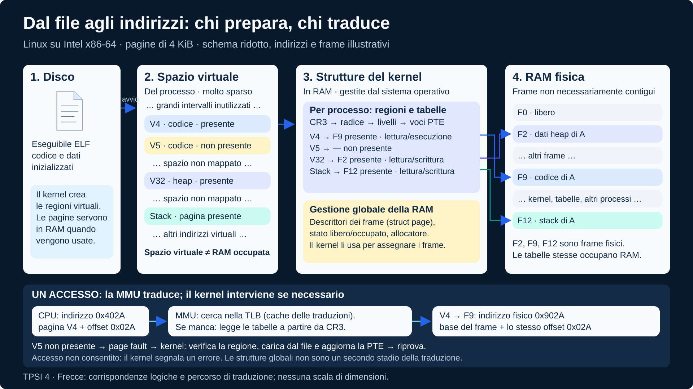
</p>
<p align="center"><em>Il kernel prepara le corrispondenze; la MMU le usa per raggiungere le pagine fisiche. Pagine virtuali vicine possono occupare frame fisici distanti.</em></p>

<p align="justify">Segui la figura in quattro passaggi:</p>

<ol>
  <li><strong>A sinistra, le pagine virtuali:</strong> sono il modo in cui il processo vede organizzata la propria memoria. Lo spazio può essere molto grande e solo una parte delle pagine è presente in RAM.</li>
  <li><strong>Al centro, il kernel e le strutture dati:</strong> il sistema operativo assegna i frame e prepara le tabelle delle pagine. Nella figura la tabella dice, per esempio, che la pagina virtuale V1 si trova nel frame fisico F4. Il kernel tiene anche traccia dei frame liberi e occupati.</li>
  <li><strong>Sotto, la MMU:</strong> è la parte hardware della CPU che traduce gli indirizzi usando le corrispondenze preparate dal kernel. Il programma indica una posizione virtuale; la MMU permette di raggiungere quella fisica corretta.</li>
  <li><strong>A destra, le pagine fisiche:</strong> sono i blocchi effettivamente presenti nella RAM. Cerca gli stessi colori: V1 è in F4, V2 in F1 e V3 in F6. L'ordine nella RAM può essere diverso dall'ordine virtuale.</li>
</ol>

<!-- definition -->
<table align="center">
<tr><td>
&#10071; <strong>Importante</strong>
<p align="justify"><strong>Mappare una pagina</strong> significa stabilire la corrispondenza tra una pagina virtuale e il frame fisico che la contiene.</p>
</td></tr>
</table>
<!-- /definition -->

<p align="justify">La tabella contiene indicazioni su dove trovare le pagine; i dati delle pagine sono nei frame fisici. Le tabelle sono anch'esse conservate in RAM: nella figura sono separate per distinguerne la funzione.</p>

<p align="justify">Ogni processo ha le proprie mappature: lo stesso indirizzo virtuale in due processi può quindi portare a dati fisici diversi. Per riprendere correttamente un processo, il sistema deve rendere nuovamente utilizzabili le sue corrispondenze.</p>

<p align="justify"><strong><span style="font-size: 1.15em;">&#10067;</span> Leggi l'immagine:</strong> in quale frame si trova V2? Chi prepara la corrispondenza e chi la usa per tradurre l'indirizzo?</p>

### 4. Stack e heap: due esigenze diverse nella stessa memoria

<p align="justify">All'interno dello spazio di indirizzamento servono organizzazioni adatte a durate diverse. Una chiamata di funzione deve ricordare come tornare al chiamante; un insieme di campioni può invece dover rimanere disponibile anche dopo il ritorno dalla funzione che lo ha allocato.</p>

<!-- definition -->
<table align="center">
<tr><td>
&#10071; <strong>Importante</strong>
<p align="justify">Lo <strong>stack</strong> è organizzato come una pila: l'ultima chiamata aperta è la prima a concludersi. Nel modello usuale, ogni chiamata dispone di un <strong>record di attivazione</strong>, o <em>stack frame</em>, con informazioni utili alla sua esecuzione e al ritorno.</p>
</td></tr>
</table>
<!-- /definition -->

<p align="justify">Può contenere variabili locali, valori salvati e informazioni di collegamento; la disposizione concreta dipende dall'architettura, dalle convenzioni di chiamata e dalle ottimizzazioni. Alcuni valori possono restare nei registri.</p>

<!-- figure:01-stack-chiamate-annidate -->
<p align="center">
  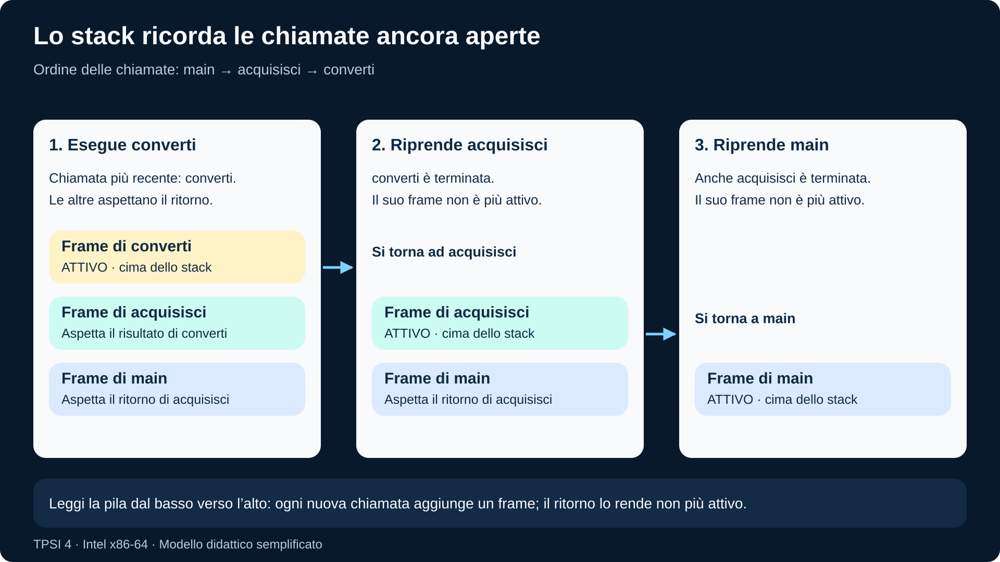
</p>
<p align="center"><em>L’ultima chiamata aperta è la prima a terminare: da converti si torna ad acquisisci, poi a main.</em></p>

<p align="justify">Anche due chiamate ricorsive della stessa funzione devono conservare separatamente il proprio stato. Quando una funzione termina, i suoi oggetti locali automatici cessano di esistere: restituire l'indirizzo di uno di essi non ne prolunga la durata.</p>

<!-- definition -->
<table align="center">
<tr><td>
&#10071; <strong>Importante</strong>
<p align="justify">L'<strong>heap</strong> indica, nel modello didattico, la memoria gestita con allocazioni dinamiche.</p>
</td></tr>
</table>
<!-- /definition -->

<p align="justify">Il programma chiede un blocco della dimensione necessaria, ottiene un puntatore e lo usa finché lo rilascia. In C si impiegano funzioni come <code>malloc</code> e <code>free</code>; l'allocatore gestisce blocchi occupati e liberi e richiede memoria al sistema quando serve. L'ordine di rilascio non deve seguire quello delle chiamate di funzione.</p>

### Registri e memoria su Intel x86-64

<p align="justify">Usiamo una CPU Intel x86-64 come riferimento e seguiamo un gesto semplice: <strong>leggere il numero 20, aggiungere 3 e scrivere 23 al suo posto</strong>. Un programma scritto in C viene tradotto in istruzioni macchina; l'assembly è un modo leggibile di rappresentarle. Per capire il contesto basta seguire ciò che queste istruzioni fanno ai registri e alla memoria.</p>

#### Un esempio minimo: dal C ai registri della figura

<p align="justify">Il chiamante <code>main</code> crea la variabile locale <code>valore</code>, inizializzata a 20, e chiama <code>f(&amp;valore)</code>: passa l'indirizzo della propria variabile. La funzione riceve quell'indirizzo nel parametro puntatore <code>p</code> e usa la variabile locale <code>incremento</code> per aggiornare il dato del chiamante.</p>

```c
void f(long *p)
{
    long incremento = 3;
    *p = 20;
    *p = *p + incremento;
}

int main(void)
{
    long valore = 20;
    f(&valore);          // Passa l'indirizzo, non una copia del numero 20
    // Ora valore contiene 23
    return 0;
}
```

<p align="justify">Seguiamo una disposizione didattica della memoria durante <code>f</code>, dopo l'inizializzazione di <code>incremento</code> e prima della somma. <strong>I frame di main e di f sono porzioni dello stesso stack del thread</strong>: il frame del chiamante resta presente mentre la funzione chiamata lavora. In questo esempio anche il dato puntato è nello stack; non usiamo l'heap.</p>

<!-- figure:01-puntatore-stack-chiamante -->
<p align="center">
  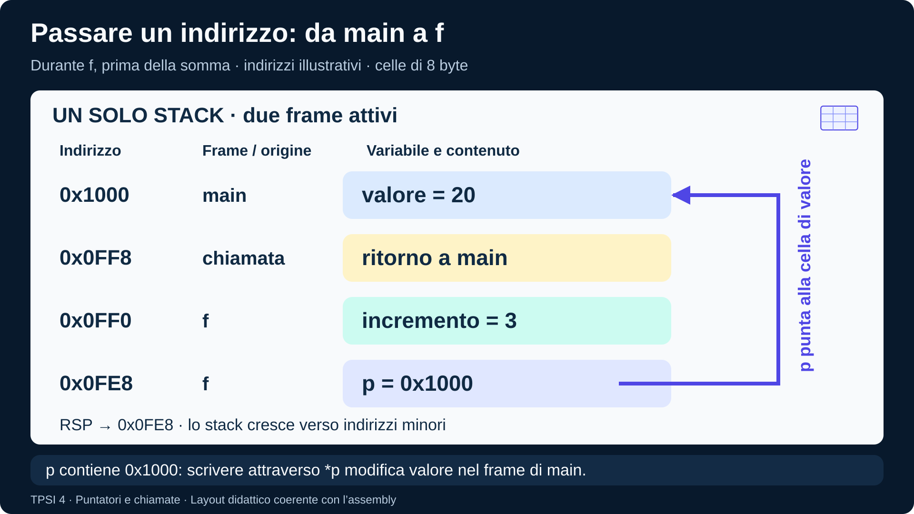
</p>
<p align="center"><em>p contiene l’indirizzo di valore, mentre &amp;p è l’indirizzo del puntatore stesso. Scrivere attraverso *p modifica valore nel frame del chiamante.</em></p>

<ul>
  <li><strong><code>&amp;valore = 0x1000</code>:</strong> è l'indirizzo della variabile di <code>main</code>; il suo contenuto iniziale è 20.</li>
  <li><strong><code>p = 0x1000</code>:</strong> il parametro contiene una copia di quell'indirizzo. <code>*p</code> raggiunge quindi la stessa cella di <code>valore</code>; scrivere <code>*p = 23</code> modifica proprio la variabile del chiamante.</li>
  <li><strong><code>&amp;p = 0x0FE8</code>:</strong> è l'indirizzo della cella che contiene il puntatore nel nostro layout. È diverso da <code>p</code>: la freccia parte dalla cella di <code>p</code> e raggiunge la cella indicata dall'indirizzo che essa contiene.</li>
</ul>

<p align="justify">Nel riferimento <strong>Linux x86-64</strong>, sia <code>long</code> sia questo puntatore occupano 8 byte. Per rendere visibile la memoria scegliamo una traduzione che salva <code>p</code> in <code>[rsp]</code> e <code>incremento</code> in <code>[rsp + 8]</code>. Gli indirizzi sono illustrativi e il layout non è imposto dal C: un compilatore può tenere il parametro in un registro o disporre diversamente le variabili.</p>

<p align="justify"><strong>Perché prima RSP non compariva nelle istruzioni?</strong> Il precedente esempio modificava soltanto <code>*p</code> e usava RAX come valore temporaneo: non avevamo riservato spazio per variabili locali. Lo stack era comunque usato implicitamente dal ritorno. Aggiungere una variabile locale in C non obbliga il compilatore a metterla nello stack: può tenerla in un registro o sostituirla con il valore costante 3. Qui scegliamo esplicitamente di mostrarne la collocazione nello stack.</p>

<p align="justify">All'ingresso della funzione, la <a href="https://gitlab.com/x86-psABIs/x86-64-ABI">convenzione System V AMD64 delle chiamate Linux x86-64</a> prevede che il primo parametro puntatore sia in <strong>RDI</strong>. La chiamata ha già salvato l'indirizzo di ritorno in cima allo stack. <strong>Il parametro arriva in RDI; è il corpo di f a copiarlo nella cella dello stack disegnata per p</strong>, con <code>mov [rsp], rdi</code>. Conserviamo anche la copia in RDI per gli accessi al dato. Leggiamo questa traduzione didattica in sintassi Intel: prima la destinazione, poi la sorgente.</p>

```asm
f:
    sub rsp, 16          # 1. Riserva 8 byte per p e 8 per incremento
    mov [rsp], rdi       # 2. Salva p: la cella contiene l'indirizzo di valore
    mov rax, 3           # 3. Prepara il valore di incremento
    mov [rsp + 8], rax   # 4. Salva incremento nella sua cella di 8 byte
    mov rax, 20          # 5. Prepara il valore iniziale
    mov [rdi], rax       # 6. Scrivi 20 in valore, nello stack di main
    mov rax, [rdi]       # 7. Rileggi valore: RAX contiene 20
    add rax, [rsp + 8]   # 8. Leggi incremento dallo stack: RAX diventa 23
    mov [rdi], rax       # 9. Scrivi 23 in valore, tramite il puntatore
    add rsp, 16          # 10. Rilascia le celle di p e incremento
    ret                 # 11. Recupera il ritorno dallo stack e torna
```

<!-- definition -->
<table align="center">
<tr><td>
&#10071; <strong>Importante</strong>
<p align="justify">Nell'indirizzamento <strong>base + scostamento</strong>, l'indirizzo si ottiene sommando al valore di un registro un numero di byte. In <code>[rsp + 8]</code>, la base è RSP e lo scostamento, o <em>offset</em>, è 8 byte. Le parentesi quadre indicano il contenuto della memoria a quell'indirizzo.</p>
</td></tr>
</table>
<!-- /definition -->

<p align="justify"><code>mov [rsp + 8], rax</code> scrive nella cella della variabile locale; <code>add rax, [rsp + 8]</code> legge da quella cella il valore 3 e lo somma a RAX. <strong>Nessuna delle due istruzioni modifica RSP.</strong> Al contrario, <code>sub rsp, 16</code> e <code>add rsp, 16</code> cambiano il valore del registro per riservare e rilasciare spazio. La dimensione di 8 byte degli accessi in questo esempio è determinata dall'operando RAX.</p>

<p align="justify">Usiamo indirizzi illustrativi: all'ingresso RSP vale <code>0x0FF8</code> e lì si trova l'indirizzo di ritorno. Dopo <code>sub rsp, 16</code>, RSP vale <code>0x0FE8</code>. La cella di <code>incremento</code> si trova quindi a <code>0x0FE8 + 8 = 0x0FF0</code>. I 16 byte contengono due celle: 8 byte per il parametro <code>p</code> e 8 byte per <code>incremento</code>.</p>

<table align="center">
<thead><tr><th>Rispetto a RSP, dopo la riserva</th><th>Indirizzo illustrativo</th><th>Contenuto</th></tr></thead>
<tbody>
<tr><td><code>[rsp]</code>, 8 byte</td><td><code>0x0FE8</code></td><td><code>p = 0x1000</code>, dopo il passaggio 2.</td></tr>
<tr><td><code>[rsp + 8]</code>, 8 byte</td><td><code>0x0FF0</code></td><td><code>incremento = 3</code>, dopo il passaggio 4.</td></tr>
<tr><td><code>[rsp + 16]</code>, 8 byte</td><td><code>0x0FF8</code></td><td>Indirizzo di ritorno, già salvato dalla chiamata.</td></tr>
</tbody>
</table>

<p align="justify">RDI mantiene l'indirizzo di <code>valore</code> nel frame di <code>main</code>; RSP permette di raggiungere <code>p</code> e <code>incremento</code> nel frame di <code>f</code>. Dopo il passaggio 8, <strong>RAX contiene 23, <code>incremento</code> contiene ancora 3 e <code>*p</code> contiene ancora 20</strong>: è il momento mostrato dalla figura. RIP indica la successiva scrittura <code>mov [rdi], rax</code>.</p>

<p align="justify">Prima di <code>ret</code>, <code>add rsp, 16</code> riporta RSP a <code>0x0FF8</code>, dove si trova il ritorno. <code>ret</code> recupera quell'indirizzo e avanza RSP di altri 8 byte. Saltare il rilascio dello spazio farebbe cercare il ritorno nella posizione sbagliata. Lo scostamento <code>+8</code> resta valido per <code>incremento</code> finché RSP non cambia: non è una proprietà del nome C, ma della disposizione scelta per questa chiamata.</p>

<p align="justify">Questa sequenza è scritta per mostrare registri e memoria, non è l'output di una specifica compilazione. Un compilatore può scegliere un altro layout o ridurre il corpo alla scrittura del risultato costante 23. In questo esempio non servono RBP né ulteriori chiamate: la distinzione importante è fra <strong>RSP, che contiene un indirizzo</strong>, e <strong>la variabile locale, conservata nella memoria raggiunta con quell'indirizzo più lo scostamento</strong>.</p>

#### Primo passo: dove si trova il lavoro in corso?

<p align="justify">Immaginiamo di fermare l'esecuzione dopo il calcolo, ma prima della scrittura. Il nuovo valore è già pronto nella CPU, mentre il dato in memoria non è ancora cambiato. La figura mostra questa situazione.</p>

<!-- figure:01-registri-memoria -->
<p align="center">
  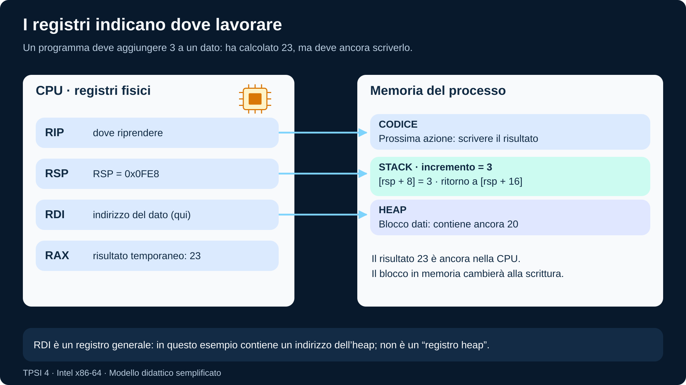
</p>
<p align="center"><em>RDI punta a valore nel frame di main; RSP individua il frame di f. Dopo la somma RAX contiene 23, ma valore contiene ancora 20.</em></p>

<p align="justify">Leggiamola partendo dai registri.</p>

<p align="justify">Ogni <strong>registro</strong> è una piccola memoria interna alla CPU; quelli indicati qui possono contenere valori a 64 bit.</p>

<ul>
  <li><strong>RIP — dove riprendere:</strong> individua il punto del codice da cui proseguire. Qui il prossimo lavoro è scrivere il risultato.</li>
  <li><strong>RSP — dove si trova la cima dello stack:</strong> qui vale <code>0x0FE8</code>; aggiungendo 8 raggiungiamo la cella di <code>incremento</code>, che contiene 3.</li>
  <li><strong>RAX — un risultato temporaneo:</strong> nel nostro esempio contiene 23. È un registro generale: il suo contenuto dipende dalle istruzioni eseguite.</li>
  <li><strong>RDI — un indirizzo:</strong> qui contiene <code>0x1000</code> e indica <code>valore</code> nel frame di <code>main</code>. È un registro generale: può contenere un indirizzo dello stack, dell'heap o di un'altra area accessibile.</li>
</ul>

<p align="justify">Altri registri completano lo stato: <strong>RBP</strong> può aiutare a ritrovare i dati della chiamata corrente; <strong>RFLAGS</strong> conserva anche esiti di operazioni e confronti. Il kernel gestisce inoltre le traduzioni della memoria, collegate a <strong>CR3</strong>, che permette di individuare le tabelle attive. Non è necessario imparare tutto l'elenco per seguire l'esempio: servono il punto di ripresa, i valori intermedi e gli indirizzi corretti.</p>

<p align="justify"><strong>Stack e heap sono aree di memoria, non registri.</strong> I registri contengono alcuni valori e indirizzi usati per lavorare su quelle aree. Per questo il processo deve ritrovare sia lo stato della CPU sia la propria memoria.</p>

#### Secondo passo: una funzione deve sapere dove tornare

<p align="justify">Ora <code>main</code> chiama una funzione con tre variabili locali. <code>somma</code> assegna 2 ad <code>a</code>, 3 a <code>b</code>, calcola 5 in <code>c</code> e restituisce quel valore al chiamante.</p>

```c
int somma(void)
{
    int a = 2;
    int b = 3;
    int c = a + b;
    return c;
}

int main(void)
{
    int risultato = somma();
    return risultato;
}
```

<p align="justify">Per vedere lo stack, immaginiamo che il compilatore metta le tre variabili in memoria: nel nostro riferimento Linux x86-64 ogni <code>int</code> occupa <strong>4 byte</strong>, quindi servono <strong>12 byte</strong>. La chiamata salva anche un <strong>indirizzo di ritorno di 8 byte</strong>: indica dove <code>main</code> deve proseguire dopo <code>somma</code>.</p>

<!-- figure:01-chiamata-stack -->
<p align="center">
  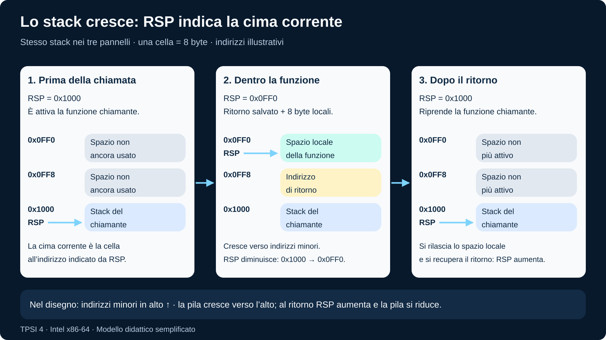
</p>
<p align="center"><em>La chiamata salva 8 byte per il ritorno; nel modello somma riserva altri 12 byte per tre int. RSP scende da 0x1000 a 0x0FEC e torna a 0x1000 quando la funzione termina.</em></p>

<p align="justify">Leggi il pannello centrale dopo il calcolo di <code>c</code>, prima del ritorno. Le celle mostrano i valori effettivi: <strong>a = 2, b = 3, c = 5</strong>. Il numero <strong>0x401025</strong> è invece un indirizzo illustrativo del codice di <code>main</code>: è il punto di ritorno, non il risultato della somma. L'indirizzo a sinistra, <strong>0x0FF8</strong>, indica dove quel punto di ritorno è conservato nello stack.</p>

<ol>
  <li><strong>Prima della chiamata:</strong> RSP vale <code>0x1000</code> e indica la cima dello stack di <code>main</code>.</li>
  <li><strong>La chiamata salva il ritorno:</strong> RSP diminuisce di 8 byte e diventa <code>0x0FF8</code>.</li>
  <li><strong>somma riserva le variabili:</strong> nel modello RSP diminuisce di altri 12 byte e diventa <code>0x0FEC</code>. La cima è ora la cella di <code>c</code>; sopra di essa, nel disegno, ci sono indirizzi ancora minori.</li>
  <li><strong>La funzione termina:</strong> il valore 5 viene predisposto nel registro di risultato (la parte a 32 bit di RAX). Si rilasciano i 12 byte locali e si recupera l'indirizzo di ritorno; RSP torna a <code>0x1000</code>. <code>main</code> riprende e assegna il valore ricevuto a <code>risultato</code>.</li>
</ol>

<p align="justify"><strong>Quando lo stack cresce, RSP diminuisce; quando si riduce, RSP aumenta.</strong> Le celle grigie non sono più attive: possono essere riutilizzate senza cancellare prima i vecchi byte. La figura mostra una possibile organizzazione semplificata; il compilatore può cambiare ordine, riservare spazio aggiuntivo o tenere le variabili nei registri. Nel precedente esempio abbiamo scelto 16 byte riservati per un puntatore e una variabile <code>long</code>; qui seguiamo invece tre variabili <code>int</code>, ciascuna di 4 byte.</p>

<p align="justify">In questo passaggio il processo e il thread rimangono gli stessi. Una chiamata di funzione cambia il punto del programma in esecuzione. Il <a href="#cambio-di-contesto">cambio di contesto</a>, invece, permette di sospendere un'attività e farne avanzare un'altra.</p>

### 5. File e altri oggetti aperti: riferimenti alle risorse

<p align="justify">Per salvare una media, l'applicazione deve aprire <code>misure.txt</code>.</p>

<!-- definition -->
<table align="center">
<tr><td>
&#10071; <strong>Importante</strong>
<p align="justify">In Linux un <strong>descrittore di file</strong> è un piccolo intero che seleziona una voce della tabella dei descrittori del processo.</p>
</td></tr>
</table>
<!-- /definition -->

<p align="justify">La voce rimanda a strutture del kernel che rappresentano l'apertura e, per un file ordinario, conservano informazioni come posizione corrente e modalità di accesso. Il contenuto del file non diventa automaticamente una parte della memoria privata del processo.</p>

```text
processo A                    kernel                    risorsa
descrittore 3  ---------->  apertura del file  ------->  misure.txt
                           posizione, modalità
```

<p align="justify">Lo stesso meccanismo permette di riferirsi anche a pipe, terminali e socket. Per convenzione, <code>0</code>, <code>1</code> e <code>2</code> sono ingresso standard, uscita standard ed errori standard; possono essere rediretti. Il numero <code>3</code> in due processi non identifica necessariamente la stessa risorsa, perché ogni numero va interpretato nella relativa tabella. Viceversa, due descrittori possono riferirsi alla stessa apertura. Chiudere un descrittore rimuove quel riferimento: non significa cancellare il file.</p>

<p align="justify">Nell'esempio del sensore, ricordare il descrittore consente di continuare a scrivere sul file già aperto dopo una sospensione. Quando usiamo <code>fopen</code> in C, lavoriamo invece con un <code>FILE *</code>: un oggetto della libreria che aggiunge gestione del flusso e buffering sopra il descrittore.</p>

### 6. Credenziali e permessi: identità e autorizzazione

<p align="justify">Il PID distingue un'esecuzione; non dice per conto di quale utente essa agisca.</p>

<!-- definition -->
<table align="center">
<tr><td>
&#10071; <strong>Importante</strong>
<p align="justify">Le <strong>credenziali</strong> sono informazioni di identità associate al processo, fra cui identificatori di utente (<strong>UID</strong>) e gruppo (<strong>GID</strong>) e gruppi supplementari.</p>
</td></tr>
</table>
<!-- /definition -->

<p align="justify">Il kernel le usa nei controlli di accesso. Più processi dello stesso utente possono quindi avere PID diversi e le stesse credenziali.</p>

<!-- definition -->
<table align="center">
<tr><td>
&#10071; <strong>Importante</strong>
<p align="justify">I <strong>permessi</strong> esprimono operazioni consentite sulle risorse.</p>
</td></tr>
</table>
<!-- /definition -->

<p align="justify">Per un file, per esempio, distinguiamo lettura, scrittura ed esecuzione per proprietario, gruppo e altri utenti. Il kernel confronta le credenziali con le regole applicabili all'operazione richiesta. I permessi di <code>misure.txt</code> sono proprietà della risorsa: non sono tutti contenuti nella scheda del processo.</p>

<p align="justify">Se l'applicazione può leggere il file ma non aprirlo in scrittura, conoscere il percorso non basta a ottenere il permesso. Linux distingue anche identità reali ed effettive; nei casi ordinari coincidono, mentre i dettagli dei controlli includono ulteriori meccanismi. Qui ci interessa la separazione: identificare il processo, identificare l'utente e autorizzare un'operazione sono tre problemi diversi.</p>

### 7. Stato di pianificazione: poter avanzare e ottenere la CPU

<!-- definition -->
<table align="center">
<tr><td>
&#10071; <strong>Importante</strong>
<p align="justify">La <strong>pianificazione</strong>, o <em>scheduling</em>, decide quale attività pronta eseguire sulle CPU disponibili.</p>
</td></tr>
</table>
<!-- /definition -->

<p align="justify">Il kernel conserva lo stato dell'attività e informazioni utili alla scelta, come politica e priorità di pianificazione. Le attività pronte sono organizzate in strutture che permettono allo <strong>scheduler</strong>, il componente incaricato della scelta, di individuarle.</p>

<p align="justify">Riprendiamo l'applicazione: mentre calcola la media è <strong>in esecuzione</strong>; se potrebbe continuare ma la CPU esegue altro, è <strong>pronta</strong>; se una lettura bloccante aspetta un campione non ancora disponibile, è <strong>in attesa</strong>. Nel terzo caso assegnarle tempo di CPU non risolverebbe la mancanza del dato. All'arrivo del campione torna pronta e attende di essere selezionata.</p>

<p align="justify">Questo stato appartiene alla singola attività perché due esecuzioni dello stesso programma possono trovarsi in condizioni diverse. Non va confuso con il contatore di programma: quello indica dove riprendere; lo stato indica se si può riprendere e se si sta già eseguendo. Il diagramma successivo rappresenta proprio queste transizioni. Linux pianifica i singoli thread: il modello a un solo flusso ci permette per ora di parlare di processo pronto o in esecuzione.</p>

### 8. Relazioni con altri processi: origine e coordinamento

<p align="justify">Quando avviamo l'applicazione da una shell, entra in gioco una relazione di creazione: un processo può creare un <strong>figlio</strong> e diventare il suo <strong>padre</strong>.</p>

<!-- definition -->
<table align="center">
<tr><td>
&#10071; <strong>Importante</strong>
<p align="justify">Il <strong>PPID</strong> è l'identificatore del padre.</p>
</td></tr>
</table>
<!-- /definition -->

<p align="justify">Questi collegamenti permettono di rappresentare i processi come un albero; non indicano che la memoria del figlio sia contenuta in quella del padre.</p>

<p align="justify">Immaginiamo che l'applicazione affidi l'esportazione delle misure a un figlio. Il padre può continuare un'altra attività e poi raccoglierne l'esito con <code>wait</code> o <code>waitpid</code>. Il kernel deve ricordare la relazione per gestire questa attesa e conservare le informazioni di terminazione necessarie. La parentela non sincronizza automaticamente ogni operazione: se i due devono scambiarsi campioni, serve un meccanismo di comunicazione.</p>

<p align="justify">Esistono anche <strong>gruppi di processi</strong> e <strong>sessioni</strong>, usati fra l'altro dalla shell per gestire lavori e terminali. Non sono gruppi di utenti: descrivono un'altra relazione. Approfondiremo la creazione con <code>fork</code> e l'attesa nelle sezioni operative; per ora ricordiamo che un processo ha sia uno stato individuale sia legami che il sistema deve amministrare.</p>

### Ricomporre il modello

<p align="justify">Proviamo ora a sospendere idealmente l'applicazione e a descrivere ciò che rimane. Questa tabella collega ogni domanda al posto in cui cercare la risposta; è un modello concettuale, non il layout di una singola struttura del kernel.</p>

<table align="center">
<thead><tr><th>Domanda</th><th>Elemento</th><th>Organizzazione essenziale</th></tr></thead>
<tbody>
<tr><td>Quale esecuzione?</td><td>PID</td><td>Identificatore registrato dal kernel.</td></tr>
<tr><td>Da dove riprende?</td><td>Contesto</td><td>Valori dei registri attivi nella CPU o salvati in memoria.</td></tr>
<tr><td>Quali indirizzi vede?</td><td>Spazio di indirizzamento</td><td>Regioni virtuali, mappature e protezioni.</td></tr>
<tr><td>Come conserva chiamate e dati?</td><td>Stack e heap</td><td>Record di attivazione e blocchi allocati dinamicamente.</td></tr>
<tr><td>Su quali risorse opera?</td><td>Oggetti aperti</td><td>Descrittori che rimandano a strutture del kernel.</td></tr>
<tr><td>Per conto di chi agisce?</td><td>Credenziali</td><td>Identità usate insieme alle regole di accesso delle risorse.</td></tr>
<tr><td>Può avanzare adesso?</td><td>Stato di pianificazione</td><td>Stato e informazioni gestite dallo scheduler.</td></tr>
<tr><td>Con chi è collegato?</td><td>Relazioni</td><td>Padre, figli, gruppi di processi e sessioni.</td></tr>
</tbody>
</table>

<p align="justify"><strong><span style="font-size: 1.15em;">&#10067;</span> Fermati e ragiona:</strong> rispondi motivando, prima di aprire le soluzioni.</p>

<ol>
  <li>Due esecuzioni dello stesso programma devono avere la stessa media e gli stessi file aperti?</li>
  <li>Se salviamo l'array dei campioni ma perdiamo il contesto, possiamo riprendere con certezza dal punto corretto?</li>
  <li>La fine di una funzione libera automaticamente un blocco ottenuto con <code>malloc</code>?</li>
  <li>Un processo che aspetta un campione e uno che aspetta soltanto la CPU si trovano nello stesso stato?</li>
  <li>Conoscere il PID di un altro processo o il nome di un file concede automaticamente il diritto di usarli?</li>
</ol>

<details>
<summary>Confronta le risposte</summary>
<ol>
  <li>No: il codice comune non impone dati uguali o aperture uguali; le esecuzioni hanno una propria storia.</li>
  <li>No: mancano la posizione nel codice e i valori intermedi necessari alla ripresa.</li>
  <li>No: la durata del blocco allocato è distinta da quella della variabile locale che ne contiene l'indirizzo; bisogna gestirne il rilascio.</li>
  <li>No: il primo è in attesa di un evento, il secondo è pronto.</li>
  <li>No: un identificatore individua una risorsa o un'esecuzione; l'autorizzazione dipende da controlli separati.</li>
</ol>
</details>

## Stato e ciclo di vita di un processo

<!-- definition -->
<table align="center">
<tr><td>
&#10071; <strong>Importante</strong>
<p align="justify">Per ragionare sul sistema operativo è utile un modello semplificato a stati:</p>

<ul>
  <li><strong>Nuovo</strong>: il sistema sta creando le strutture necessarie.</li>
  <li><strong>Pronto</strong>: il processo può essere eseguito, ma aspetta la CPU.</li>
  <li><strong>In esecuzione</strong>: sta usando un processore.</li>
  <li><strong>In attesa</strong>: non può proseguire finché non avviene un evento, per esempio la disponibilità di dati.</li>
  <li><strong>Terminato</strong>: non esegue più istruzioni; alcune informazioni possono restare temporaneamente disponibili al padre.</li>
</ul>
</td></tr>
</table>
<!-- /definition -->

<p align="justify">Nel diagramma, il completamento dell'evento riporta il processo in stato pronto; lo scheduler decide quando assegnargli la CPU. Il diagramma non descrive tutti i dettagli di un kernel reale. Serve a capire due idee:</p>

<ol>
  <li>un processo pronto non è necessariamente in esecuzione;</li>
  <li>un processo in attesa non deve consumare continuamente la CPU per controllare se l'evento è avvenuto.</li>
</ol>

### Cambio di contesto

<p align="justify">Riprendiamo il calcolo <strong>20 + 3</strong>. Il processo A ha già ottenuto 23 in un registro, ma non lo ha ancora scritto nel proprio blocco di memoria. Ora il sistema operativo decide di assegnare la CPU al processo B. Consideriamo una sola CPU logica e un thread per processo.</p>

<!-- figure:01-contesto-salvataggio -->
<p align="center">
  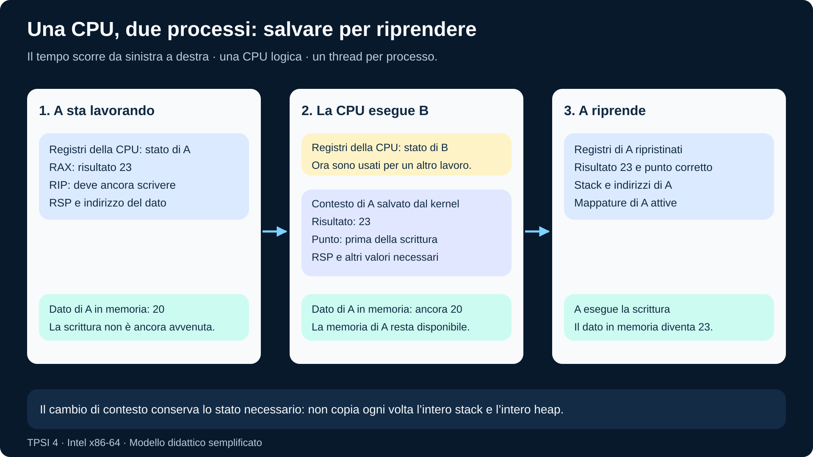
</p>
<p align="center"><em>Durante la pausa il risultato resta nel contesto salvato. Alla ripresa A ritrova registri e memoria coerenti e può completare la scrittura.</em></p>

<ol>
  <li><strong>A lavora:</strong> nei registri ci sono il risultato 23, il punto da cui proseguire e gli indirizzi necessari. Il dato in memoria vale ancora 20.</li>
  <li><strong>A viene sospeso:</strong> il kernel, con il supporto dell'hardware, conserva il contesto necessario nelle strutture e negli stack associati al thread. La CPU può usare i registri per B; i valori salvati di A restano disponibili in memoria.</li>
  <li><strong>A riprende:</strong> il sistema ripristina il suo stato e le mappature corrette. A ritrova il risultato 23, il proprio stack e il blocco da aggiornare. Può quindi completare la scrittura.</li>
</ol>

<p align="justify">Non basta ricordare soltanto “il processo stava facendo una somma”. Se perdiamo il risultato intermedio, non sappiamo che cosa scrivere; se perdiamo l'indirizzo, non sappiamo dove scriverlo; se perdiamo il punto di esecuzione, non sappiamo quale operazione compiere dopo. Il contesto unisce queste informazioni.</p>

<p align="justify">Il salvataggio non copia a ogni cambio tutto lo stack e tutto l'heap: i loro dati restano nella memoria gestita dal sistema. Vanno conservati lo stato necessario della CPU e la possibilità di accedere alla memoria corretta. La figura evidenzia pochi elementi, ma il sistema deve preservare anche gli altri registri e lo stato architetturale necessari.</p>

<p align="justify">Un'interruzione del timer o un'operazione che richiede attesa può portare il controllo al kernel. Lo scheduler decide quale attività pronta eseguire. Entrare nel kernel non comporta sempre cambiare processo; quando il cambio avviene, il lavoro di salvataggio e ripristino ha un costo.</p>

<p align="justify"><strong><span style="font-size: 1.15em;">&#10067;</span> Controlla il modello:</strong> durante la pausa di A, dove si trova il valore 23? Perché il blocco di A contiene ancora 20? Che cosa deve ritrovare A per completare la scrittura? Rileggi i tre pannelli della figura per motivare le risposte.</p>

<!-- figure:01-stati-processo -->
<p align="center">
  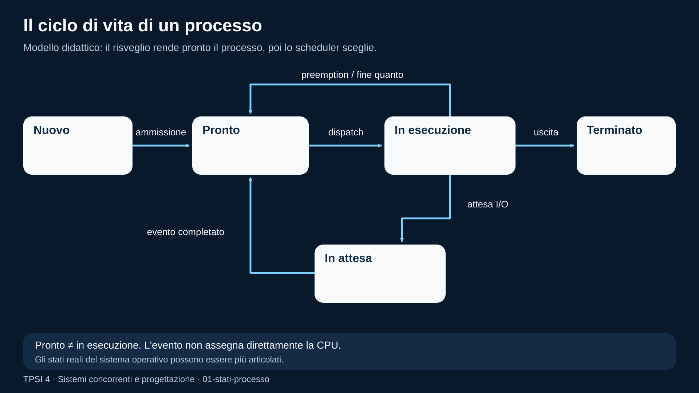
</p>
<p align="center"><em>Nuovo passa a pronto; lo scheduler porta pronto in esecuzione. Attesa di I/O porta in attesa; l&#x27;evento riporta a pronto. La preemption riporta il processo da in esecuzione a pronto; l&#x27;uscita porta a terminato.</em></p>

## Risorse private e risorse condivise

<p align="justify">Una domanda fondamentale è: <strong>quale stato appartiene a una sola attività e quale è visibile a più attività?</strong></p>

<p align="justify">Con processi separati, lo spazio di indirizzamento è normalmente isolato. Dopo una creazione con <code>fork</code>, padre e figlio osservano inizialmente valori equivalenti, ma le modifiche ordinarie alla memoria di uno non diventano automaticamente modifiche nella memoria dell'altro.</p>

<p align="justify">Con più thread nello stesso processo, invece, sono tipicamente condivisi:</p>

<ul>
  <li>variabili globali;</li>
  <li>heap;</li>
  <li>descrittori e oggetti del processo;</li>
  <li>codice eseguibile.</li>
</ul>

<p align="justify">Ogni thread possiede almeno uno stack e un contesto di esecuzione separati.</p>

<table align="center">
<thead>
<tr>
<th>Elemento</th>
<th>Processi distinti</th>
<th>Thread dello stesso processo</th>
</tr>
</thead>
<tbody>
<tr>
<td>spazio di indirizzamento</td>
<td>isolato per impostazione predefinita</td>
<td>condiviso</td>
</tr>
<tr>
<td>stack</td>
<td>separato</td>
<td>separato per thread</td>
</tr>
<tr>
<td>heap</td>
<td>separato</td>
<td>condiviso</td>
</tr>
<tr>
<td>comunicazione</td>
<td>richiede un meccanismo IPC</td>
<td>può usare memoria condivisa</td>
</tr>
<tr>
<td>isolamento dei guasti</td>
<td>maggiore</td>
<td>minore</td>
</tr>
<tr>
<td>costo di coordinamento</td>
<td>spesso maggiore</td>
<td>spesso minore, ma più delicato</td>
</tr>
</tbody>
</table>

<p align="justify">L'isolamento riduce alcuni errori, ma rende necessaria una comunicazione esplicita. La condivisione facilita lo scambio di dati, ma può produrre race condition.</p>

<!-- figure:01-memoria-thread -->
<p align="center">
  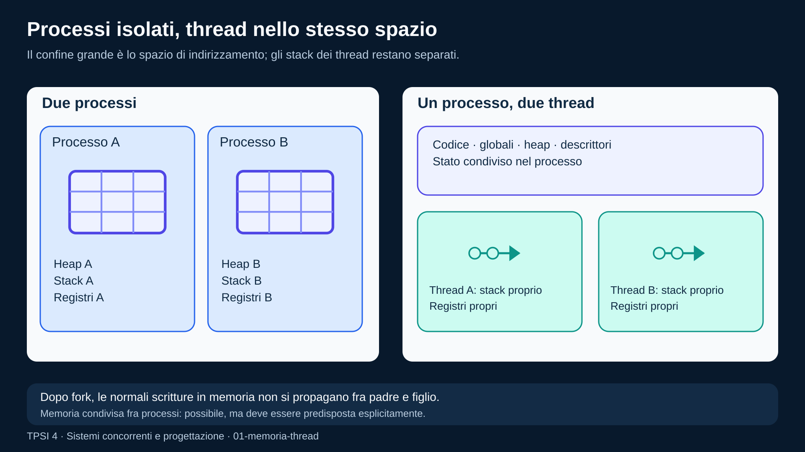
</p>
<p align="center"><em>Due processi hanno heap separati. Due thread di uno stesso processo condividono heap, globali e descrittori, ma conservano stack e registri propri.</em></p>

## Sequenziale, concorrente e parallelo

<p align="justify">I termini non sono sinonimi.</p>

### Esecuzione sequenziale

<!-- definition -->
<table align="center">
<tr><td>
&#10071; <strong>Importante</strong>
<p align="justify">Nell'<strong>esecuzione sequenziale</strong> una sola attività logica avanza alla volta secondo un ordine determinato dal programma.</p>
</td></tr>
</table>
<!-- /definition -->

```text
A1 -> A2 -> A3 -> B1 -> B2
```

### Esecuzione concorrente

<!-- definition -->
<table align="center">
<tr><td>
&#10071; <strong>Importante</strong>
<p align="justify">Nell'<strong>esecuzione concorrente</strong> più attività sono in corso nello stesso intervallo di tempo.</p>
</td></tr>
</table>
<!-- /definition -->

<p align="justify">Su una sola CPU possono alternarsi:</p>

```text
A1 -> B1 -> A2 -> B2 -> A3
```

<p align="justify">La concorrenza riguarda la struttura e la possibilità di avanzamento indipendente.</p>

### Esecuzione parallela

<!-- definition -->
<table align="center">
<tr><td>
&#10071; <strong>Importante</strong>
<p align="justify">Nell'<strong>esecuzione parallela</strong> due o più attività eseguono realmente istruzioni nello stesso istante su unità di calcolo diverse.</p>
</td></tr>
</table>
<!-- /definition -->

```text
CPU 1: A1 -> A2 -> A3
CPU 2: B1 -> B2 -> B3
```

<p align="justify">Il parallelismo può aumentare le prestazioni, ma soltanto se il lavoro può essere suddiviso e il costo di comunicazione e sincronizzazione non annulla il beneficio.</p>

### Domanda di controllo

<p align="justify">Un programma con due thread su un computer a singolo core può essere concorrente? Sì. Può alternare i thread anche se non li esegue simultaneamente.</p>

<!-- figure:01-concorrenza-parallelismo -->
<p align="center">
  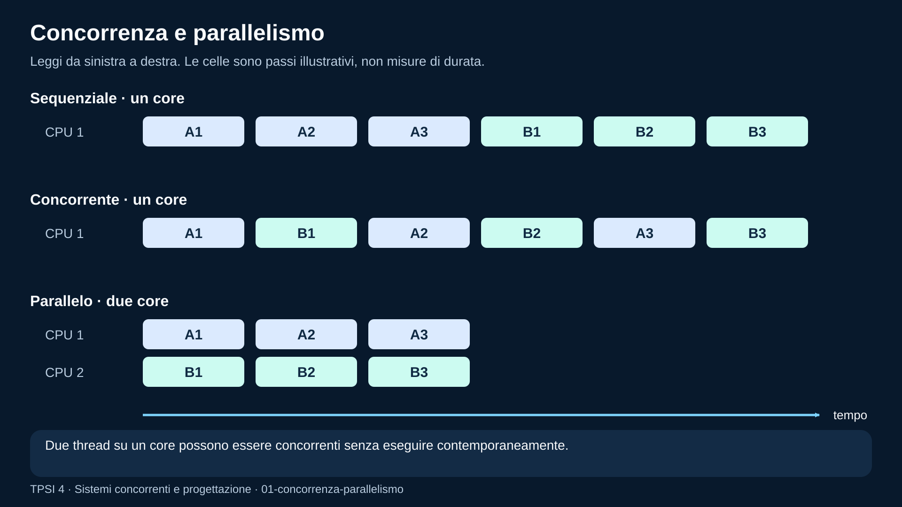
</p>
<p align="center"><em>Sequenziale: A termina prima di B. Concorrente su un core: A e B alternano i passi. Parallelo su due core: A e B eseguono passi nello stesso intervallo.</em></p>

## Gerarchia dei processi in Linux

<p align="justify">I processi formano relazioni di creazione. Un processo può creare un figlio; il figlio può crearne altri. Per osservare PID, PPID e comando:</p>

```bash
ps -e -o pid,ppid,state,command
```

<p align="justify">Per una vista ad albero, quando disponibile:</p>

```bash
pstree -p
```

<p align="justify">L'albero non implica che il padre controlli ogni istruzione del figlio. Indica una relazione utile per creazione, attesa, ereditarietà di alcune risorse e raccolta dello stato di terminazione.</p>

## Creazione di processi: `fork`, `exec` e `wait`

<p align="justify">In ambiente POSIX tre operazioni hanno ruoli distinti.</p>

### `fork`

<!-- definition -->
<table align="center">
<tr><td>
&#10071; <strong>Importante</strong>
<p align="justify"><strong><code>fork()</code></strong> crea un nuovo processo.</p>
</td></tr>
</table>
<!-- /definition -->

<p align="justify">Dopo la chiamata esistono due flussi che proseguono dall'istruzione successiva:</p>

<ul>
  <li>nel padre, il valore di ritorno è il PID del figlio;</li>
  <li>nel figlio, il valore di ritorno è <code>0</code>;</li>
  <li>in caso di errore, il padre riceve <code>-1</code> e il figlio non viene creato.</li>
</ul>

<p align="justify">La distinzione deve essere controllata esplicitamente.</p>

### `exec`

<!-- definition -->
<table align="center">
<tr><td>
&#10071; <strong>Importante</strong>
<p align="justify">La famiglia <strong><code>exec</code></strong> sostituisce il programma eseguito dal processo corrente.</p>
</td></tr>
</table>
<!-- /definition -->

<p align="justify">Se la chiamata riesce, il codice successivo alla <code>exec</code> non viene eseguito, perché il processo sta eseguendo un nuovo programma.</p>

### `wait` e `waitpid`

<!-- definition -->
<table align="center">
<tr><td>
&#10071; <strong>Importante</strong>
<p align="justify">Il padre usa <code>wait</code> o <code>waitpid</code> per attendere o raccogliere lo stato di un figlio. Se il figlio termina e il padre non ne raccoglie lo stato, resta temporaneamente un record chiamato comunemente <strong>zombie</strong>.</p>
</td></tr>
</table>
<!-- /definition -->

<p align="justify">Collegamenti:</p>

<ul>
  <li><a href="https://github.com/TheBitPoets/2cornot2c/blob/main/LINUX_PROGRAMMING.md#creare-un-processo">Creare un processo</a></li>
  <li><a href="https://github.com/TheBitPoets/2cornot2c/blob/main/LINUX_PROGRAMMING.md#fork-exec"><code>fork()</code> e <code>exec()</code></a></li>
  <li><a href="https://github.com/TheBitPoets/2cornot2c/blob/main/LINUX_PROGRAMMING.md#aspettare-la-terminazione-di-un-processo">Aspettare la terminazione di un processo</a></li>
  <li><a href="https://github.com/TheBitPoets/2cornot2c/blob/main/LINUX_PROGRAMMING.md#processi-zombie">Processi zombie</a></li>
</ul>

<!-- figure:01-fork-exec-wait -->
<p align="center">
  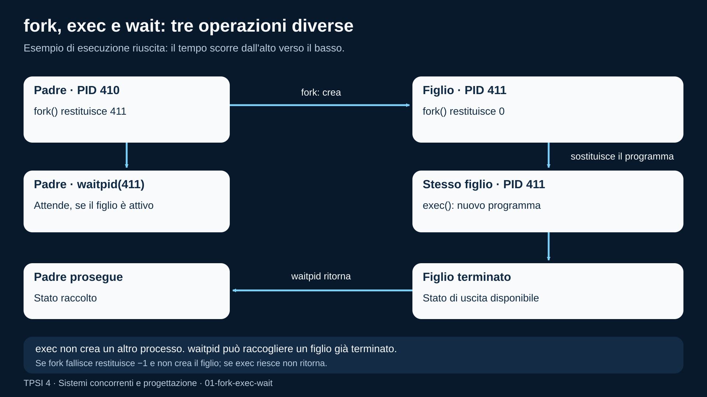
</p>
<p align="center"><em>fork crea un figlio con un PID nuovo; exec cambia il programma del figlio mantenendone il PID; waitpid nel padre raccoglie lo stato dopo la terminazione del figlio.</em></p>

## Esempio C originale: padre e figlio con uscita controllata

```c
#include <errno.h>
#include <stdio.h>
#include <stdlib.h>
#include <sys/types.h>
#include <sys/wait.h>
#include <unistd.h>

int main(void) {
    pid_t child = fork();

    if (child < 0) {
        perror("fork");
        return EXIT_FAILURE;
    }

    if (child == 0) {
        puts("figlio: lavoro completato");
        return 7;
    }

    int status = 0;
    if (waitpid(child, &status, 0) < 0) {
        perror("waitpid");
        return EXIT_FAILURE;
    }

    if (WIFEXITED(status)) {
        printf("padre: codice del figlio = %d\n", WEXITSTATUS(status));
    } else {
        puts("padre: il figlio non e terminato normalmente");
    }

    return EXIT_SUCCESS;
}
```

<p align="justify">Osservazioni:</p>

<ul>
  <li>il ramo figlio termina con codice <code>7</code>;</li>
  <li>il padre non interpreta direttamente <code>status</code> come codice di uscita;</li>
  <li>le macro <code>WIFEXITED</code> e <code>WEXITSTATUS</code> verificano e decodificano lo stato;</li>
  <li>l'ordine delle prime stampe può cambiare in esempi più complessi, ma il padre stampa il risultato dopo <code>waitpid</code>.</li>
</ul>

<p align="justify">Compilazione:</p>

```bash
gcc -Wall -Wextra -Wpedantic -std=c17 process_wait.c -o process_wait
```

## Da processo a thread

<!-- definition -->
<table align="center">
<tr><td>
&#10071; <strong>Importante</strong>
<p align="justify">Un <strong>thread</strong> è un flusso di esecuzione all'interno di un processo.</p>
</td></tr>
</table>
<!-- /definition -->

<p align="justify">Più thread possono lavorare sugli stessi oggetti in memoria.</p>

<p align="justify">Usare thread può essere conveniente quando:</p>

<ul>
  <li>le attività condividono molti dati;</li>
  <li>si desidera mantenere reattiva un'applicazione;</li>
  <li>il lavoro può essere suddiviso;</li>
  <li>il costo della comunicazione tra processi sarebbe eccessivo.</li>
</ul>

<p align="justify">Usare processi può essere preferibile quando:</p>

<ul>
  <li>serve isolamento;</li>
  <li>i componenti hanno cicli di vita indipendenti;</li>
  <li>un guasto non deve corrompere tutto lo stato;</li>
  <li>si vogliono applicare permessi e limiti distinti.</li>
</ul>

<p align="justify">Collegamenti alla dispensa:</p>

<ul>
  <li><a href="https://github.com/TheBitPoets/2cornot2c/blob/main/LINUX_PROGRAMMING.md#i-thread">I Thread</a></li>
  <li><a href="https://github.com/TheBitPoets/2cornot2c/blob/main/LINUX_PROGRAMMING.md#creazione-di-un-thread">Creazione di un thread</a></li>
  <li><a href="https://github.com/TheBitPoets/2cornot2c/blob/main/LINUX_PROGRAMMING.md#passare-dati-a-un-thread">Passare dati a un thread</a></li>
  <li><a href="https://github.com/TheBitPoets/2cornot2c/blob/main/LINUX_PROGRAMMING.md#attendere-la-terminazione-dei-thread">Attendere la terminazione dei thread</a></li>
  <li><a href="https://github.com/TheBitPoets/2cornot2c/blob/main/LINUX_PROGRAMMING.md#processi-vs-thread">Processi vs Thread</a></li>
</ul>

## Esempio concettuale POSIX thread

<p align="justify">Il frammento seguente mostra la forma essenziale. La sincronizzazione verrà approfondita nel modulo successivo.</p>

```c
#include <pthread.h>
#include <stdio.h>
#include <stdlib.h>

typedef struct {
    int first;
    int last;
    long result;
} SumTask;

static void *sum_range(void *raw_task) {
    SumTask *task = raw_task;
    long total = 0;

    for (int value = task->first; value <= task->last; ++value) {
        total += value;
    }

    task->result = total;
    return NULL;
}

int main(void) {
    SumTask left = {.first = 1, .last = 500000, .result = 0};
    SumTask right = {.first = 500001, .last = 1000000, .result = 0};
    pthread_t left_thread;
    pthread_t right_thread;

    if (pthread_create(&left_thread, NULL, sum_range, &left) != 0 ||
        pthread_create(&right_thread, NULL, sum_range, &right) != 0) {
        fputs("errore nella creazione dei thread\n", stderr);
        return EXIT_FAILURE;
    }

    pthread_join(left_thread, NULL);
    pthread_join(right_thread, NULL);

    printf("%ld\n", left.result + right.result);
    return EXIT_SUCCESS;
}
```

<p align="justify">Compilazione manuale:</p>

```bash
gcc -Wall -Wextra -Wpedantic -std=c17 -pthread sum_threads.c -o sum_threads
```

<p align="justify">Ogni thread scrive in un campo diverso. Il <code>join</code> garantisce che i risultati siano pronti prima della somma finale.</p>

## Confronto Java: `Runnable` e `join`

```java
final class SumTask implements Runnable {
    private final int first;
    private final int last;
    private long result;

    SumTask(int first, int last) {
        this.first = first;
        this.last = last;
    }

    @Override
    public void run() {
        long total = 0;
        for (int value = first; value <= last; value++) {
            total += value;
        }
        result = total;
    }

    long result() {
        return result;
    }
}

public final class ParallelSum {
    public static void main(String[] args) throws InterruptedException {
        SumTask left = new SumTask(1, 500_000);
        SumTask right = new SumTask(500_001, 1_000_000);

        Thread leftThread = new Thread(left, "sum-left");
        Thread rightThread = new Thread(right, "sum-right");

        leftThread.start();
        rightThread.start();
        leftThread.join();
        rightThread.join();

        System.out.println(left.result() + right.result());
    }
}
```

<p align="justify">Confronto:</p>

<table align="center">
<thead>
<tr>
<th>Concetto</th>
<th>POSIX C</th>
<th>Java</th>
</tr>
</thead>
<tbody>
<tr>
<td>funzione eseguita</td>
<td>funzione <code>void *(*)(void *)</code></td>
<td><code>Runnable.run()</code></td>
</tr>
<tr>
<td>handle</td>
<td><code>pthread_t</code></td>
<td>oggetto <code>Thread</code></td>
</tr>
<tr>
<td>avvio</td>
<td><code>pthread_create</code></td>
<td><code>start</code></td>
</tr>
<tr>
<td>attesa</td>
<td><code>pthread_join</code></td>
<td><code>join</code></td>
</tr>
<tr>
<td>passaggio dati</td>
<td>struttura e puntatore</td>
<td>campi dell'oggetto</td>
</tr>
<tr>
<td>errore</td>
<td>codice di ritorno</td>
<td>eccezioni e stato</td>
</tr>
</tbody>
</table>

<p align="justify">Il runner automatico Java della piattaforma è ancora pianificato. Questo esempio è quindi materiale di studio o laboratorio con correzione docente.</p>

## Descrivere la concorrenza con eventi e tracce

<p align="justify">Un programma concorrente non è descritto completamente da una sola sequenza globale. È utile individuare gli <strong>eventi</strong> importanti.</p>

<p align="justify">Esempio con due attività:</p>

```text
A1: legge x
A2: incrementa x
A3: scrive x

B1: legge x
B2: incrementa x
B3: scrive x
```

<p align="justify">All'interno di A vale l'ordine <code>A1 &lt; A2 &lt; A3</code>. All'interno di B vale <code>B1 &lt; B2 &lt; B3</code>. Fra eventi di thread diversi possono esistere molti interleaving.</p>

<p align="justify">Se <code>x</code> vale inizialmente <code>0</code>, entrambi possono leggere <code>0</code> e poi scrivere <code>1</code>. Due incrementi logici producono un solo incremento osservabile. Questo è un esempio di race condition.</p>

### Proprietà di sicurezza e di progresso

<!-- definition -->
<table align="center">
<tr><td>
&#10071; <strong>Importante</strong>
<p align="justify">Due tipi di proprietà di un programma concorrente:</p>
<ul>
  <li>Una proprietà di <strong>safety</strong> afferma che qualcosa di scorretto non deve accadere. Esempio: il saldo non deve diventare negativo.</li>
  <li>Una proprietà di <strong>liveness</strong> afferma che qualcosa di desiderato deve prima o poi accadere. Esempio: una richiesta accettata deve essere elaborata.</li>
</ul>
</td></tr>
</table>
<!-- /definition -->

### Invariante

<!-- definition -->
<table align="center">
<tr><td>
&#10071; <strong>Importante</strong>
<p align="justify">Un <strong>invariante</strong> è una proprietà che deve restare vera nei punti significativi dell'esecuzione.</p>
</td></tr>
</table>
<!-- /definition -->

<p align="justify">Per un buffer limitato di capacità <code>N</code>:</p>

```text
0 <= elementi_presenti <= N
```

<p align="justify">La progettazione della sincronizzazione serve anche a preservare invarianti in tutti gli interleaving consentiti.</p>

## Errori frequenti

### Confondere `fork` con una normale funzione

<p align="justify">Dopo una <code>fork</code> riuscita esistono due processi. Se entrambi eseguono codice non previsto, possono duplicare stampe, file o altre operazioni.</p>

### Dimenticare il ramo di errore

<p align="justify"><code>fork</code>, <code>waitpid</code> e le funzioni thread restituiscono errori. Ignorarli produce programmi che sembrano funzionare soltanto nelle condizioni migliori.</p>

### Usare `sleep` come sincronizzazione

<p align="justify">Un ritardo non dimostra che un'altra attività abbia completato il lavoro. La macchina o il carico possono cambiare. È necessario un meccanismo di sincronizzazione esplicito.</p>

### Chiamare `run()` invece di `start()` in Java

<p align="justify">Invocare direttamente <code>run()</code> esegue il metodo nel thread corrente. <code>start()</code> crea il nuovo flusso e poi provoca l'esecuzione di <code>run()</code>.</p>

### Condividere una variabile senza contratto

<p align="justify">La condivisione non è sbagliata in sé. È sbagliato non stabilire chi può leggere o scrivere, quando e con quale sincronizzazione.</p>

### Credere che un output osservato sia l'unico possibile

<p align="justify">Una singola esecuzione non esplora tutti gli interleaving. Un bug concorrente può comparire raramente.</p>

## Esercizi graduati

### Livello A — osserva

<ol>
  <li>Avvia <code>sleep 30</code> in background e usa <code>ps</code> per individuarne PID e PPID.</li>
  <li>Esegui due volte lo stesso programma e verifica che i PID siano diversi.</li>
  <li>Compila l'esempio <code>process_wait.c</code> e annota quali righe appartengono al padre e quali al figlio.</li>
  <li>Disegna lo schema delle risorse private e condivise per due processi e per due thread.</li>
</ol>

### Livello B — modifica

<ol>
  <li>Modifica l'esempio padre-figlio affinché il figlio restituisca un codice letto da input.</li>
  <li>Crea due figli e attendili con due chiamate a <code>waitpid</code>.</li>
  <li>Nel programma POSIX thread, dividi l'intervallo in quattro parti.</li>
  <li>Nell'esempio Java, assegna nomi significativi ai thread e stampali con <code>Thread.currentThread().getName()</code>.</li>
</ol>

### Livello C — scrivi

<ol>
  <li>Scrivi un programma che crea un figlio; il figlio stampa i numeri pari e il padre i numeri dispari. Spiega perché l'ordine globale non è deterministico.</li>
  <li>Scrivi una funzione che costruisce una tabella con PID, PPID e ruolo del processo.</li>
  <li>Implementa una somma parallela con un numero di segmenti scelto da riga di comando.</li>
  <li>Realizza in Java due <code>Runnable</code>: uno conta le vocali e uno le consonanti della stessa stringa immutabile.</li>
</ol>

### Livello D — esegui il debug

<ol>
  <li>Correggi un programma che non distingue il valore di ritorno di <code>fork</code>.</li>
  <li>Individua perché una <code>printf</code> eseguita prima di <code>fork</code> può apparire più volte quando l'output è bufferizzato e non ancora scaricato.</li>
  <li>Correggi un programma Java che invoca <code>run()</code> e poi sostiene di usare due thread.</li>
  <li>Analizza una somma concorrente che usa un unico contatore condiviso senza sincronizzazione.</li>
</ol>

### Livello E — mini-progetto

<p align="justify">Costruisci un piccolo orchestratore che avvia tre programmi distinti, raccoglie il loro stato di uscita e produce un riepilogo. Definisci prima:</p>

<ul>
  <li>formato dei comandi;</li>
  <li>gestione degli errori;</li>
  <li>timeout previsto;</li>
  <li>significato dei codici di uscita;</li>
  <li>eventi da registrare.</li>
</ul>

### Livello F — progetto integrato

<p align="justify">Progetta un sistema di elaborazione di file composto da:</p>

<ul>
  <li>processo coordinatore;</li>
  <li>processi worker;</li>
  <li>protocollo di assegnazione dei file;</li>
  <li>gestione del worker terminato in errore;</li>
  <li>log strutturato;</li>
  <li>test dei casi limite.</li>
</ul>

<p align="justify">In questa fase è sufficiente produrre requisiti, diagramma e prototipo minimo. La comunicazione completa verrà sviluppata nel modulo successivo.</p>

## Laboratorio assegnabile: calcolo con `fork` e pipe

<p align="justify">Activity collegata:</p>

```text
tpsi4-activity-c-fork-pipe-square-001
```

<p align="justify">Obiettivo: il processo padre legge un intero, il figlio ne calcola il quadrato e invia il risultato al padre attraverso una pipe. Il padre attende il figlio e stampa soltanto il risultato ricevuto.</p>

<p align="justify">Il laboratorio verifica:</p>

<ul>
  <li>distinzione padre/figlio;</li>
  <li>chiusura delle estremità non usate della pipe;</li>
  <li>lettura e scrittura con controllo degli errori;</li>
  <li>uso di <code>waitpid</code>;</li>
  <li>output deterministico compatibile con il grader C esistente.</li>
</ul>

## Verifica rapida

<ol>
  <li>Qual è la differenza tra programma e processo?</li>
  <li>Un processo pronto sta necessariamente usando la CPU?</li>
  <li>Perché due processi non condividono automaticamente le normali variabili?</li>
  <li>Che cosa restituisce <code>fork()</code> nel figlio?</li>
  <li>Che cosa accade al processo quando una <code>exec</code> riesce?</li>
  <li>Perché il padre dovrebbe eseguire <code>wait</code> o <code>waitpid</code>?</li>
  <li>Qual è la differenza tra concorrenza e parallelismo?</li>
  <li>Quali aree sono normalmente condivise da thread dello stesso processo?</li>
  <li>Che cosa rappresenta un interleaving?</li>
  <li>Fornisci un esempio di proprietà di safety e uno di liveness.</li>
</ol>

## Sintesi inclusiva

<ul>
  <li>Un programma è un file; un processo è quel programma mentre viene eseguito.</li>
  <li>Ogni processo ha un PID e può avere un processo padre.</li>
  <li>Il contesto ricorda da dove riprendere; lo spazio di indirizzamento definisce gli indirizzi del processo e le sue mappature.</li>
  <li>Lo stack sostiene le chiamate di funzione; l'heap serve alle allocazioni dinamiche.</li>
  <li>I descrittori fanno riferimento alle risorse aperte; le credenziali identificano per conto di chi il processo agisce.</li>
  <li>Il sistema operativo alterna processi pronti e gestisce quelli in attesa.</li>
  <li>Processi distinti hanno memoria separata; i thread dello stesso processo condividono più stato.</li>
  <li>Concorrente significa che più attività avanzano nello stesso intervallo; parallelo significa che eseguono nello stesso istante.</li>
  <li><code>fork</code> crea un figlio, <code>exec</code> sostituisce il programma, <code>wait</code> raccoglie la terminazione.</li>
  <li>I thread sono più leggeri, ma la memoria condivisa richiede regole precise.</li>
  <li>L'ordine tra attività concorrenti può cambiare.</li>
  <li>Una soluzione corretta deve funzionare per tutti gli ordini consentiti, non soltanto per quello osservato una volta.</li>
</ul>

## Collegamento al modulo successivo

<p align="justify">Questo modulo introduce le attività concorrenti e il loro stato. Il modulo <a href="02_COMUNICAZIONE_E_SINCRONIZZAZIONE.md">Comunicazione e sincronizzazione</a> affronta come scambiare dati, proteggere invarianti e risolvere i problemi classici di coordinamento.</p>

## Fonti e note di revisione

<ul>
  <li>Riferimento curricolare: indice pubblico del volume 2, usato solo per verificare la copertura.</li>
  <li>Fonte tecnica remota: <a href="https://github.com/TheBitPoets/2cornot2c/blob/main/LINUX_PROGRAMMING.md#linux-programming">LINUX_PROGRAMMING.md nel repository 2cornot2c</a>, a partire da <code>Linux Programming</code>.</li>
  <li>Identità, autorizzazioni e relazioni: <a href="https://man7.org/linux/man-pages/man2/getpid.2.html">getpid(2)</a>, <a href="https://man7.org/linux/man-pages/man7/credentials.7.html">credentials(7)</a> e <a href="https://man7.org/linux/man-pages/man2/wait.2.html">wait(2)</a>.</li>
  <li>Contesto e chiamate di funzione: manuale GDB, <a href="https://sourceware.org/gdb/current/onlinedocs/gdb.html/Registers.html">Registers</a> e <a href="https://sourceware.org/gdb/current/onlinedocs/gdb.html/Frames.html">Stack Frames</a>.</li>
  <li>Architettura di riferimento: <a href="https://www.intel.com/content/www/us/en/developer/articles/technical/intel-sdm.html">Intel 64 and IA-32 Architectures Software Developer's Manuals</a>, volume 1 per registri e chiamate, volume 2 per istruzioni e volume 3 per memoria e interruzioni. Gli schemi selezionano gli elementi utili alla lezione.</li>
  <li>Contesto nel kernel: <a href="https://docs.kernel.org/arch/x86/kernel-stacks.html">Linux, Kernel Stacks</a> e <a href="https://github.com/torvalds/linux/blob/master/arch/x86/entry/entry_64.S">codice di ingresso e cambio del contesto x86-64</a>. La sequenza descrive il comportamento complessivo senza riprodurre l'implementazione del kernel.</li>
  <li>Collegamento fra strutture del processo e tabelle delle pagine: <a href="https://docs.kernel.org/mm/page_tables.html">Linux, Page Tables</a>.</li>
  <li>Memoria e allocazioni: <a href="https://man7.org/linux/man-pages/man5/proc_pid_maps.5.html">proc_pid_maps(5)</a> e <a href="https://man7.org/linux/man-pages/man3/malloc.3.html">malloc(3)</a>. La descrizione di stack e heap è un modello didattico, non una disposizione universale della memoria.</li>
  <li>Risorse aperte: <a href="https://man7.org/linux/man-pages/man2/open.2.html">open(2)</a> e <a href="https://man7.org/linux/man-pages/man5/proc_pid_fd.5.html">proc_pid_fd(5)</a>.</li>
  <li>Stato e distinzione processo/thread: <a href="https://man7.org/linux/man-pages/man5/proc_pid_status.5.html">proc_pid_status(5)</a> e <a href="https://man7.org/linux/man-pages/man7/pthreads.7.html">pthreads(7)</a>.</li>
  <li>Tutti gli esempi di questo modulo sono formulati ex novo per il pacchetto.</li>
  <li>Gli esempi della fonte Linux con intestazioni di copyright esterne non devono essere duplicati nelle activity senza averne verificato la licenza.</li>
  <li>Stato: <code>draft</code>; revisione docente richiesta prima della pubblicazione agli studenti.</li>
</ul>
