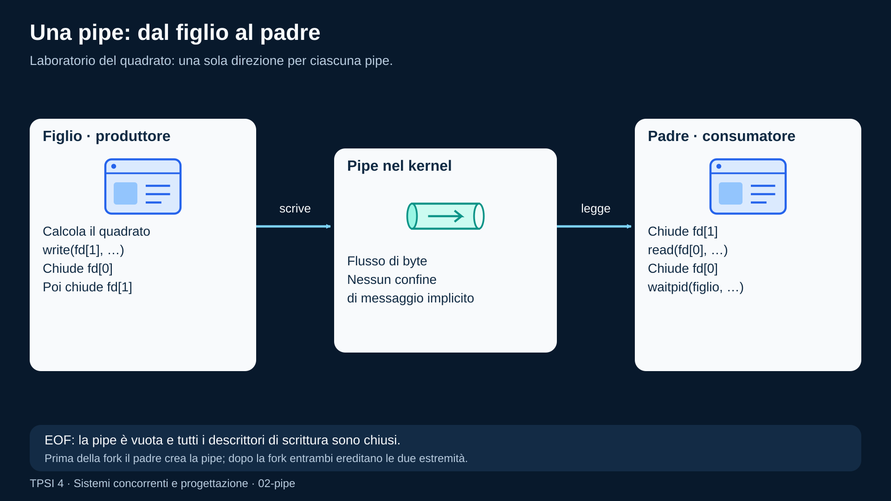
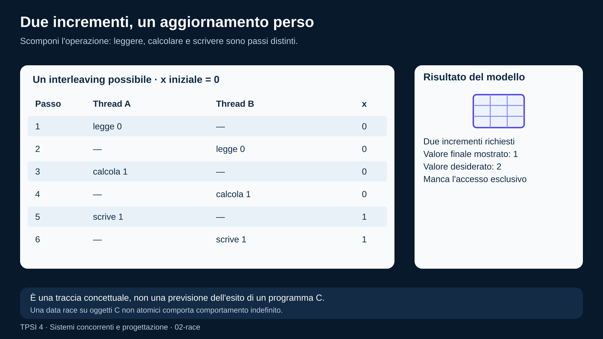
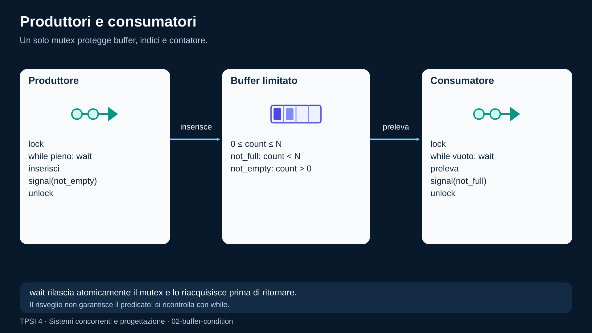
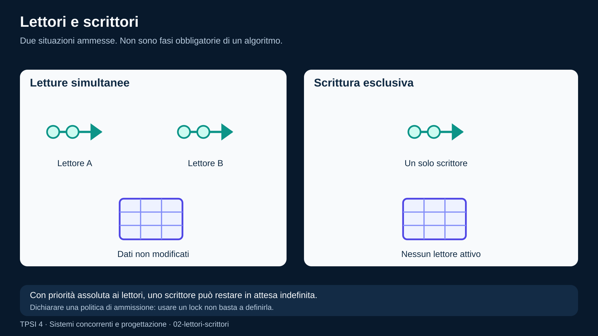
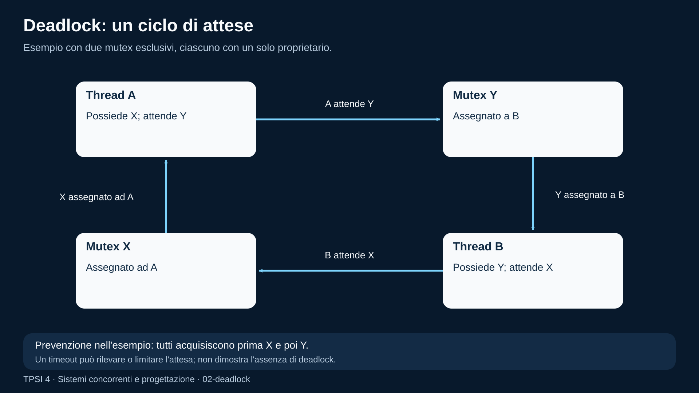
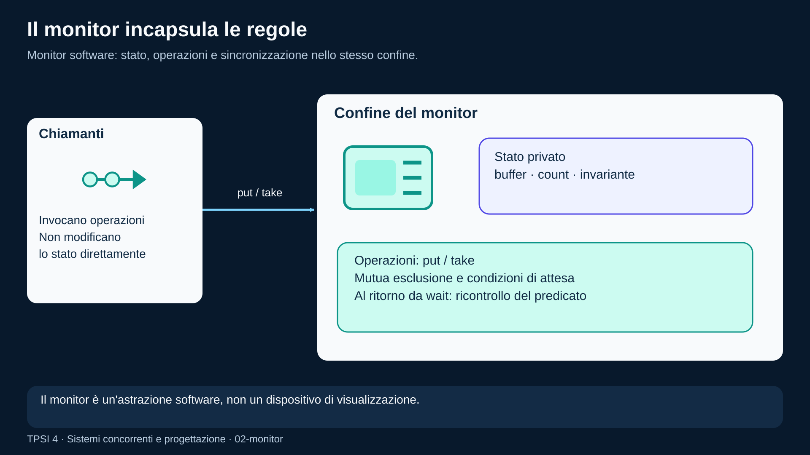

# Comunicazione e sincronizzazione

<!--
content_id: tpsi4-content-comunicazione-sincronizzazione
status: draft
curriculum_reference: tpsi4-curriculum-hoepli-volume-2
technical_sources:
  - tpsi4-source-linux-programming
transformation: original-course-material
-->

## In questa unità impareremo

<!-- visual-orientation -->
<table align="center">
<tr>
<td>
<details>
<summary>&#129517; <strong>Orientamento della sezione</strong></summary>

<p align="justify">
<strong><span style="font-size: 1.15em;">&#128506;</span> Contesto:</strong>
Distingue comunicazione e sincronizzazione e sviluppa memoria condivisa, messaggi, race, mutex, semafori, condition, deadlock, monitor e problemi classici.
</p>

<p align="justify">
<strong><span style="font-size: 1.15em;">&#128736;</span> Prerequisiti:</strong>
Processi, thread, interleaving, invarianti e gestione degli errori.
</p>

<p align="justify">
<strong><span style="font-size: 1.15em;">&#127919;</span> Obiettivi:</strong>
Progettare un semplice protocollo IPC, riconoscere e correggere race/deadlock e confrontare primitive POSIX e Java.
</p>

<p align="justify">
<strong><span style="font-size: 1.15em;">&#128257;</span> Richiamo:</strong>
Riprendere risorse private/condivise, fork, wait e proprietà safety/liveness.
</p>

<p align="justify">
<strong><span style="font-size: 1.15em;">&#128064;</span> Anticipazione:</strong>
I problemi tecnici verranno trasformati in requisiti e criteri verificabili.
</p>

<p align="justify">
<strong><span style="font-size: 1.15em;">&#10145;</span> Prossimo passo:</strong>
Completare il laboratorio pipe e progettare un buffer produttore/consumatore.
</p>

<p align="justify">
<strong><span style="font-size: 1.15em;">&#128279;</span> Rimando:</strong>
Modulo originale; sezioni Linux su segnali, thread, mutex, semafori, condition e deadlock. <a href="#fonti-e-note-di-revisione">Fonti e note della lezione</a>; <a href="COVERAGE.md">matrice di copertura</a>.
</p>

</details>
</td>
</tr>
</table>

<p align="justify">Al termine dell'unità lo studente dovrà saper:</p>

<ul>
  <li>distinguere comunicazione, condivisione e sincronizzazione;</li>
  <li>scegliere tra memoria condivisa e scambio di messaggi in casi semplici;</li>
  <li>riconoscere una race condition e una sezione critica;</li>
  <li>spiegare il ruolo di mutex, semafori e variabili di condizione;</li>
  <li>modellare produttori/consumatori e lettori/scrittori;</li>
  <li>riconoscere le condizioni che rendono possibile un deadlock;</li>
  <li>spiegare il concetto di monitor;</li>
  <li>progettare un piccolo protocollo di messaggi;</li>
  <li>confrontare primitive POSIX e classi Java equivalenti.</li>
</ul>

## Prerequisiti

<p align="justify">Prima di iniziare è necessario conoscere:</p>

<ul>
  <li>processi, thread e interleaving;</li>
  <li><code>fork</code>, <code>wait</code> e gestione degli errori;</li>
  <li>strutture, array e puntatori in C;</li>
  <li>proprietà di safety, liveness e invariante;</li>
  <li>nozioni di classi e oggetti per la traccia Java.</li>
</ul>

## Problema iniziale: una coda condivisa

<p align="justify">Un thread acquisisce misure e le inserisce in una coda. Un secondo thread le salva su disco.</p>

<p align="justify">Le operazioni logiche sono:</p>

```text
produttore: crea dato -> inserisce dato
consumatore: estrae dato -> salva dato
```

<p align="justify">Se la coda è limitata, emergono almeno tre vincoli:</p>

<ol>
  <li>il produttore non deve inserire quando la coda è piena;</li>
  <li>il consumatore non deve estrarre quando la coda è vuota;</li>
  <li>produttore e consumatore non devono modificare contemporaneamente la struttura interna della coda.</li>
</ol>

<p align="justify">Il terzo vincolo riguarda la <strong>mutua esclusione</strong>. I primi due riguardano l'<strong>attesa di una condizione</strong>. Una soluzione corretta deve trattare entrambi.</p>

## Comunicazione e sincronizzazione non sono la stessa cosa

<p align="justify">La <strong>comunicazione</strong> trasferisce informazione. La <strong>sincronizzazione</strong> impone vincoli sull'ordine o sull'accesso.</p>

<p align="justify">Esempi:</p>

<ul>
  <li>una pipe trasferisce byte da un processo a un altro;</li>
  <li>un mutex impedisce a più thread di entrare insieme in una sezione critica;</li>
  <li>una variabile di condizione permette di aspettare che lo stato diventi adatto;</li>
  <li>un semaforo può rappresentare risorse disponibili e, in alcuni casi, anche eventi.</li>
</ul>

<p align="justify">Un meccanismo può contribuire a entrambi gli scopi, ma la progettazione deve indicare chiaramente quale problema risolve.</p>

## Due modelli principali

### Memoria condivisa

<p align="justify">Le attività accedono allo stesso stato. È necessario stabilire:</p>

<ul>
  <li>quali dati sono condivisi;</li>
  <li>quale operazione deve essere atomica;</li>
  <li>quale primitiva protegge ogni invariante;</li>
  <li>chi possiede la responsabilità di inizializzazione e distruzione.</li>
</ul>

<p align="justify">Vantaggio: lo scambio può essere efficiente.</p>

<p align="justify">Rischio: gli errori di sincronizzazione possono corrompere lo stato in modo intermittente.</p>

### Scambio di messaggi

<p align="justify">Un'attività invia un messaggio e un'altra lo riceve. Il canale può essere:</p>

<ul>
  <li>unidirezionale o bidirezionale;</li>
  <li>sincrono o asincrono;</li>
  <li>affidabile o soggetto a perdita;</li>
  <li>locale o di rete;</li>
  <li>a byte o a messaggi strutturati.</li>
</ul>

<p align="justify">Vantaggio: la proprietà dei dati è più esplicita.</p>

<p align="justify">Rischio: serve progettare un protocollo, gestire limiti, errori e messaggi incompleti.</p>

## Comunicazione tra processi con pipe

<p align="justify">Una pipe POSIX ordinaria è un canale di byte con due estremità:</p>

```text
fd[1] -> scrittura
fd[0] -> lettura
```

<p align="justify">Dopo <code>fork</code>, padre e figlio ereditano i descrittori. Ogni processo deve chiudere le estremità che non usa. Se mantiene aperto un descrittore di scrittura inutilmente, il lettore potrebbe non osservare la fine del flusso quando se l'aspetta.</p>

### Esempio originale: un messaggio strutturato

```c
#include <errno.h>
#include <stdint.h>
#include <stdio.h>
#include <stdlib.h>
#include <sys/types.h>
#include <sys/wait.h>
#include <unistd.h>

typedef struct {
    int32_t input;
    int32_t output;
} Message;

static int write_all(int fd, const void *buffer, size_t size) {
    const unsigned char *cursor = buffer;
    size_t written = 0;

    while (written < size) {
        ssize_t count = write(fd, cursor + written, size - written);
        if (count < 0) {
            if (errno == EINTR) {
                continue;
            }
            return -1;
        }
        written += (size_t)count;
    }
    return 0;
}

static int read_all(int fd, void *buffer, size_t size) {
    unsigned char *cursor = buffer;
    size_t read_bytes = 0;

    while (read_bytes < size) {
        ssize_t count = read(fd, cursor + read_bytes, size - read_bytes);
        if (count == 0) {
            return -1;
        }
        if (count < 0) {
            if (errno == EINTR) {
                continue;
            }
            return -1;
        }
        read_bytes += (size_t)count;
    }
    return 0;
}

int main(void) {
    int channel[2];
    if (pipe(channel) < 0) {
        perror("pipe");
        return EXIT_FAILURE;
    }

    pid_t child = fork();
    if (child < 0) {
        perror("fork");
        return EXIT_FAILURE;
    }

    if (child == 0) {
        close(channel[0]);
        Message message = {.input = 12, .output = 12 * 12};
        int result = write_all(channel[1], &message, sizeof message);
        close(channel[1]);
        return result == 0 ? EXIT_SUCCESS : EXIT_FAILURE;
    }

    close(channel[1]);
    Message received;
    int read_result = read_all(channel[0], &received, sizeof received);
    close(channel[0]);

    int status = 0;
    waitpid(child, &status, 0);

    if (read_result < 0 || !WIFEXITED(status) || WEXITSTATUS(status) != 0) {
        fputs("comunicazione non riuscita\n", stderr);
        return EXIT_FAILURE;
    }

    printf("%d -> %d\n", received.input, received.output);
    return EXIT_SUCCESS;
}
```

<p align="justify">Il ciclo <code>read_all</code> è necessario perché una singola <code>read</code> non costituisce un contratto generale di lettura completa per qualunque flusso di byte.</p>

<!-- figure:02-pipe -->
<p align="center">
  
</p>
<p align="center"><em>Dopo pipe e fork, il figlio scrive il quadrato su fd[1] e chiude fd[0]; il padre legge fd[0] e chiude fd[1]. I dati attraversano la pipe del kernel; waitpid raccoglie il figlio.</em></p>

## Segnali: notifiche, non contenitori generici

<p align="justify">Un segnale comunica principalmente che è avvenuto un evento. Non è il mezzo adatto per trasferire strutture dati complesse.</p>

<p align="justify">Collegamenti:</p>

<ul>
  <li><a href="https://github.com/TheBitPoets/2cornot2c/blob/main/LINUX_PROGRAMMING.md#segnali">Segnali</a></li>
  <li><a href="https://github.com/TheBitPoets/2cornot2c/blob/main/LINUX_PROGRAMMING.md#sigaction"><code>sigaction</code></a></li>
  <li><a href="https://github.com/TheBitPoets/2cornot2c/blob/main/LINUX_PROGRAMMING.md#signal-handling">Signal Handling</a></li>
</ul>

<p align="justify">Un gestore di segnale deve rispettare vincoli severi: molte funzioni di libreria non sono sicure in quel contesto. Una strategia comune è impostare un flag di tipo appropriato o scrivere su un descrittore predisposto, lasciando il lavoro complesso al normale flusso del programma.</p>

## Race condition

<p align="justify">Una race condition esiste quando il risultato dipende da un ordine di esecuzione non controllato tra accessi concorrenti.</p>

<p align="justify">Consideriamo l'operazione apparente:</p>

```c
counter++;
```

<p align="justify">Può essere scomposta concettualmente in:</p>

```text
leggi counter
calcola counter + 1
scrivi il nuovo valore
```

<p align="justify">Due thread possono leggere lo stesso valore e sovrascriversi. Il problema non è che l'ordine cambia: è che alcuni ordini violano la specifica.</p>

<p align="justify">Collegamento:</p>

<ul>
  <li><a href="https://github.com/TheBitPoets/2cornot2c/blob/main/LINUX_PROGRAMMING.md#race-conditions">Race Conditions</a></li>
</ul>

<!-- figure:02-race -->
<p align="center">
  
</p>
<p align="center"><em>Nel modello didattico A e B leggono entrambi zero, calcolano uno e scrivono uno. L&#x27;aggiornamento di un thread viene perso.</em></p>

## Sezione critica e invariante

<table align="center">
<tr><td>
<p align="justify">
<strong><span style="font-size: 1.15em;">&#128214;</span> Definizione:</strong>
Una <strong>sezione critica</strong> è una porzione di codice che accede a stato condiviso e deve rispettare una regola di coordinamento.</p>
</td></tr>
</table>

<p align="justify">Una progettazione corretta non parte dal mutex, ma dall'invariante.</p>

<p align="justify">Esempio conto corrente:</p>

```text
saldo >= limite_minimo
```

<p align="justify">L'operazione di prelievo logica comprende controllo e aggiornamento. Proteggere soltanto la scrittura non basta:</p>

```text
controlla saldo
calcola nuovo saldo
scrivi saldo
```

<p align="justify">L'intera transazione che preserva l'invariante deve essere coordinata.</p>

## Mutex

<p align="justify">Un mutex rappresenta il possesso esclusivo di una risorsa logica. La regola essenziale è:</p>

```text
lock
  controlla e modifica lo stato protetto
unlock
```

<p align="justify">Collegamenti:</p>

<ul>
  <li><a href="https://github.com/TheBitPoets/2cornot2c/blob/main/LINUX_PROGRAMMING.md#mutex">Mutex</a></li>
  <li><a href="https://github.com/TheBitPoets/2cornot2c/blob/main/LINUX_PROGRAMMING.md#test-mutex-non-bloccanti">Test Mutex non bloccanti</a></li>
</ul>

### Esempio POSIX originale: contatore protetto

```c
#include <pthread.h>
#include <stdio.h>
#include <stdlib.h>

static long counter = 0;
static pthread_mutex_t counter_mutex = PTHREAD_MUTEX_INITIALIZER;

typedef struct {
    int repetitions;
} Task;

static void *increment(void *raw_task) {
    const Task *task = raw_task;

    for (int i = 0; i < task->repetitions; ++i) {
        pthread_mutex_lock(&counter_mutex);
        ++counter;
        pthread_mutex_unlock(&counter_mutex);
    }

    return NULL;
}

int main(void) {
    enum { THREADS = 4, REPETITIONS = 50000 };
    pthread_t workers[THREADS];
    Task task = {.repetitions = REPETITIONS};

    for (int i = 0; i < THREADS; ++i) {
        if (pthread_create(&workers[i], NULL, increment, &task) != 0) {
            return EXIT_FAILURE;
        }
    }

    for (int i = 0; i < THREADS; ++i) {
        pthread_join(workers[i], NULL);
    }

    printf("%ld\n", counter);
    pthread_mutex_destroy(&counter_mutex);
    return EXIT_SUCCESS;
}
```

<p align="justify">La soluzione è corretta ma non necessariamente ottimale. Acquisire un mutex per ogni singolo incremento crea contesa. Un miglioramento possibile consiste nell'accumulare localmente e aggiungere una sola volta il subtotale.</p>

## Java: `synchronized` e `Lock`

<p align="justify">Un blocco <code>synchronized</code> associa mutua esclusione e regole di visibilità a un monitor Java:</p>

```java
final class SafeCounter {
    private long value;

    synchronized void increment() {
        value++;
    }

    synchronized long value() {
        return value;
    }
}
```

<p align="justify">Una <code>ReentrantLock</code> rende esplicite acquisizione e rilascio:</p>

```java
import java.util.concurrent.locks.Lock;
import java.util.concurrent.locks.ReentrantLock;

final class SafeCounter {
    private final Lock lock = new ReentrantLock();
    private long value;

    void increment() {
        lock.lock();
        try {
            value++;
        } finally {
            lock.unlock();
        }
    }
}
```

<p align="justify">Il blocco <code>finally</code> evita di lasciare il lock acquisito quando il codice solleva un'eccezione.</p>

## Semafori

<p align="justify">Un semaforo contiene logicamente un contatore non negativo e due operazioni atomiche:</p>

<ul>
  <li>acquisizione: attende una disponibilità e la consuma;</li>
  <li>rilascio: restituisce una disponibilità e può risvegliare un'attività.</li>
</ul>

<p align="justify">Un semaforo con valore iniziale <code>N</code> può rappresentare <code>N</code> risorse equivalenti, per esempio posti disponibili.</p>

<p align="justify">Collegamento:</p>

<ul>
  <li><a href="https://github.com/TheBitPoets/2cornot2c/blob/main/LINUX_PROGRAMMING.md#semafori">Semafori</a></li>
</ul>

### Mutex e semaforo non sono intercambiabili per abitudine

<p align="justify">Un mutex esprime proprietà e mutua esclusione. In genere chi acquisisce deve anche rilasciare.</p>

<p align="justify">Un semaforo può esprimere quantità o eventi; un'attività può rilasciare una disponibilità prodotta da un'altra. Scegliere la primitiva in base al significato rende il programma più leggibile e verificabile.</p>

### Esempio Java: parcheggio limitato

```java
import java.util.concurrent.Semaphore;

final class ParkingLot {
    private final Semaphore spaces;

    ParkingLot(int capacity) {
        spaces = new Semaphore(capacity, true);
    }

    void enter() throws InterruptedException {
        spaces.acquire();
    }

    void leave() {
        spaces.release();
    }
}
```

<p align="justify">L'opzione di fairness può ridurre alcuni fenomeni di attesa indefinita, ma ha un costo e non sostituisce la progettazione dell'intero protocollo.</p>

<!-- figure:02-mutex-semaforo -->
<p align="center">
  
</p>
<p align="center"><em>Un mutex protegge l&#x27;accesso esclusivo allo stato ed è rilasciato dal proprietario. Un semaforo rappresenta disponibilità: acquisire consuma un permesso, rilasciare ne restituisce uno.</em></p>

## Variabili di condizione

<p align="justify">Una variabile di condizione permette a un thread di attendere finché lo stato protetto da un mutex può soddisfare una proprietà.</p>

<p align="justify">Schema POSIX:</p>

```text
lock(mutex)
while condizione_non_vera:
    wait(condition, mutex)
usa o modifica lo stato
unlock(mutex)
```

<p align="justify">La <code>wait</code> rilascia atomicamente il mutex mentre il thread dorme e lo riacquisisce prima di ritornare.</p>

<p align="justify">La condizione deve essere verificata in un ciclo <code>while</code>, non con un semplice <code>if</code>, perché:</p>

<ul>
  <li>il risveglio non garantisce che il thread sia l'unico interessato;</li>
  <li>un altro thread può modificare di nuovo lo stato prima dell'acquisizione;</li>
  <li>sono possibili risvegli senza che la condizione logica sia diventata vera.</li>
</ul>

<p align="justify">Collegamento:</p>

<ul>
  <li><a href="https://github.com/TheBitPoets/2cornot2c/blob/main/LINUX_PROGRAMMING.md#variabili-di-condizione">Variabili di condizione</a></li>
</ul>

<p align="justify">In Java, <code>Condition.await()</code> e <code>Condition.signal()</code> sono associate a un <code>Lock</code>. I metodi <code>wait</code>, <code>notify</code> e <code>notifyAll</code> sono invece associati al monitor intrinseco di un oggetto.</p>

## Produttori e consumatori

<p align="justify">Il problema del buffer limitato possiede l'invariante:</p>

```text
0 <= count <= capacity
```

<p align="justify">Una soluzione con mutex e variabili di condizione usa:</p>

<ul>
  <li>un mutex per proteggere indici, contatore e array;</li>
  <li>una condizione <code>not_empty</code>;</li>
  <li>una condizione <code>not_full</code>.</li>
</ul>

<p align="justify">Pseudocodice produttore:</p>

```text
lock
while buffer pieno:
    attendi not_full
inserisci
segnala not_empty
unlock
```

<p align="justify">Pseudocodice consumatore:</p>

```text
lock
while buffer vuoto:
    attendi not_empty
estrai
segnala not_full
unlock
```

<p align="justify">In Java, <code>ArrayBlockingQueue</code> o un'altra <code>BlockingQueue</code> fornisce già un'astrazione robusta. Implementare una coda manuale resta utile come esercizio, ma nel software reale è opportuno valutare primitive consolidate.</p>

<!-- figure:02-buffer-condition -->
<p align="center">
  
</p>
<p align="center"><em>Il produttore attende not_full quando il buffer è pieno; il consumatore attende not_empty quando è vuoto. Inserimento e prelievo avvengono sotto mutex; ogni risveglio richiede un nuovo controllo del predicato.</em></p>

## Lettori e scrittori

<p align="justify">Più lettori possono accedere contemporaneamente a dati immutati, mentre uno scrittore richiede accesso esclusivo.</p>

<p align="justify">Le politiche possibili non sono equivalenti:</p>

<ul>
  <li>priorità ai lettori;</li>
  <li>priorità agli scrittori;</li>
  <li>ordine equo;</li>
  <li>limiti temporali o batch.</li>
</ul>

<p align="justify">Una politica con priorità assoluta ai lettori può causare starvation dello scrittore se arrivano continuamente nuovi lettori. Una soluzione deve dichiarare la politica, non soltanto usare un lock.</p>

<p align="justify">In Java esiste <code>ReadWriteLock</code>. In POSIX si può usare <code>pthread_rwlock_t</code> quando disponibile e adatto, oppure costruire il protocollo con mutex e condition.</p>

<!-- figure:02-lettori-scrittori -->
<p align="center">
  
</p>
<p align="center"><em>Più lettori possono leggere insieme; uno scrittore richiede accesso esclusivo, senza lettori attivi. La politica di ammissione deve evitare attese indefinite.</em></p>

## Deadlock

<p align="justify">Un deadlock è una situazione in cui un insieme di attività resta bloccato perché ciascuna attende una risorsa o un evento che soltanto un'altra attività dell'insieme può produrre.</p>

<p align="justify">Quattro condizioni classiche rendono possibile il deadlock:</p>

<ol>
  <li>mutua esclusione;</li>
  <li>possesso e attesa;</li>
  <li>assenza di revoca forzata;</li>
  <li>attesa circolare.</li>
</ol>

<p align="justify">Collegamenti:</p>

<ul>
  <li><a href="https://github.com/TheBitPoets/2cornot2c/blob/main/LINUX_PROGRAMMING.md#mutex-deadlocks">Mutex Deadlocks</a></li>
  <li><a href="https://github.com/TheBitPoets/2cornot2c/blob/main/LINUX_PROGRAMMING.md#deadlocks-con-due-o-più-thread">Deadlocks con due o più Thread</a></li>
</ul>

### Esempio di ordine incoerente

```text
thread A: lock X -> lock Y
thread B: lock Y -> lock X
```

<p align="justify">Se A possiede X e B possiede Y, entrambi possono attendere per sempre.</p>

### Strategie

<ul>
  <li>imporre un ordine globale di acquisizione;</li>
  <li>evitare di mantenere una risorsa mentre se ne attende un'altra;</li>
  <li>usare <code>trylock</code> e rollback quando il protocollo lo consente;</li>
  <li>ridurre il numero di lock;</li>
  <li>usare messaggi o ownership invece di memoria condivisa;</li>
  <li>rilevare e recuperare in sistemi che lo prevedono.</li>
</ul>

<p align="justify">Il timeout non dimostra l'assenza di deadlock. Può evitare un'attesa infinita, ma introduce un percorso di recupero che deve essere progettato.</p>

<!-- figure:02-deadlock -->
<p align="center">
  
</p>
<p align="center"><em>Il thread A possiede X e attende Y; B possiede Y e attende X. Nel grafo la freccia risorsa verso thread indica assegnazione, thread verso risorsa indica attesa.</em></p>

## Monitor

<p align="justify">Un monitor combina:</p>

<ul>
  <li>stato privato;</li>
  <li>operazioni che accedono a quello stato;</li>
  <li>mutua esclusione implicita o incapsulata;</li>
  <li>condizioni sulle quali le operazioni possono attendere.</li>
</ul>

<p align="justify">Il vantaggio concettuale è che l'invariante è protetto dentro un componente, invece di dipendere dalla disciplina di tutti i chiamanti.</p>

<p align="justify">Esempio Java semplificato:</p>

```java
final class OneSlotMailbox<T> {
    private T value;
    private boolean full;

    synchronized void put(T next) throws InterruptedException {
        while (full) {
            wait();
        }
        value = next;
        full = true;
        notifyAll();
    }

    synchronized T take() throws InterruptedException {
        while (!full) {
            wait();
        }
        T result = value;
        value = null;
        full = false;
        notifyAll();
        return result;
    }
}
```

<p align="justify">La classe incapsula stato e regole. In C la stessa idea può essere realizzata con una struttura che contiene dati, mutex e condition, esposta tramite funzioni che mantengono l'invariante.</p>

<!-- figure:02-monitor -->
<p align="center">
  
</p>
<p align="center"><em>I chiamanti accedono allo stato del monitor attraverso operazioni protette. Il monitor contiene stato privato, mutua esclusione e condizioni di attesa.</em></p>

## Scambio di messaggi e protocollo

<p align="justify">Un messaggio utile non è soltanto una sequenza di byte. Deve avere un significato concordato.</p>

<p align="justify">Esempio di envelope:</p>

```text
versione
tipo
id richiesta
lunghezza payload
payload
```

<p align="justify">Domande di progettazione:</p>

<ul>
  <li>Come viene delimitato un messaggio?</li>
  <li>Che cosa accade se il mittente termina a metà invio?</li>
  <li>Come si rappresentano errori e risposta?</li>
  <li>Un messaggio può essere ripetuto?</li>
  <li>L'operazione è idempotente?</li>
  <li>Esiste un timeout?</li>
  <li>Come viene validata la dimensione dichiarata?</li>
</ul>

<p align="justify">Per un laboratorio locale si può usare una pipe. Per processi non imparentati si possono valutare FIFO, socket locali o code di messaggi. Per la rete diventano rilevanti serializzazione, ordine dei byte, autenticazione e perdita della connessione.</p>

<!-- figure:02-protocollo -->
<p align="center">
  
</p>
<p align="center"><em>Un messaggio comprende versione, tipo, ID richiesta, lunghezza e payload. Il ricevente accumula i byte e valida il formato prima di elaborare la richiesta.</em></p>

## Ownership come strumento di progetto

<p align="justify">Un modo efficace per ridurre la sincronizzazione consiste nell'assegnare ogni oggetto mutabile a un solo proprietario. Le altre attività inviano richieste invece di modificarlo direttamente.</p>

```text
thread database possiede la connessione
altri thread inviano comandi
thread database restituisce risultati
```

<p align="justify">Questo approccio non elimina ogni problema: la coda e il protocollo devono comunque essere corretti. Riduce però il numero di punti in cui lo stato condiviso può cambiare.</p>

## Cancellazione e cleanup

<p align="justify">La terminazione di un thread mentre possiede un lock o una risorsa può lasciare lo stato incoerente. La cancellazione asincrona è quindi pericolosa in molte sezioni.</p>

<p align="justify">Collegamenti:</p>

<ul>
  <li><a href="https://github.com/TheBitPoets/2cornot2c/blob/main/LINUX_PROGRAMMING.md#cancellazione-del-thread">Cancellazione del thread</a></li>
  <li><a href="https://github.com/TheBitPoets/2cornot2c/blob/main/LINUX_PROGRAMMING.md#sezioni-critiche-non-cancellabili">Sezioni critiche non cancellabili</a></li>
  <li><a href="https://github.com/TheBitPoets/2cornot2c/blob/main/LINUX_PROGRAMMING.md#gestori-di-pulizia-cleanup-handler">Gestori di pulizia</a></li>
</ul>

<p align="justify">È spesso preferibile una terminazione cooperativa:</p>

<ol>
  <li>viene impostata o inviata una richiesta di arresto;</li>
  <li>il worker termina in un punto sicuro;</li>
  <li>rilascia risorse e segnala il completamento;</li>
  <li>il coordinatore esegue il join.</li>
</ol>

## Errori frequenti

### Proteggere la variabile sbagliata

<p align="justify">Un lock deve proteggere un invariante o un insieme coerente di dati. Avere un mutex per ogni singolo campo può rendere impossibile un aggiornamento atomico dell'insieme.</p>

### Tenere il lock durante I/O lento

<p align="justify">L'I/O dentro una sezione critica può bloccare inutilmente altri thread. Copiare i dati necessari, rilasciare il lock e poi eseguire l'I/O è spesso migliore, purché l'invariante lo consenta.</p>

### Dimenticare `finally` in Java

<p align="justify">Con <code>Lock</code>, un'eccezione può impedire <code>unlock</code>. Usare <code>try/finally</code>.</p>

### Usare `if` attorno a `wait`

<p align="justify">La condizione deve essere ricontrollata con <code>while</code>.</p>

### Rilasciare un semaforo senza aver prodotto la risorsa logica

<p align="justify">Il contatore non deve perdere il rapporto con lo stato reale. Un <code>release</code> in eccesso può consentire accessi non validi.</p>

### Correggere un deadlock aggiungendo casualmente timeout

<p align="justify">Il timeout può mascherare il problema e creare risultati parziali. Serve una politica di ordine o recupero.</p>

### Assumere che una `read` restituisca un messaggio completo

<p align="justify">Un flusso di byte non conserva automaticamente i confini logici del protocollo.</p>

## Esercizi graduati

### Livello A — osserva

<ol>
  <li>Evidenzia le sezioni critiche di un contatore condiviso.</li>
  <li>Compila una tabella: mutex, semaforo, condition, pipe, segnale; indica lo scopo principale di ciascuno.</li>
  <li>Traccia gli stati di un buffer di capacità 2 durante tre inserimenti e due estrazioni.</li>
  <li>Disegna il grafo di attesa di due thread e due lock.</li>
</ol>

### Livello B — modifica

<ol>
  <li>Estendi l'esempio pipe affinché invii due valori e una operazione.</li>
  <li>Riduci la contesa nel contatore POSIX usando un subtotale locale.</li>
  <li>Modifica <code>OneSlotMailbox</code> in Java per contare quanti messaggi sono transitati.</li>
  <li>Aggiungi controlli di errore e cleanup a un esempio con mutex.</li>
</ol>

### Livello C — scrivi

<ol>
  <li>Implementa una coda circolare protetta da mutex e due condition.</li>
  <li>Realizza un semaforo che limita a tre il numero di worker dentro una funzione simulata.</li>
  <li>Costruisci un protocollo padre/figlio request/response su due pipe.</li>
  <li>Implementa in Java un produttore e due consumatori con <code>BlockingQueue</code> e un messaggio di fine.</li>
</ol>

### Livello D — debug

<ol>
  <li>Correggi un buffer che usa <code>if</code> al posto di <code>while</code> prima della wait.</li>
  <li>Trova l'ordine di acquisizione che può causare deadlock in due funzioni.</li>
  <li>Analizza un <code>release</code> eseguito anche quando <code>acquire</code> è fallito o è stato interrotto.</li>
  <li>Correggi una lettura di struttura che assume che un'unica <code>read</code> sia sempre completa.</li>
</ol>

### Livello E — mini-progetto

<p align="justify">Realizza un servizio locale con processo coordinatore e worker. Il protocollo deve comprendere:</p>

<ul>
  <li>ID richiesta;</li>
  <li>comando;</li>
  <li>payload limitato;</li>
  <li>risposta di successo o errore;</li>
  <li>chiusura ordinata;</li>
  <li>gestione del worker terminato.</li>
</ul>

### Livello F — progetto integrato

<p align="justify">Progetta un sistema produttore/consumatore osservabile dalla dashboard:</p>

<ul>
  <li>coda limitata;</li>
  <li>più produttori e consumatori;</li>
  <li>arresto cooperativo;</li>
  <li>metriche su attesa e throughput;</li>
  <li>test che aumentano la probabilità di esporre race e deadlock;</li>
  <li>confronto fra implementazione POSIX e Java.</li>
</ul>

## Laboratori proposti

### Laboratorio 1 — `fork` e pipe

<p align="justify">Usa l'activity <code>tpsi4-activity-c-fork-pipe-square-001</code> introdotta nel modulo precedente e analizzala come protocollo minimo.</p>

### Laboratorio 2 — contatore sicuro

<p align="justify">Confronta tre versioni:</p>

<ol>
  <li>contatore globale senza lock;</li>
  <li>mutex per ogni incremento;</li>
  <li>subtotali locali e una sola fusione.</li>
</ol>

<p align="justify">Misura correttezza e tempo, senza concludere da una sola esecuzione.</p>

### Laboratorio 3 — produttore/consumatore

<p align="justify">Implementa un buffer limitato con mutex e condition. Aggiungi log con numero progressivo di evento, ma non affidarti all'ordine dei log per la correttezza.</p>

### Laboratorio 4 — deadlock controllato

<p align="justify">Crea in un ambiente isolato due thread che acquisiscono due lock in ordine opposto. Osserva il blocco, poi correggi imponendo un ordine globale. Il programma dimostrativo deve avere timeout esterno per non bloccare l'intero laboratorio.</p>

### Laboratorio 5 — confronto Java

<p align="justify">Realizza lo stesso buffer con:</p>

<ul>
  <li>classe monitor con <code>synchronized</code>/<code>wait</code>/<code>notifyAll</code>;</li>
  <li><code>BlockingQueue</code>.</li>
</ul>

<p align="justify">Confronta quantità di codice, responsabilità e possibilità di errore. La correzione è docente finché il runner Java non è implementato.</p>

## Verifica rapida

<ol>
  <li>Qual è la differenza tra comunicazione e sincronizzazione?</li>
  <li>Che cosa rende critica una sezione di codice?</li>
  <li>Perché <code>counter++</code> non è necessariamente atomica?</li>
  <li>Quando un semaforo descrive meglio il problema di un mutex?</li>
  <li>Perché la condizione di una <code>wait</code> viene controllata in un ciclo?</li>
  <li>Qual è l'invariante del buffer limitato?</li>
  <li>Come può verificarsi starvation nel problema lettori/scrittori?</li>
  <li>Elenca le quattro condizioni del deadlock.</li>
  <li>Che cosa incapsula un monitor?</li>
  <li>Perché un protocollo deve indicare lunghezza o delimitazione dei messaggi?</li>
</ol>

## Sintesi inclusiva

<ul>
  <li>Comunicare significa trasferire dati; sincronizzare significa imporre ordine e regole di accesso.</li>
  <li>La memoria condivisa è veloce, ma richiede protezioni.</li>
  <li>Una race condition produce risultati dipendenti da un ordine non controllato.</li>
  <li>Il mutex protegge uno stato o un invariante.</li>
  <li>Il semaforo rappresenta disponibilità, quantità o eventi.</li>
  <li>La variabile di condizione permette di dormire finché lo stato non è adatto.</li>
  <li>Produttori e consumatori coordinano una coda limitata.</li>
  <li>Lettori e scrittori richiedono una politica contro starvation.</li>
  <li>Un deadlock è un ciclo di attese che non può avanzare.</li>
  <li>Un monitor unisce stato privato, operazioni e condizioni.</li>
  <li>Lo scambio di messaggi richiede un protocollo chiaro e validato.</li>
</ul>

## Collegamento al modulo successivo

<p align="justify">Dopo aver studiato la correttezza delle attività concorrenti, il percorso passa alla progettazione intenzionale del software: <a href="03_REQUISITI_SOFTWARE.md">Requisiti software</a>. I problemi di sincronizzazione verranno trasformati in requisiti, scenari e criteri di accettazione verificabili.</p>

## Fonti e note di revisione

<ul>
  <li>Riferimento curricolare: indice pubblico del volume 2, usato per la copertura.</li>
  <li>Fonte tecnica remota: sezioni su segnali, thread, race condition, mutex, semafori, condition e deadlock di <a href="https://github.com/TheBitPoets/2cornot2c/blob/main/LINUX_PROGRAMMING.md#linux-programming">LINUX_PROGRAMMING.md nel repository 2cornot2c</a>.</li>
  <li>Pipe, monitor, protocolli, produttori/consumatori e lettori/scrittori sono spiegati con testo ed esempi originali.</li>
  <li>Gli esempi che verranno estratti dalla dispensa Linux devono conservare la provenienza e superare il controllo di licenza.</li>
  <li>Stato: <code>draft</code>; revisione tecnica e didattica richiesta.</li>
</ul>
