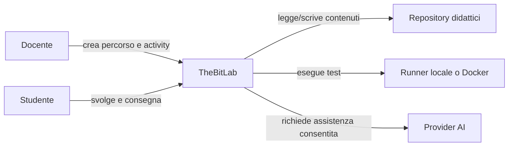

# Requisiti software

<!--
content_id: tpsi4-content-requisiti-software
status: draft
curriculum_reference: tpsi4-curriculum-hoepli-volume-2
transformation: original-course-material
-->

## In questa unità impareremo

Al termine dell'unità lo studente dovrà saper:

- distinguere bisogno, requisito, soluzione e vincolo;
- riconoscere stakeholder e punti di vista diversi;
- raccogliere informazioni con interviste, osservazione e analisi di documenti;
- classificare requisiti funzionali e non funzionali;
- trasformare richieste vaghe in requisiti verificabili;
- descrivere attori, casi d'uso, scenari principali e alternativi;
- scrivere criteri di accettazione;
- costruire una specifica leggera dei requisiti;
- collegare requisiti, progetto, activity e test attraverso la tracciabilità;
- gestire versioni, conflitti e modifiche dei requisiti.

## Prerequisiti

Sono utili:

- nozioni di processo di sviluppo;
- capacità di leggere diagrammi e tabelle;
- conoscenza di Git e issue almeno a livello introduttivo;
- esperienza con un piccolo programma o progetto di laboratorio.

## Problema iniziale: «Voglio una piattaforma facile»

Una frase come:

```text
La piattaforma deve essere facile da usare.
```

esprime un bisogno reale, ma non è ancora un requisito sufficiente. Mancano almeno:

- chi deve usarla;
- per svolgere quale attività;
- in quale contesto;
- con quali vincoli;
- come verifichiamo che sia davvero facile.

Una possibile trasformazione è:

```text
Durante la creazione di una nuova activity, un docente autenticato deve poter
completare i campi obbligatori, vedere gli errori di validazione e salvare una
bozza senza usare la riga di comando.
```

Criterio misurabile possibile:

```text
Nella prova guidata, almeno 8 docenti su 10 completano la bozza senza assistenza
esterna e senza errori bloccanti entro 10 minuti.
```

Il requisito non impone ancora il colore dei pulsanti o la libreria grafica. Descrive risultato, attore e criterio osservabile.

## Bisogno, requisito, soluzione e vincolo

### Bisogno

È il problema o l'obiettivo dello stakeholder.

```text
Il docente vuole riutilizzare materiali provenienti da fonti diverse.
```

### Requisito

È una proprietà o capacità richiesta al sistema.

```text
Il sistema deve permettere al docente di selezionare contenuti da più fonti
catalogate e inserirli nella stessa UDA conservando la provenienza.
```

### Soluzione

È una scelta progettuale che soddisfa uno o più requisiti.

```text
La Course Board usa un catalogo `sources[]` e memorizza `source_id` negli item.
```

### Vincolo

Limita le soluzioni ammesse.

```text
Il primo MVP deve funzionare senza un database esterno e senza fetch di rete.
```

Confondere requisito e soluzione restringe troppo presto lo spazio progettuale. Dire «serve un bottone blu» non spiega quale problema risolve.

## La specifica dei requisiti

Una specifica dei requisiti descrive ciò che il sistema deve offrire e i limiti entro cui deve operare. Non deve essere necessariamente un documento enorme. Anche un progetto scolastico beneficia di una specifica breve, coerente e versionata.

Una struttura minima può contenere:

1. scopo e contesto;
2. stakeholder e attori;
3. glossario;
4. requisiti funzionali;
5. requisiti non funzionali;
6. vincoli;
7. casi d'uso e scenari;
8. dati e regole;
9. criteri di accettazione;
10. rischi e questioni aperte;
11. matrice di tracciabilità.

## Caratteristiche di un buon requisito

Un requisito dovrebbe essere:

- **necessario**: risponde a un bisogno reale;
- **chiaro**: non dipende da interpretazioni contraddittorie;
- **singolare**: non unisce troppe richieste indipendenti;
- **fattibile**: può essere realizzato con risorse e vincoli disponibili;
- **verificabile**: esiste una prova o osservazione che ne determina l'esito;
- **coerente**: non contraddice altri requisiti;
- **tracciabile**: sappiamo da chi o da cosa deriva e quali artefatti lo realizzano;
- **prioritizzato**: è possibile distinguere essenziale, importante e rinviabile;
- **versionato**: le modifiche lasciano una storia comprensibile.

### Esempio di requisito non verificabile

```text
Il sistema deve essere molto veloce.
```

### Versione migliorata

```text
Con un catalogo di 5.000 heading locali, la ricerca per titolo deve restituire
i primi risultati entro 500 ms sul computer di riferimento definito nel piano
di prova.
```

La misura da sola non basta: bisogna specificare dati, ambiente e modalità della prova.

## Requisiti funzionali

Descrivono servizi, comportamenti e regole del sistema.

Esempi:

```text
RF-01 Il docente può creare una bozza di activity.
RF-02 Il sistema valida i campi obbligatori prima del salvataggio.
RF-03 Il docente può collegare una activity a una UDA.
RF-04 Lo studente vede soltanto gli asset con visibilità student.
RF-05 Il grader usa anche test non distribuiti allo studente.
```

Un requisito funzionale non coincide con una schermata. La stessa capacità potrebbe essere offerta da GUI, CLI o API.

## Requisiti non funzionali

Descrivono qualità, limiti e condizioni operative.

Categorie frequenti:

- prestazioni;
- affidabilità;
- sicurezza;
- privacy;
- usabilità;
- accessibilità;
- portabilità;
- manutenibilità;
- interoperabilità;
- osservabilità;
- compatibilità;
- limiti di risorse.

Esempi:

```text
RNF-01 I path importati non devono uscire dalla root autorizzata.
RNF-02 I test nascosti non devono essere inclusi nello scaffold studente.
RNF-03 Un file Markdown locale non può superare il limite configurato.
RNF-04 Gli errori visibili non devono includere token o credenziali.
RNF-05 Le operazioni di importazione devono conservare fonte e versione.
```

## Regole di dominio

Una regola di dominio non è soltanto un dettaglio tecnico.

Esempio:

```text
Una soluzione docente non può essere visibile allo studente prima della chiusura
della prova, salvo scelta esplicita del docente.
```

La regola deve essere rappresentata in dati, servizi, UI e test. Se esiste soltanto in una nota, è facile violarla accidentalmente.

## Stakeholder e attori

Uno **stakeholder** ha interesse nel sistema o ne subisce gli effetti. Un **attore** interagisce con il sistema in un caso d'uso.

Possibili stakeholder di una piattaforma didattica:

- docente;
- studente;
- amministratore;
- scuola;
- famiglia;
- responsabile privacy;
- manutentore tecnico;
- autore dei materiali;
- fornitore di un servizio esterno.

Lo stesso stakeholder può avere più ruoli. Un docente può essere anche autore e revisore.

### Matrice stakeholder/bisogni

| Stakeholder | Bisogno | Rischio se ignorato |
| --- | --- | --- |
| docente | preparare e riusare attività rapidamente | abbandono della piattaforma |
| studente | consegne chiare e feedback comprensibile | errori non didattici e demotivazione |
| scuola | controllo di accessi e dati | violazioni e responsabilità |
| manutentore | contratti stabili e test | regressioni e costi elevati |
| autore | provenienza e licenza | perdita di attribuzione o uso illecito |

## Raccolta dei requisiti

Non esiste una tecnica unica. È utile combinare più fonti.

### Intervista

Domande efficaci esplorano attività reali:

- Qual è l'ultima volta che hai svolto questa operazione?
- Quali passaggi hai seguito?
- Dove hai perso più tempo?
- Quali errori accadono spesso?
- Che cosa fai quando manca un'informazione?
- Quale risultato consideri accettabile?

Domande che suggeriscono già la soluzione possono distorcere la raccolta:

```text
Non sarebbe meglio avere un bottone rosso qui?
```

### Osservazione

Osservare l'utente al lavoro rivela passaggi che non vengono ricordati durante un'intervista. L'osservazione deve rispettare privacy e consenso.

### Analisi di documenti e sistemi esistenti

Sono fonti utili:

- moduli cartacei;
- fogli di calcolo;
- email ricorrenti;
- registri;
- issue;
- log;
- manuali;
- regolamenti;
- dati anonimi di utilizzo.

Un comportamento esistente non è automaticamente un requisito da conservare. Può essere un workaround da eliminare.

### Workshop

Riunisce più stakeholder per chiarire termini, priorità e conflitti. È utile usare esempi concreti e registrare le decisioni.

### Prototipo

Un prototipo aiuta a scoprire requisiti, ma può far sembrare definitive scelte ancora provvisorie. Bisogna distinguere ciò che viene validato: flusso, contenuti, layout o fattibilità tecnica.

## Analisi dei requisiti

Dopo la raccolta, le informazioni devono essere organizzate.

Attività tipiche:

- eliminare duplicati;
- chiarire termini ambigui;
- separare bisogno e soluzione;
- individuare conflitti;
- identificare dipendenze;
- verificare fattibilità;
- assegnare priorità;
- definire criteri di accettazione;
- registrare questioni aperte.

### Glossario

Termini come `activity`, `assignment`, `submission`, `attempt` e `feedback` devono avere un significato stabile. Il glossario riduce le incomprensioni fra codice, documentazione e interfaccia.

### Priorità MoSCoW

Una tecnica semplice:

- **Must**: essenziale per il rilascio;
- **Should**: importante, ma esiste una soluzione temporanea;
- **Could**: utile se tempo e risorse lo consentono;
- **Won't now**: deliberatamente escluso dal rilascio corrente.

`Won't now` non significa «mai». Rende esplicito il confine.

## Attori, casi d'uso e scenari

Un caso d'uso descrive un obiettivo dell'attore e le interazioni significative con il sistema.

### Template leggero

```text
ID: UC-COURSE-01
Titolo: Importare una fonte Markdown locale
Attore primario: Docente
Precondizioni: docente autenticato; file nella root consentita
Trigger: il docente aggiunge una fonte al progetto
Flusso principale:
  1. il docente inserisce metadati e file;
  2. il sistema valida il descrittore;
  3. il sistema indicizza gli heading;
  4. il docente vede la fonte nella Course Board.
Flussi alternativi:
  A1. path non sicuro -> il sistema rifiuta senza salvare;
  A2. file assente -> la fonte resta non indicizzabile;
Postcondizioni: fonte e provenienza disponibili nel progetto
```

### Scenario

Uno scenario è un percorso specifico dentro il caso d'uso. Il flusso principale è uno scenario; ogni alternativa ne forma un altro.

### Diagramma di contesto



Il diagramma non sostituisce le descrizioni. Serve a mostrare confini e relazioni.

## Caso di studio: creare e assegnare un laboratorio

### Attori

- docente;
- studente;
- grader;
- provider repository.

### Flusso principale

1. Il docente seleziona una UDA.
2. Sceglie un contenuto o un insieme di frammenti.
3. Crea o seleziona una activity.
4. Controlla consegna, asset, visibilità, test e rubrica.
5. Seleziona la classe o gli studenti.
6. La piattaforma genera lo scaffold.
7. Lo studente apre il lab, modifica i file e avvia il runner.
8. Il runner produce un report.
9. La dashboard docente mostra stato e risultati.
10. Il docente approva o integra il feedback.

### Alternative

- l'activity non è valida;
- il repository dello studente non è disponibile;
- il runner manca;
- la compilazione fallisce;
- un test va in timeout;
- lo studente chiede un aiuto non consentito;
- il docente ritira l'assegnazione.

### Requisiti derivati

```text
RF-LAB-01 Il sistema deve validare l'activity prima della distribuzione.
RF-LAB-02 Lo scaffold deve includere soltanto asset studente.
RF-LAB-03 Il report deve identificare activity, studente, tentativo e toolchain.
RF-LAB-04 Il docente deve poter leggere i dettagli dei test consentiti.
RNF-LAB-01 Il runner deve applicare un timeout.
RNF-LAB-02 I test nascosti non devono essere eseguiti nel processo studente.
```

## Criteri di accettazione

Un criterio di accettazione traduce il requisito in comportamento osservabile.

Formato Given/When/Then:

```text
Dato un descrittore di fonte con path `../segreti`
Quando il docente prova a salvare il progetto
Allora il sistema rifiuta il descrittore
E il progetto precedente resta invariato
E la risposta non espone percorsi sensibili
```

I criteri devono coprire anche errori, limiti e permessi, non soltanto il percorso ideale.

## Documentazione dei requisiti

### Scheda requisito

```text
ID
Titolo
Descrizione
Motivazione
Fonte/stakeholder
Priorità
Stato
Criteri di accettazione
Dipendenze
Rischi
Versione
```

### SRS leggera

Per un progetto scolastico si può usare un unico Markdown:

```text
# Scopo
# Contesto e confini
# Glossario
# Stakeholder e attori
# Requisiti funzionali
# Requisiti non funzionali
# Casi d'uso
# Modello dati essenziale
# Criteri di accettazione
# Questioni aperte
# Tracciabilità
```

La qualità è più importante della quantità. Un documento breve ma verificato è preferibile a decine di requisiti vaghi.

## Tracciabilità

La tracciabilità collega il perché al cosa e al come.

```text
bisogno
  -> requisito
      -> caso d'uso
          -> componente
              -> activity/test
                  -> risultato
```

Esempio:

| Requisito | Implementazione | Test | Evidenza |
| --- | --- | --- | --- |
| RNF-02 test nascosti non distribuiti | scaffold filtra visibility | test scaffold | file assente nel repository studente |
| RF-03 collegare activity a UDA | `activity_ids` nell'item | test contratto percorso | activity visibile nel pannello studente |

La tracciabilità aiuta a valutare l'impatto di una modifica. Se cambia un requisito, possiamo individuare documenti, codice e test da aggiornare.

## Gestione delle modifiche

I requisiti cambiano perché:

- emerge un nuovo stakeholder;
- cambia la normativa;
- un prototipo rivela un problema;
- una tecnologia non è disponibile;
- un requisito era ambiguo;
- la priorità del progetto cambia.

Un cambiamento dovrebbe registrare:

1. proposta;
2. motivazione;
3. impatto;
4. alternative;
5. decisione;
6. versione interessata;
7. aggiornamento di test e documentazione.

Git, issue e pull request permettono di conservare questa storia.

## Errori frequenti

### Scrivere soltanto la soluzione

```text
Usare MongoDB.
```

Manca il problema che la scelta dovrebbe risolvere. Una soluzione tecnica può essere un vincolo deliberato, ma va motivata.

### Unire troppi requisiti

```text
Il sistema deve importare, modificare, pubblicare, tradurre e correggere i contenuti.
```

È difficile assegnare priorità e verificare un requisito così ampio.

### Usare parole assolute senza condizioni

`sempre`, `mai`, `immediatamente` e `sicuro` devono essere accompagnati da un contesto verificabile.

### Ignorare i flussi di errore

Una specifica che descrive soltanto il successo produce sistemi fragili.

### Confondere stakeholder e attore

Un genitore può essere stakeholder senza interagire direttamente con il sistema nel primo MVP.

### Scrivere casi d'uso come sequenze di click

Il caso d'uso deve descrivere l'obiettivo e le responsabilità. I dettagli della schermata appartengono al design dell'interazione.

### Non aggiornare i test

Un requisito modificato con test vecchi produce una contraddizione nascosta.

## Esercizi graduati

### Livello A — riconosci

1. Classifica dieci frasi come bisogno, requisito, soluzione o vincolo.
2. Evidenzia parole ambigue in una lista di requisiti.
3. Distingui requisiti funzionali e non funzionali.
4. Individua attori e stakeholder in una biblioteca scolastica digitale.

### Livello B — riscrivi

1. Trasforma «il programma deve essere veloce» in un requisito misurabile.
2. Dividi un requisito che contiene cinque funzioni indipendenti.
3. Aggiungi criteri di accettazione a una richiesta di login.
4. Scrivi un glossario di dieci termini per un lab di programmazione.

### Livello C — modella

1. Scrivi il caso d'uso «assegnare un laboratorio a un gruppo».
2. Descrivi scenario principale e tre alternative.
3. Crea un diagramma attori/casi d'uso o un diagramma di contesto.
4. Costruisci una matrice requisito-test per un programma produttore/consumatore.

### Livello D — analizza

1. Individua conflitti fra requisiti di sicurezza e usabilità.
2. Correggi una specifica che espone soluzioni senza motivazione.
3. Analizza una change request e individua componenti e test coinvolti.
4. Trova requisiti mancanti in un prototipo o in una consegna esistente.

### Livello E — mini-progetto

Intervista un compagno che svolge il ruolo di docente e produci:

- stakeholder map;
- dieci requisiti prioritizzati;
- due casi d'uso completi;
- cinque criteri di accettazione;
- una questione aperta e un rischio.

### Livello F — progetto integrato

Specifica un modulo di importazione di fonti didattiche che supporti almeno:

- Markdown locale;
- repository GitHub dichiarato;
- stato di indicizzazione;
- provenienza;
- gestione degli errori;
- limiti di dimensione;
- permessi;
- preview e conferma docente.

La specifica deve essere indipendente dall'implementazione concreta e accompagnata da matrice di tracciabilità.

## Laboratorio: dalla richiesta all'activity

### Scenario

Il docente chiede:

```text
Voglio un laboratorio sul problema produttore/consumatore che gli studenti
possano eseguire, con aiuti limitati e test che non mostrino la soluzione.
```

### Consegna

1. Identifica stakeholder e bisogno.
2. Scrivi cinque requisiti funzionali.
3. Scrivi cinque requisiti non funzionali.
4. Definisci modalità di aiuto.
5. Definisci asset studente e docente.
6. Scrivi tre criteri di accettazione.
7. Crea una bozza `activity.json` valida.
8. Collega ogni campo della bozza a un requisito.

### Evidenza

Il laboratorio è completato quando:

- `scripts/validate_activity.py` accetta il JSON;
- la matrice requisito-campo è completa;
- soluzione e test nascosti non sono classificati come asset studente;
- il docente può spiegare quali parti restano manuali.

## Verifica rapida

1. Qual è la differenza tra bisogno e requisito?
2. Perché un requisito non dovrebbe imporre subito una soluzione?
3. Elenca quattro caratteristiche di un buon requisito.
4. Fornisci un requisito funzionale e uno non funzionale.
5. Qual è la differenza fra stakeholder e attore?
6. Perché conviene combinare più tecniche di raccolta?
7. Che cosa rappresenta uno scenario alternativo?
8. Come si rende verificabile un requisito di prestazione?
9. Che cosa collega una matrice di tracciabilità?
10. Perché i requisiti devono essere versionati?

## Sintesi inclusiva

- Il bisogno descrive il problema; il requisito descrive una capacità o qualità necessaria.
- La soluzione tecnica viene scelta dopo aver compreso il requisito.
- Un buon requisito è chiaro, necessario, fattibile e verificabile.
- I requisiti funzionali descrivono servizi; quelli non funzionali descrivono qualità e limiti.
- Gli stakeholder hanno interesse nel sistema; gli attori interagiscono nei casi d'uso.
- I requisiti si raccolgono con interviste, osservazione, documenti, workshop e prototipi.
- Un caso d'uso descrive un obiettivo, non soltanto una sequenza di click.
- I criteri di accettazione rendono osservabile il risultato atteso.
- La tracciabilità collega bisogno, requisito, codice, activity e test.
- Le modifiche devono lasciare una storia e aggiornare anche i test.

## Collegamento al modulo successivo

Una specifica utile deve essere comunicata e mantenuta. Il modulo [Documentazione e controllo di versione](04_DOCUMENTAZIONE_VERSIONAMENTO.md) mostra come organizzare documenti, codice, decisioni, commit e revisioni.

## Fonti e note di revisione

- Riferimento curricolare: indice pubblico del volume 2.
- Esempi di dominio: contratti e flussi di 2cornot2c, riformulati a scopo didattico.
- Diagrammi, requisiti ed esercizi sono originali.
- Stato: `draft`; verificare durata delle attività e livello della classe prima della pubblicazione.