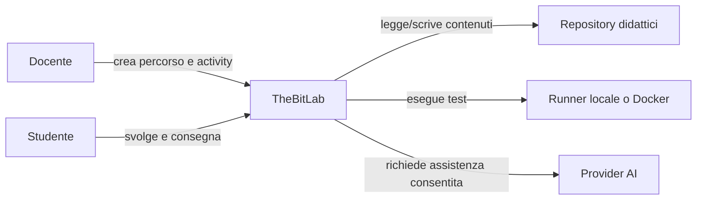
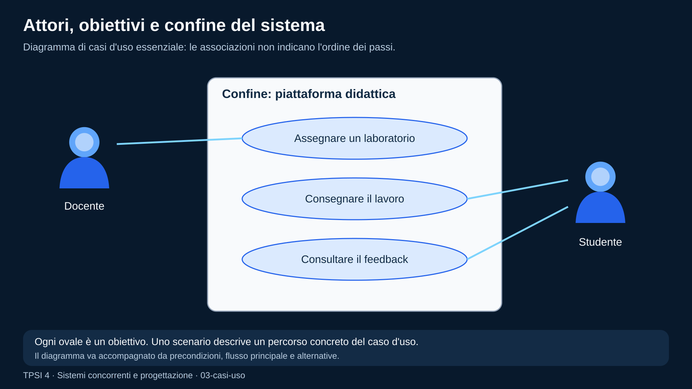
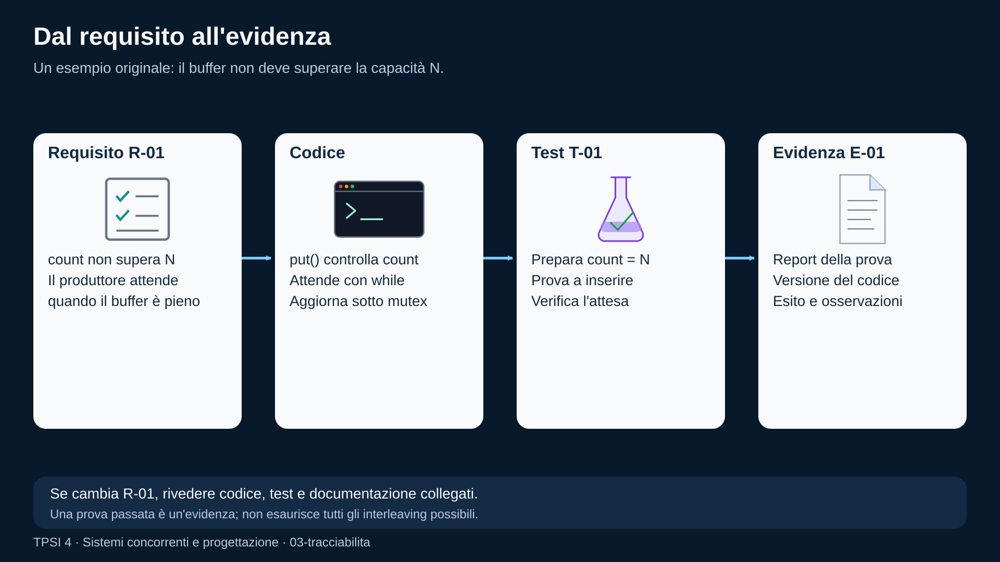

# Requisiti software

<!--
content_id: tpsi4-content-requisiti-software
status: draft
curriculum_reference: tpsi4-curriculum-hoepli-volume-2
transformation: original-course-material
-->

## In questa unità impareremo

<!-- visual-orientation -->
<table align="center">
<tr>
<td>
<details>
<summary>&#129517; <strong>Orientamento della sezione</strong></summary>

<p align="justify">
<strong><span style="font-size: 1.15em;">&#128506;</span> Contesto:</strong>
Trasforma bisogni e problemi osservati in requisiti, casi d&#x27;uso, scenari, criteri di accettazione e tracciabilità.
</p>

<p align="justify">
<strong><span style="font-size: 1.15em;">&#128736;</span> Prerequisiti:</strong>
Esperienza con piccoli progetti e con gli errori tipici dei sistemi concorrenti.
</p>

<p align="justify">
<strong><span style="font-size: 1.15em;">&#127919;</span> Obiettivi:</strong>
Scrivere requisiti funzionali/non funzionali verificabili, modellare attori e scenari, costruire una specifica leggera.
</p>

<p align="justify">
<strong><span style="font-size: 1.15em;">&#128257;</span> Richiamo:</strong>
Riprendere invarianti e proprietà di correttezza come esempi di requisiti tecnici.
</p>

<p align="justify">
<strong><span style="font-size: 1.15em;">&#128064;</span> Anticipazione:</strong>
Prepara documentazione, Git, pull request e collegamento fra requisito e test.
</p>

<p align="justify">
<strong><span style="font-size: 1.15em;">&#10145;</span> Prossimo passo:</strong>
Produrre una mini SRS e una bozza activity tracciata ai requisiti.
</p>

<p align="justify">
<strong><span style="font-size: 1.15em;">&#128279;</span> Rimando:</strong>
Modulo originale e contratti didattici del repository usati come caso di studio. <a href="#fonti-e-note-di-revisione">Fonti e note della lezione</a>; <a href="COVERAGE.md">matrice di copertura</a>.
</p>

</details>
</td>
</tr>
</table>

<p align="justify">Al termine dell'unità lo studente dovrà saper:</p>

<ul>
  <li>distinguere bisogno, requisito, soluzione e vincolo;</li>
  <li>riconoscere stakeholder e punti di vista diversi;</li>
  <li>raccogliere informazioni con interviste, osservazione e analisi di documenti;</li>
  <li>classificare requisiti funzionali e non funzionali;</li>
  <li>trasformare richieste vaghe in requisiti verificabili;</li>
  <li>descrivere attori, casi d'uso, scenari principali e alternativi;</li>
  <li>scrivere criteri di accettazione;</li>
  <li>costruire una specifica leggera dei requisiti;</li>
  <li>collegare requisiti, progetto, activity e test attraverso la tracciabilità;</li>
  <li>gestire versioni, conflitti e modifiche dei requisiti.</li>
</ul>

## Prerequisiti

<p align="justify">Sono utili:</p>

<ul>
  <li>nozioni di processo di sviluppo;</li>
  <li>capacità di leggere diagrammi e tabelle;</li>
  <li>conoscenza di Git e issue almeno a livello introduttivo;</li>
  <li>esperienza con un piccolo programma o progetto di laboratorio.</li>
</ul>

## Problema iniziale: «Voglio una piattaforma facile»

<p align="justify">Una frase come:</p>

```text
La piattaforma deve essere facile da usare.
```

<p align="justify">esprime un bisogno reale, ma non è ancora un requisito sufficiente. Mancano almeno:</p>

<ul>
  <li>chi deve usarla;</li>
  <li>per svolgere quale attività;</li>
  <li>in quale contesto;</li>
  <li>con quali vincoli;</li>
  <li>come verifichiamo che sia davvero facile.</li>
</ul>

<p align="justify">Una possibile trasformazione è:</p>

```text
Durante la creazione di una nuova activity, un docente autenticato deve poter
completare i campi obbligatori, vedere gli errori di validazione e salvare una
bozza senza usare la riga di comando.
```

<p align="justify">Criterio misurabile possibile:</p>

```text
Nella prova guidata, almeno 8 docenti su 10 completano la bozza senza assistenza
esterna e senza errori bloccanti entro 10 minuti.
```

<p align="justify">Il requisito non impone ancora il colore dei pulsanti o la libreria grafica. Descrive risultato, attore e criterio osservabile.</p>

## Bisogno, requisito, soluzione e vincolo

### Bisogno

<!-- definition -->
<table align="center">
<tr><td>
&#10071; <strong>Importante</strong>
<p align="justify">Il <strong>bisogno</strong> è il problema o l'obiettivo dello stakeholder.</p>
</td></tr>
</table>
<!-- /definition -->

```text
Il docente vuole riutilizzare materiali provenienti da fonti diverse.
```

### Requisito

<!-- definition -->
<table align="center">
<tr><td>
&#10071; <strong>Importante</strong>
<p align="justify">Un <strong>requisito</strong> è una proprietà o capacità richiesta al sistema.</p>
</td></tr>
</table>
<!-- /definition -->

```text
Il sistema deve permettere al docente di selezionare contenuti da più fonti
catalogate e inserirli nella stessa UDA conservando la provenienza.
```

### Soluzione

<!-- definition -->
<table align="center">
<tr><td>
&#10071; <strong>Importante</strong>
<p align="justify">Una <strong>soluzione</strong> è una scelta progettuale che soddisfa uno o più requisiti.</p>
</td></tr>
</table>
<!-- /definition -->

```text
La Course Board usa un catalogo `sources[]` e memorizza `source_id` negli item.
```

### Vincolo

<!-- definition -->
<table align="center">
<tr><td>
&#10071; <strong>Importante</strong>
<p align="justify">Un <strong>vincolo</strong> limita le soluzioni ammesse.</p>
</td></tr>
</table>
<!-- /definition -->

```text
Il primo MVP deve funzionare senza un database esterno e senza fetch di rete.
```

<p align="justify">Confondere requisito e soluzione restringe troppo presto lo spazio progettuale. Dire «serve un bottone blu» non spiega quale problema risolve.</p>

## La specifica dei requisiti

<!-- definition -->
<table align="center">
<tr><td>
&#10071; <strong>Importante</strong>
<p align="justify">Una <strong>specifica dei requisiti</strong> descrive ciò che il sistema deve offrire e i limiti entro cui deve operare.</p>
</td></tr>
</table>
<!-- /definition -->

<p align="justify">Non deve essere necessariamente un documento enorme. Anche un progetto scolastico beneficia di una specifica breve, coerente e versionata.</p>

<p align="justify">Una struttura minima può contenere:</p>

<ol>
  <li>scopo e contesto;</li>
  <li>stakeholder e attori;</li>
  <li>glossario;</li>
  <li>requisiti funzionali;</li>
  <li>requisiti non funzionali;</li>
  <li>vincoli;</li>
  <li>casi d'uso e scenari;</li>
  <li>dati e regole;</li>
  <li>criteri di accettazione;</li>
  <li>rischi e questioni aperte;</li>
  <li>matrice di tracciabilità.</li>
</ol>

## Caratteristiche di un buon requisito

<p align="justify">Un requisito dovrebbe essere:</p>

<ul>
  <li><strong>necessario</strong>: risponde a un bisogno reale;</li>
  <li><strong>chiaro</strong>: non dipende da interpretazioni contraddittorie;</li>
  <li><strong>singolare</strong>: non unisce troppe richieste indipendenti;</li>
  <li><strong>fattibile</strong>: può essere realizzato con risorse e vincoli disponibili;</li>
  <li><strong>verificabile</strong>: esiste una prova o osservazione che ne determina l'esito;</li>
  <li><strong>coerente</strong>: non contraddice altri requisiti;</li>
  <li><strong>tracciabile</strong>: sappiamo da chi o da cosa deriva e quali artefatti lo realizzano;</li>
  <li><strong>prioritizzato</strong>: è possibile distinguere essenziale, importante e rinviabile;</li>
  <li><strong>versionato</strong>: le modifiche lasciano una storia comprensibile.</li>
</ul>

### Esempio di requisito non verificabile

```text
Il sistema deve essere molto veloce.
```

### Versione migliorata

```text
Con un catalogo di 5.000 heading locali, la ricerca per titolo deve restituire
i primi risultati entro 500 ms sul computer di riferimento definito nel piano
di prova.
```

<p align="justify">La misura da sola non basta: bisogna specificare dati, ambiente e modalità della prova.</p>

## Requisiti funzionali

<!-- definition -->
<table align="center">
<tr><td>
&#10071; <strong>Importante</strong>
<p align="justify">I <strong>requisiti funzionali</strong> descrivono servizi, comportamenti e regole del sistema.</p>
</td></tr>
</table>
<!-- /definition -->

<p align="justify">Esempi:</p>

```text
RF-01 Il docente può creare una bozza di activity.
RF-02 Il sistema valida i campi obbligatori prima del salvataggio.
RF-03 Il docente può collegare una activity a una UDA.
RF-04 Lo studente vede soltanto gli asset con visibilità student.
RF-05 Il grader usa anche test non distribuiti allo studente.
```

<p align="justify">Un requisito funzionale non coincide con una schermata. La stessa capacità potrebbe essere offerta da GUI, CLI o API.</p>

## Requisiti non funzionali

<!-- definition -->
<table align="center">
<tr><td>
&#10071; <strong>Importante</strong>
<p align="justify">I <strong>requisiti non funzionali</strong> descrivono qualità, limiti e condizioni operative.</p>
</td></tr>
</table>
<!-- /definition -->

<p align="justify">Categorie frequenti:</p>

<ul>
  <li>prestazioni;</li>
  <li>affidabilità;</li>
  <li>sicurezza;</li>
  <li>privacy;</li>
  <li>usabilità;</li>
  <li>accessibilità;</li>
  <li>portabilità;</li>
  <li>manutenibilità;</li>
  <li>interoperabilità;</li>
  <li>osservabilità;</li>
  <li>compatibilità;</li>
  <li>limiti di risorse.</li>
</ul>

<p align="justify">Esempi:</p>

```text
RNF-01 I path importati non devono uscire dalla root autorizzata.
RNF-02 I test nascosti non devono essere inclusi nello scaffold studente.
RNF-03 Un file Markdown locale non può superare il limite configurato.
RNF-04 Gli errori visibili non devono includere token o credenziali.
RNF-05 Le operazioni di importazione devono conservare fonte e versione.
```

## Regole di dominio

<p align="justify">Una regola di dominio non è soltanto un dettaglio tecnico.</p>

<p align="justify">Esempio:</p>

```text
Una soluzione docente non può essere visibile allo studente prima della chiusura
della prova, salvo scelta esplicita del docente.
```

<p align="justify">La regola deve essere rappresentata in dati, servizi, UI e test. Se esiste soltanto in una nota, è facile violarla accidentalmente.</p>

## Stakeholder e attori

<!-- definition -->
<table align="center">
<tr><td>
&#10071; <strong>Importante</strong>
<p align="justify">Uno <strong>stakeholder</strong> ha interesse nel sistema o ne subisce gli effetti. Un <strong>attore</strong> interagisce con il sistema in un caso d'uso.</p>
</td></tr>
</table>
<!-- /definition -->

<p align="justify">Possibili stakeholder di una piattaforma didattica:</p>

<ul>
  <li>docente;</li>
  <li>studente;</li>
  <li>amministratore;</li>
  <li>scuola;</li>
  <li>famiglia;</li>
  <li>responsabile privacy;</li>
  <li>manutentore tecnico;</li>
  <li>autore dei materiali;</li>
  <li>fornitore di un servizio esterno.</li>
</ul>

<p align="justify">Lo stesso stakeholder può avere più ruoli. Un docente può essere anche autore e revisore.</p>

### Matrice stakeholder/bisogni

<table align="center">
<thead>
<tr>
<th>Stakeholder</th>
<th>Bisogno</th>
<th>Rischio se ignorato</th>
</tr>
</thead>
<tbody>
<tr>
<td>docente</td>
<td>preparare e riusare attività rapidamente</td>
<td>abbandono della piattaforma</td>
</tr>
<tr>
<td>studente</td>
<td>consegne chiare e feedback comprensibile</td>
<td>errori non didattici e demotivazione</td>
</tr>
<tr>
<td>scuola</td>
<td>controllo di accessi e dati</td>
<td>violazioni e responsabilità</td>
</tr>
<tr>
<td>manutentore</td>
<td>contratti stabili e test</td>
<td>regressioni e costi elevati</td>
</tr>
<tr>
<td>autore</td>
<td>provenienza e licenza</td>
<td>perdita di attribuzione o uso illecito</td>
</tr>
</tbody>
</table>

## Raccolta dei requisiti

<p align="justify">Non esiste una tecnica unica. È utile combinare più fonti.</p>

### Intervista

<p align="justify">Domande efficaci esplorano attività reali:</p>

<ul>
  <li>Qual è l'ultima volta che hai svolto questa operazione?</li>
  <li>Quali passaggi hai seguito?</li>
  <li>Dove hai perso più tempo?</li>
  <li>Quali errori accadono spesso?</li>
  <li>Che cosa fai quando manca un'informazione?</li>
  <li>Quale risultato consideri accettabile?</li>
</ul>

<p align="justify">Domande che suggeriscono già la soluzione possono distorcere la raccolta:</p>

```text
Non sarebbe meglio avere un bottone rosso qui?
```

### Osservazione

<p align="justify">Osservare l'utente al lavoro rivela passaggi che non vengono ricordati durante un'intervista. L'osservazione deve rispettare privacy e consenso.</p>

### Analisi di documenti e sistemi esistenti

<p align="justify">Sono fonti utili:</p>

<ul>
  <li>moduli cartacei;</li>
  <li>fogli di calcolo;</li>
  <li>email ricorrenti;</li>
  <li>registri;</li>
  <li>issue;</li>
  <li>log;</li>
  <li>manuali;</li>
  <li>regolamenti;</li>
  <li>dati anonimi di utilizzo.</li>
</ul>

<p align="justify">Un comportamento esistente non è automaticamente un requisito da conservare. Può essere un workaround da eliminare.</p>

### Workshop

<p align="justify">Riunisce più stakeholder per chiarire termini, priorità e conflitti. È utile usare esempi concreti e registrare le decisioni.</p>

### Prototipo

<p align="justify">Un prototipo aiuta a scoprire requisiti, ma può far sembrare definitive scelte ancora provvisorie. Bisogna distinguere ciò che viene validato: flusso, contenuti, layout o fattibilità tecnica.</p>

## Analisi dei requisiti

<p align="justify">Dopo la raccolta, le informazioni devono essere organizzate.</p>

<p align="justify">Attività tipiche:</p>

<ul>
  <li>eliminare duplicati;</li>
  <li>chiarire termini ambigui;</li>
  <li>separare bisogno e soluzione;</li>
  <li>individuare conflitti;</li>
  <li>identificare dipendenze;</li>
  <li>verificare fattibilità;</li>
  <li>assegnare priorità;</li>
  <li>definire criteri di accettazione;</li>
  <li>registrare questioni aperte.</li>
</ul>

### Glossario

<p align="justify">Termini come <code>activity</code>, <code>assignment</code>, <code>submission</code>, <code>attempt</code> e <code>feedback</code> devono avere un significato stabile. Il glossario riduce le incomprensioni fra codice, documentazione e interfaccia.</p>

### Priorità MoSCoW

<p align="justify">Una tecnica semplice:</p>

<ul>
  <li><strong>Must</strong>: essenziale per il rilascio;</li>
  <li><strong>Should</strong>: importante, ma esiste una soluzione temporanea;</li>
  <li><strong>Could</strong>: utile se tempo e risorse lo consentono;</li>
  <li><strong>Won't now</strong>: deliberatamente escluso dal rilascio corrente.</li>
</ul>

<p align="justify"><code>Won't now</code> non significa «mai». Rende esplicito il confine.</p>

## Attori, casi d'uso e scenari

<!-- definition -->
<table align="center">
<tr><td>
&#10071; <strong>Importante</strong>
<p align="justify">Un <strong>caso d'uso</strong> descrive un obiettivo dell'attore e le interazioni significative con il sistema.</p>
</td></tr>
</table>
<!-- /definition -->

### Template leggero

```text
ID: UC-COURSE-01
Titolo: Importare una fonte Markdown locale
Attore primario: Docente
Precondizioni: docente autenticato; file nella root consentita
Trigger: il docente aggiunge una fonte al progetto
Flusso principale:
  1. il docente inserisce metadati e file;
  2. il sistema valida il descrittore;
  3. il sistema indicizza gli heading;
  4. il docente vede la fonte nella Course Board.
Flussi alternativi:
  A1. path non sicuro -> il sistema rifiuta senza salvare;
  A2. file assente -> la fonte resta non indicizzabile;
Postcondizioni: fonte e provenienza disponibili nel progetto
```

### Scenario

<!-- definition -->
<table align="center">
<tr><td>
&#10071; <strong>Importante</strong>
<p align="justify">Uno <strong>scenario</strong> è un percorso specifico dentro il caso d'uso.</p>
</td></tr>
</table>
<!-- /definition -->

<p align="justify">Il flusso principale è uno scenario; ogni alternativa ne forma un altro.</p>

### Diagramma di contesto



<p align="justify">Il diagramma non sostituisce le descrizioni. Serve a mostrare confini e relazioni.</p>

<!-- figure:03-casi-uso -->
<p align="center">
  
</p>
<p align="center"><em>Il docente è associato all&#x27;assegnazione del laboratorio; lo studente alla consegna e alla consultazione del feedback. I casi d&#x27;uso sono dentro il confine della piattaforma; gli attori sono esterni.</em></p>

## Caso di studio: creare e assegnare un laboratorio

### Attori

<ul>
  <li>docente;</li>
  <li>studente;</li>
  <li>grader;</li>
  <li>provider repository.</li>
</ul>

### Flusso principale

<ol>
  <li>Il docente seleziona una UDA.</li>
  <li>Sceglie un contenuto o un insieme di frammenti.</li>
  <li>Crea o seleziona una activity.</li>
  <li>Controlla consegna, asset, visibilità, test e rubrica.</li>
  <li>Seleziona la classe o gli studenti.</li>
  <li>La piattaforma genera lo scaffold.</li>
  <li>Lo studente apre il lab, modifica i file e avvia il runner.</li>
  <li>Il runner produce un report.</li>
  <li>La dashboard docente mostra stato e risultati.</li>
  <li>Il docente approva o integra il feedback.</li>
</ol>

### Alternative

<ul>
  <li>l'activity non è valida;</li>
  <li>il repository dello studente non è disponibile;</li>
  <li>il runner manca;</li>
  <li>la compilazione fallisce;</li>
  <li>un test va in timeout;</li>
  <li>lo studente chiede un aiuto non consentito;</li>
  <li>il docente ritira l'assegnazione.</li>
</ul>

### Requisiti derivati

```text
RF-LAB-01 Il sistema deve validare l'activity prima della distribuzione.
RF-LAB-02 Lo scaffold deve includere soltanto asset studente.
RF-LAB-03 Il report deve identificare activity, studente, tentativo e toolchain.
RF-LAB-04 Il docente deve poter leggere i dettagli dei test consentiti.
RNF-LAB-01 Il runner deve applicare un timeout.
RNF-LAB-02 I test nascosti non devono essere eseguiti nel processo studente.
```

## Criteri di accettazione

<!-- definition -->
<table align="center">
<tr><td>
&#10071; <strong>Importante</strong>
<p align="justify">Un <strong>criterio di accettazione</strong> traduce il requisito in comportamento osservabile.</p>
</td></tr>
</table>
<!-- /definition -->

<p align="justify">Formato Given/When/Then:</p>

```text
Dato un descrittore di fonte con path `../segreti`
Quando il docente prova a salvare il progetto
Allora il sistema rifiuta il descrittore
E il progetto precedente resta invariato
E la risposta non espone percorsi sensibili
```

<p align="justify">I criteri devono coprire anche errori, limiti e permessi, non soltanto il percorso ideale.</p>

## Documentazione dei requisiti

### Scheda requisito

```text
ID
Titolo
Descrizione
Motivazione
Fonte/stakeholder
Priorità
Stato
Criteri di accettazione
Dipendenze
Rischi
Versione
```

### SRS leggera

<p align="justify">Per un progetto scolastico si può usare un unico Markdown:</p>

```text
# Scopo
# Contesto e confini
# Glossario
# Stakeholder e attori
# Requisiti funzionali
# Requisiti non funzionali
# Casi d'uso
# Modello dati essenziale
# Criteri di accettazione
# Questioni aperte
# Tracciabilità
```

<p align="justify">La qualità è più importante della quantità. Un documento breve ma verificato è preferibile a decine di requisiti vaghi.</p>

## Tracciabilità

<table align="center">
<tr><td>
<p align="justify">
<strong><span style="font-size: 1.15em;">&#128161;</span> Idea chiave:</strong>
La tracciabilità collega il perché al cosa e al come.</p>
</td></tr>
</table>

```text
bisogno
  -> requisito
      -> caso d'uso
          -> componente
              -> activity/test
                  -> risultato
```

<p align="justify">Esempio:</p>

<table align="center">
<thead>
<tr>
<th>Requisito</th>
<th>Implementazione</th>
<th>Test</th>
<th>Evidenza</th>
</tr>
</thead>
<tbody>
<tr>
<td>RNF-02 test nascosti non distribuiti</td>
<td>scaffold filtra visibility</td>
<td>test scaffold</td>
<td>file assente nel repository studente</td>
</tr>
<tr>
<td>RF-03 collegare activity a UDA</td>
<td><code>activity_ids</code> nell'item</td>
<td>test contratto percorso</td>
<td>activity visibile nel pannello studente</td>
</tr>
</tbody>
</table>

<p align="justify">La tracciabilità aiuta a valutare l'impatto di una modifica. Se cambia un requisito, possiamo individuare documenti, codice e test da aggiornare.</p>

<!-- figure:03-tracciabilita -->
<p align="center">
  
</p>
<p align="center"><em>Il requisito di capacità del buffer guida l&#x27;implementazione; un test di inserimento a buffer pieno verifica il comportamento; il report documenta l&#x27;esito. Gli identificatori collegano i quattro artefatti.</em></p>

## Gestione delle modifiche

<p align="justify">I requisiti cambiano perché:</p>

<ul>
  <li>emerge un nuovo stakeholder;</li>
  <li>cambia la normativa;</li>
  <li>un prototipo rivela un problema;</li>
  <li>una tecnologia non è disponibile;</li>
  <li>un requisito era ambiguo;</li>
  <li>la priorità del progetto cambia.</li>
</ul>

<p align="justify">Un cambiamento dovrebbe registrare:</p>

<ol>
  <li>proposta;</li>
  <li>motivazione;</li>
  <li>impatto;</li>
  <li>alternative;</li>
  <li>decisione;</li>
  <li>versione interessata;</li>
  <li>aggiornamento di test e documentazione.</li>
</ol>

<p align="justify">Git, issue e pull request permettono di conservare questa storia.</p>

## Errori frequenti

### Scrivere soltanto la soluzione

```text
Usare MongoDB.
```

<p align="justify">Manca il problema che la scelta dovrebbe risolvere. Una soluzione tecnica può essere un vincolo deliberato, ma va motivata.</p>

### Unire troppi requisiti

```text
Il sistema deve importare, modificare, pubblicare, tradurre e correggere i contenuti.
```

<p align="justify">È difficile assegnare priorità e verificare un requisito così ampio.</p>

### Usare parole assolute senza condizioni

<p align="justify"><code>sempre</code>, <code>mai</code>, <code>immediatamente</code> e <code>sicuro</code> devono essere accompagnati da un contesto verificabile.</p>

### Ignorare i flussi di errore

<p align="justify">Una specifica che descrive soltanto il successo produce sistemi fragili.</p>

### Confondere stakeholder e attore

<p align="justify">Un genitore può essere stakeholder senza interagire direttamente con il sistema nel primo MVP.</p>

### Scrivere casi d'uso come sequenze di click

<p align="justify">Il caso d'uso deve descrivere l'obiettivo e le responsabilità. I dettagli della schermata appartengono al design dell'interazione.</p>

### Non aggiornare i test

<p align="justify">Un requisito modificato con test vecchi produce una contraddizione nascosta.</p>

## Esercizi graduati

### Livello A — riconosci

<ol>
  <li>Classifica dieci frasi come bisogno, requisito, soluzione o vincolo.</li>
  <li>Evidenzia parole ambigue in una lista di requisiti.</li>
  <li>Distingui requisiti funzionali e non funzionali.</li>
  <li>Individua attori e stakeholder in una biblioteca scolastica digitale.</li>
</ol>

### Livello B — riscrivi

<ol>
  <li>Trasforma «il programma deve essere veloce» in un requisito misurabile.</li>
  <li>Dividi un requisito che contiene cinque funzioni indipendenti.</li>
  <li>Aggiungi criteri di accettazione a una richiesta di login.</li>
  <li>Scrivi un glossario di dieci termini per un lab di programmazione.</li>
</ol>

### Livello C — modella

<ol>
  <li>Scrivi il caso d'uso «assegnare un laboratorio a un gruppo».</li>
  <li>Descrivi scenario principale e tre alternative.</li>
  <li>Crea un diagramma attori/casi d'uso o un diagramma di contesto.</li>
  <li>Costruisci una matrice requisito-test per un programma produttore/consumatore.</li>
</ol>

### Livello D — analizza

<ol>
  <li>Individua conflitti fra requisiti di sicurezza e usabilità.</li>
  <li>Correggi una specifica che espone soluzioni senza motivazione.</li>
  <li>Analizza una change request e individua componenti e test coinvolti.</li>
  <li>Trova requisiti mancanti in un prototipo o in una consegna esistente.</li>
</ol>

### Livello E — mini-progetto

<p align="justify">Intervista un compagno che svolge il ruolo di docente e produci:</p>

<ul>
  <li>stakeholder map;</li>
  <li>dieci requisiti prioritizzati;</li>
  <li>due casi d'uso completi;</li>
  <li>cinque criteri di accettazione;</li>
  <li>una questione aperta e un rischio.</li>
</ul>

### Livello F — progetto integrato

<p align="justify">Specifica un modulo di importazione di fonti didattiche che supporti almeno:</p>

<ul>
  <li>Markdown locale;</li>
  <li>repository GitHub dichiarato;</li>
  <li>stato di indicizzazione;</li>
  <li>provenienza;</li>
  <li>gestione degli errori;</li>
  <li>limiti di dimensione;</li>
  <li>permessi;</li>
  <li>preview e conferma docente.</li>
</ul>

<p align="justify">La specifica deve essere indipendente dall'implementazione concreta e accompagnata da matrice di tracciabilità.</p>

## Laboratorio: dalla richiesta all'activity

### Scenario

<p align="justify">Il docente chiede:</p>

```text
Voglio un laboratorio sul problema produttore/consumatore che gli studenti
possano eseguire, con aiuti limitati e test che non mostrino la soluzione.
```

### Consegna

<ol>
  <li>Identifica stakeholder e bisogno.</li>
  <li>Scrivi cinque requisiti funzionali.</li>
  <li>Scrivi cinque requisiti non funzionali.</li>
  <li>Definisci modalità di aiuto.</li>
  <li>Definisci asset studente e docente.</li>
  <li>Scrivi tre criteri di accettazione.</li>
  <li>Crea una bozza <code>activity.json</code> valida.</li>
  <li>Collega ogni campo della bozza a un requisito.</li>
</ol>

### Evidenza

<p align="justify">Il laboratorio è completato quando:</p>

<ul>
  <li><code>scripts/validate_activity.py</code> accetta il JSON;</li>
  <li>la matrice requisito-campo è completa;</li>
  <li>soluzione e test nascosti non sono classificati come asset studente;</li>
  <li>il docente può spiegare quali parti restano manuali.</li>
</ul>

## Verifica rapida

<ol>
  <li>Qual è la differenza tra bisogno e requisito?</li>
  <li>Perché un requisito non dovrebbe imporre subito una soluzione?</li>
  <li>Elenca quattro caratteristiche di un buon requisito.</li>
  <li>Fornisci un requisito funzionale e uno non funzionale.</li>
  <li>Qual è la differenza fra stakeholder e attore?</li>
  <li>Perché conviene combinare più tecniche di raccolta?</li>
  <li>Che cosa rappresenta uno scenario alternativo?</li>
  <li>Come si rende verificabile un requisito di prestazione?</li>
  <li>Che cosa collega una matrice di tracciabilità?</li>
  <li>Perché i requisiti devono essere versionati?</li>
</ol>

## Sintesi inclusiva

<ul>
  <li>Il bisogno descrive il problema; il requisito descrive una capacità o qualità necessaria.</li>
  <li>La soluzione tecnica viene scelta dopo aver compreso il requisito.</li>
  <li>Un buon requisito è chiaro, necessario, fattibile e verificabile.</li>
  <li>I requisiti funzionali descrivono servizi; quelli non funzionali descrivono qualità e limiti.</li>
  <li>Gli stakeholder hanno interesse nel sistema; gli attori interagiscono nei casi d'uso.</li>
  <li>I requisiti si raccolgono con interviste, osservazione, documenti, workshop e prototipi.</li>
  <li>Un caso d'uso descrive un obiettivo, non soltanto una sequenza di click.</li>
  <li>I criteri di accettazione rendono osservabile il risultato atteso.</li>
  <li>La tracciabilità collega bisogno, requisito, codice, activity e test.</li>
  <li>Le modifiche devono lasciare una storia e aggiornare anche i test.</li>
</ul>

## Collegamento al modulo successivo

<p align="justify">Una specifica utile deve essere comunicata e mantenuta. Il modulo <a href="04_DOCUMENTAZIONE_VERSIONAMENTO.md">Documentazione e controllo di versione</a> mostra come organizzare documenti, codice, decisioni, commit e revisioni.</p>

## Fonti e note di revisione

<ul>
  <li>Riferimento curricolare: indice pubblico del volume 2.</li>
  <li>Esempi di dominio: contratti e flussi di 2cornot2c, riformulati a scopo didattico.</li>
  <li>Diagrammi, requisiti ed esercizi sono originali.</li>
  <li>Stato: <code>draft</code>; verificare durata delle attività e livello della classe prima della pubblicazione.</li>
</ul>
