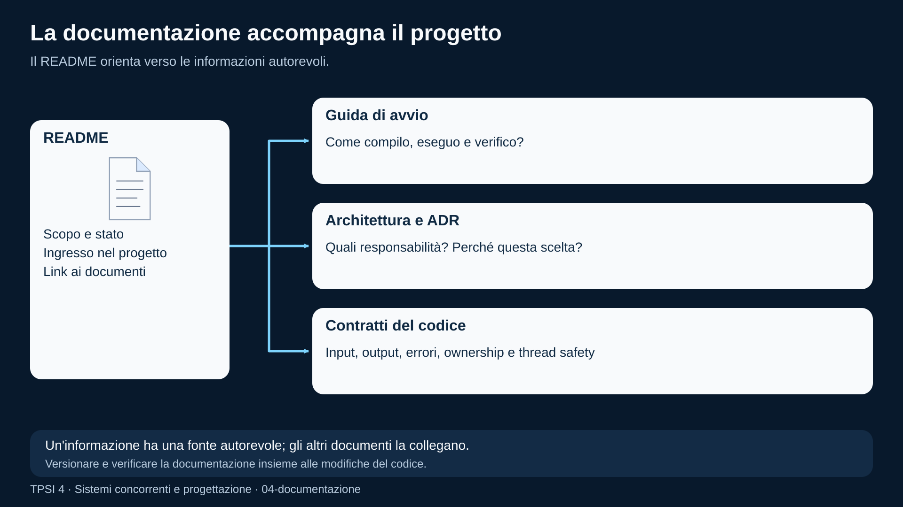
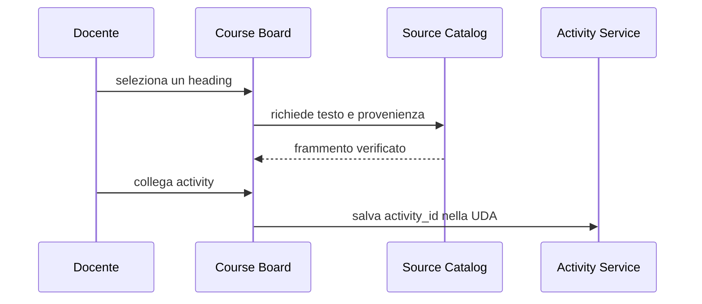
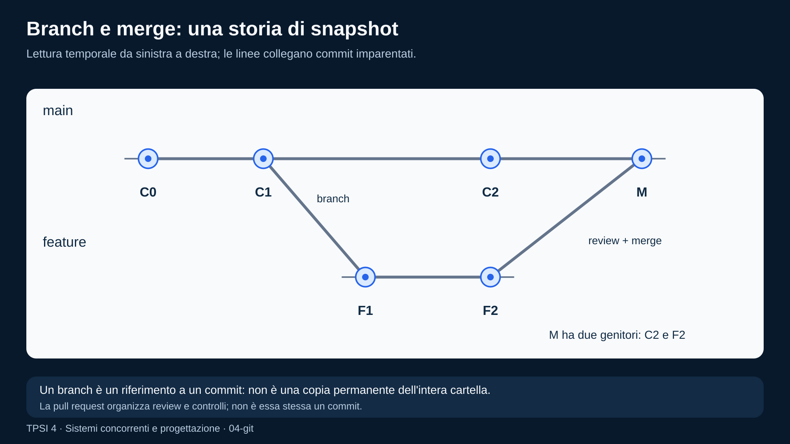

# Documentazione e controllo di versione

<!--
content_id: tpsi4-content-documentazione-versionamento
status: draft
curriculum_reference: tpsi4-curriculum-hoepli-volume-2
transformation: original-course-material
-->

## In questa unità impareremo

<!-- visual-orientation -->
<table align="center">
<tr>
<td>
<details>
<summary>&#129517; <strong>Orientamento della sezione</strong></summary>

<p align="justify">
<strong><span style="font-size: 1.15em;">&#128506;</span> Contesto:</strong>
Organizza README, documentazione del codice, ADR, contratti, Git, branch, conflitti, pull request, review e provenienza.
</p>

<p align="justify">
<strong><span style="font-size: 1.15em;">&#128736;</span> Prerequisiti:</strong>
Requisiti, criteri di accettazione e uso essenziale di Git.
</p>

<p align="justify">
<strong><span style="font-size: 1.15em;">&#127919;</span> Obiettivi:</strong>
Produrre documenti per pubblici diversi, commit intenzionali e una PR verificabile che colleghi requisiti, codice e test.
</p>

<p align="justify">
<strong><span style="font-size: 1.15em;">&#128257;</span> Richiamo:</strong>
Riprendere stakeholder, glossario, versioni e tracciabilità.
</p>

<p align="justify">
<strong><span style="font-size: 1.15em;">&#128064;</span> Anticipazione:</strong>
La documentazione verrà verificata insieme al codice con test statici e dinamici.
</p>

<p align="justify">
<strong><span style="font-size: 1.15em;">&#10145;</span> Prossimo passo:</strong>
Documentare e versionare una activity completa in un branch dedicato.
</p>

<p align="justify">
<strong><span style="font-size: 1.15em;">&#128279;</span> Rimando:</strong>
Modulo originale; documentazione e workflow del repository come esempi applicativi. <a href="#fonti-e-note-di-revisione">Fonti e note della lezione</a>; <a href="COVERAGE.md">matrice di copertura</a>.
</p>

</details>
</td>
</tr>
</table>

<p align="justify">Al termine dell'unità lo studente dovrà saper:</p>

<ul>
  <li>individuare pubblico, scopo e ciclo di vita di un documento software;</li>
  <li>organizzare la documentazione di un piccolo progetto;</li>
  <li>scrivere README, guida di avvio e note architetturali essenziali;</li>
  <li>documentare interfacce, contratti, errori e decisioni;</li>
  <li>distinguere commenti utili da commenti che ripetono il codice;</li>
  <li>usare Git per creare commit intenzionali e branch di lavoro;</li>
  <li>spiegare merge, conflitto, pull request e code review;</li>
  <li>collegare issue, requisiti, modifiche, test e documentazione;</li>
  <li>conservare provenienza e versioni delle fonti didattiche;</li>
  <li>applicare un flusso docs-as-code.</li>
</ul>

## Prerequisiti

<p align="justify">Sono richiesti:</p>

<ul>
  <li>file e directory;</li>
  <li>uso essenziale del terminale;</li>
  <li>nozioni di requisiti e criteri di accettazione;</li>
  <li>esperienza con un piccolo programma C o Java;</li>
  <li>concetti di repository e commit almeno introduttivi.</li>
</ul>

## Problema iniziale: il codice funziona, ma nessuno sa usarlo

<p align="justify">Un progetto può compilare e superare i test, ma restare inutilizzabile se mancano informazioni come:</p>

<ul>
  <li>a quale problema risponde;</li>
  <li>come si installa;</li>
  <li>quali dipendenze richiede;</li>
  <li>come si avvia;</li>
  <li>quali dati modifica;</li>
  <li>quali limiti possiede;</li>
  <li>come si eseguono i test;</li>
  <li>quali decisioni architetturali sono state prese;</li>
  <li>come contribuire senza introdurre regressioni.</li>
</ul>

<p align="justify">La documentazione non è una decorazione finale. È parte dell'interfaccia fra persone, codice e tempo.</p>

## Documentare per un pubblico

<p align="justify">Prima di scrivere bisogna sapere chi leggerà.</p>

<table align="center">
<thead>
<tr>
<th>Pubblico</th>
<th>Domande tipiche</th>
</tr>
</thead>
<tbody>
<tr>
<td>studente utilizzatore</td>
<td>come avvio il laboratorio? che cosa devo consegnare?</td>
</tr>
<tr>
<td>docente</td>
<td>come creo, assegno e correggo una activity?</td>
</tr>
<tr>
<td>sviluppatore</td>
<td>quali moduli modifico? quali contratti devo rispettare?</td>
</tr>
<tr>
<td>amministratore</td>
<td>come configuro accessi, backup e aggiornamenti?</td>
</tr>
<tr>
<td>revisore</td>
<td>quali requisiti e rischi copre la modifica?</td>
</tr>
<tr>
<td>futuro manutentore</td>
<td>perché è stata scelta questa soluzione?</td>
</tr>
</tbody>
</table>

<p align="justify">Un unico documento può servire più pubblici, ma sezioni e linguaggio devono restare riconoscibili.</p>

## Tipi di documentazione del progetto

### README

<p align="justify">È il punto di ingresso. Un README efficace risponde rapidamente a:</p>

```text
che cos'è?
per chi è?
che cosa fa?
come si prova?
quali sono i limiti attuali?
dove trovo dettagli e regole?
```

<p align="justify">Struttura possibile:</p>

```text
# Nome progetto
## Scopo
## Stato
## Requisiti
## Avvio rapido
## Esempio minimo
## Test
## Struttura repository
## Sicurezza e dati
## Contribuire
## Licenza e provenienza
```

<p align="justify">Il README non deve contenere ogni dettaglio. Deve indirizzare ai documenti autorevoli.</p>

### Guida di avvio rapido

<p align="justify">Descrive il percorso minimo riproducibile. Deve indicare:</p>

<ul>
  <li>ambiente supportato;</li>
  <li>prerequisiti;</li>
  <li>comandi esatti;</li>
  <li>output atteso;</li>
  <li>errori comuni;</li>
  <li>come annullare o pulire la prova.</li>
</ul>

<p align="justify">Una guida che funziona soltanto sul computer dell'autore non è ancora una guida verificata.</p>

### Documentazione architetturale

<p align="justify">Descrive componenti, responsabilità, confini e flussi.</p>

<p align="justify">Esempio:</p>

```text
GUI docente
    -> API locale
        -> service layer
            -> storage
            -> repository provider
            -> grading/AI services
```

<p align="justify">È utile indicare anche ciò che un livello <strong>non</strong> deve fare. Un confine negativo impedisce che logica di dominio e persistenza tornino a concentrarsi nella UI o nel server HTTP.</p>

### ADR: Architecture Decision Record

<p align="justify">Un ADR registra una decisione significativa.</p>

<p align="justify">Template breve:</p>

```text
# ADR-004: usare JSON nell'MVP e preparare storage sostituibile
Stato: accettata
Contesto: serve consegnare presto senza bloccare SQLite futuro
Decisione: servizi dipendono da una porta storage, non da file diretti
Alternative: accesso diretto JSON; SQLite immediato
Conseguenze positive: incremento piccolo, testabile
Conseguenze negative: migrazione futura e doppio livello temporaneo
```

<p align="justify">L'ADR conserva il perché. Il codice mostra soprattutto il risultato della decisione.</p>

### Runbook

<p align="justify">Un runbook descrive operazioni ripetibili:</p>

<ul>
  <li>avvio e arresto;</li>
  <li>verifica salute;</li>
  <li>backup;</li>
  <li>aggiornamento;</li>
  <li>recupero da errore;</li>
  <li>rotazione di credenziali;</li>
  <li>pubblicazione di una release.</li>
</ul>

### Changelog e note di rilascio

<p align="justify">Il changelog registra modifiche rilevanti per gli utenti o manutentori. Non deve essere la semplice copia dei messaggi di commit.</p>

<!-- figure:04-documentazione -->
<p align="center">
  
</p>
<p align="center"><em>Il README collega guida di avvio, documentazione architetturale e contratti del codice. I documenti rispondono a domande diverse e vengono mantenuti insieme al progetto.</em></p>

## Una fonte autorevole per ogni informazione

<table align="center">
<tr><td>
<p align="justify">
<strong><span style="font-size: 1.15em;">&#9888;</span> Attenzione:</strong>
La duplicazione crea contraddizioni. Se la versione supportata di Python compare in cinque file, è facile aggiornarne soltanto quattro.</p>
</td></tr>
</table>

<p align="justify">Strategie:</p>

<ul>
  <li>scegliere una fonte autorevole;</li>
  <li>generare tabelle o pagine derivate quando possibile;</li>
  <li>collegare invece di copiare;</li>
  <li>aggiungere test che rilevano valori incoerenti;</li>
  <li>indicare data o versione del documento.</li>
</ul>

<p align="justify">Nel pacchetto didattico:</p>

<ul>
  <li>il manifest descrive identità e fonti;</li>
  <li>i Markdown contengono teoria e attività;</li>
  <li><code>activity.json</code> contiene il contratto assegnabile;</li>
  <li>il CourseDesign collega contenuto, UDA e activity;</li>
  <li>i report contengono risultati, non definizioni duplicate.</li>
</ul>

## Documentazione del codice

<p align="justify">La documentazione del codice comprende più livelli.</p>

### Nomi

<p align="justify">Un nome utile riduce la necessità di commenti.</p>

```c
int x;                   /* poco informativo */
int active_workers;      /* significato più chiaro */
```

### Contratti

<p align="justify">Una funzione dovrebbe rendere comprensibili:</p>

<ul>
  <li>input;</li>
  <li>output;</li>
  <li>precondizioni;</li>
  <li>errori;</li>
  <li>proprietà della memoria;</li>
  <li>effetti collaterali;</li>
  <li>thread safety;</li>
  <li>unità di misura.</li>
</ul>

<p align="justify">Esempio C:</p>

```c
/**
 * Legge esattamente `size` byte dal descrittore.
 *
 * Restituisce 0 in caso di successo e -1 in caso di EOF prematuro
 * o errore non recuperabile. Il buffer deve avere almeno `size` byte.
 * La funzione ritenta automaticamente quando `read` è interrotta da EINTR.
 */
int read_exact(int fd, void *buffer, size_t size);
```

<p align="justify">Esempio Java:</p>

```java
/**
 * Inserisce un elemento, attendendo finché esiste spazio.
 *
 * @param value elemento non nullo da inserire
 * @throws InterruptedException se il thread viene interrotto durante l'attesa
 * @throws NullPointerException se value è null
 */
void put(T value) throws InterruptedException;
```

### Commenti sul perché

<p align="justify">Un commento utile spiega una decisione non evidente:</p>

```c
/*
 * Copiamo il payload mentre il mutex è acquisito e svolgiamo l'I/O dopo
 * il rilascio, così un client lento non blocca la coda condivisa.
 */
```

<p align="justify">Un commento inutile ripete l'istruzione:</p>

```c
counter++; /* incrementa counter */
```

### Limiti e invarianti

<p align="justify">Per codice concorrente è importante documentare:</p>

```text
quale mutex protegge quali campi
ordine globale dei lock
thread proprietario di un oggetto
condizione associata a una wait
operazioni sicure dentro un signal handler
```

<p align="justify">Queste informazioni devono essere abbastanza vicine al codice da restare aggiornate.</p>

### Esempi eseguibili

<p align="justify">Un esempio che viene compilato o testato in CI è più affidabile di uno snippet mai verificato. Quando possibile:</p>

<ul>
  <li>conservare l'esempio come file;</li>
  <li>eseguirlo nei test;</li>
  <li>incorporarne l'output nella documentazione tramite generazione;</li>
  <li>evitare output con PID o tempi non deterministici se il confronto è automatico.</li>
</ul>

## Documentazione delle API e dei dati

<p align="justify">Un endpoint o un file JSON deve descrivere:</p>

<ul>
  <li>metodo o percorso;</li>
  <li>autenticazione e permessi;</li>
  <li>schema della richiesta;</li>
  <li>schema della risposta;</li>
  <li>errori;</li>
  <li>limiti;</li>
  <li>idempotenza;</li>
  <li>esempi;</li>
  <li>versione del contratto.</li>
</ul>

<p align="justify">Esempio di contratto dati:</p>

```json
{
  "schema_version": "1.0",
  "id": "tpsi4-activity-example-001",
  "tipo": "laboratorio",
  "difficolta": "C"
}
```

<p align="justify">La presenza di <code>schema_version</code> permette al lettore e al software di sapere quale interpretazione applicare.</p>

## Diagrammi come codice

<p align="justify">Diagrammi Mermaid, PlantUML o altri formati testuali possono essere versionati insieme al codice.</p>

<p align="justify">Esempio:</p>



<p align="justify">Il diagramma deve aggiungere comprensione. Se ripete una tabella senza chiarire relazioni, può diventare un costo inutile.</p>

## Controllo di versione con Git

<p align="justify">Git conserva una storia di snapshot collegati. Un commit dovrebbe rappresentare una modifica intenzionale e spiegabile.</p>

### Stato di lavoro

```bash
git status -sb
git diff
git diff --staged
```

<p align="justify">Prima del commit è necessario capire quali file stanno per essere inclusi.</p>

### Commit

```bash
git add path/del/file
git commit -m "content: add bounded-buffer lab"
```

<p align="justify">Un buon commit:</p>

<ul>
  <li>ha uno scopo coerente;</li>
  <li>non include file estranei;</li>
  <li>lascia il progetto in uno stato comprensibile;</li>
  <li>contiene test o documentazione collegati quando necessari;</li>
  <li>usa un messaggio che descrive il cambiamento.</li>
</ul>

### Branch

<p align="justify">Un branch permette di sviluppare una modifica senza spostare immediatamente il ramo principale.</p>

```bash
git switch -c feature/bounded-buffer-lab
```

<p align="justify">Il nome deve comunicare lo scopo. Branch molto lunghi aumentano conflitti e distanza dal ramo principale.</p>

### Merge

<p align="justify">Il merge combina storie. Può produrre un commit di merge o un avanzamento lineare, in base alla situazione e alla policy.</p>

### Rebase

<p align="justify">Il rebase riposiziona commit su una nuova base e riscrive gli identificatori dei commit interessati. È utile per mantenere una storia lineare, ma non va applicato senza attenzione a commit già condivisi.</p>

<!-- figure:04-git -->
<p align="center">
  
</p>
<p align="center"><em>Da C1 parte feature con F1 e F2 mentre main avanza a C2. Dopo review, un merge crea M con genitori C2 e F2. I conflitti eventuali si risolvono prima del commit di merge.</em></p>

## Conflitti

<p align="justify">Un conflitto non significa che Git sia guasto. Significa che non può decidere automaticamente come combinare modifiche concorrenti.</p>

<p align="justify">Flusso:</p>

<ol>
  <li>leggere entrambe le intenzioni;</li>
  <li>risolvere il contenuto, non soltanto i marcatori;</li>
  <li>eseguire test e controlli;</li>
  <li>aggiungere il file risolto;</li>
  <li>completare merge o rebase;</li>
  <li>verificare la diff finale.</li>
</ol>

<p align="justify">Scegliere sempre una delle due versioni senza comprenderle può eliminare correzioni valide.</p>

## GitHub, pull request e code review

<p align="justify">Una pull request non è soltanto una richiesta di merge. È uno spazio per:</p>

<ul>
  <li>spiegare obiettivo e impatto;</li>
  <li>collegare issue e requisiti;</li>
  <li>mostrare test;</li>
  <li>discutere alternative;</li>
  <li>eseguire controlli automatici;</li>
  <li>registrare review e decisioni.</li>
</ul>

### Descrizione di una PR

```text
## Problema
## Soluzione
## Impatto per docente/studente
## Compatibilità e migrazione
## Verifiche
## Rischi e limiti
## Issue collegate
```

### Code review

<p align="justify">La review valuta il cambiamento, non la persona.</p>

<p align="justify">Un commento utile:</p>

```text
Questo ramo restituisce prima di chiudere il descrittore. Possiamo usare un
cleanup unico o aggiungere una regressione che controlli il caso di errore?
```

<p align="justify">Un commento poco utile:</p>

```text
Codice brutto.
```

<p align="justify">La review dovrebbe distinguere:</p>

<ul>
  <li>errore bloccante;</li>
  <li>rischio importante;</li>
  <li>miglioramento suggerito;</li>
  <li>preferenza stilistica.</li>
</ul>

## Storia e provenienza delle fonti

<p align="justify">Per una piattaforma multi-fonte bisogna conservare:</p>

<ul>
  <li>provider;</li>
  <li>repository o URI;</li>
  <li>ref o versione;</li>
  <li>path;</li>
  <li>digest o snapshot quando disponibile;</li>
  <li>locator del frammento;</li>
  <li>licenza;</li>
  <li>data di acquisizione;</li>
  <li>trasformazioni;</li>
  <li>revisore e stato.</li>
</ul>

<p align="justify">Esempio concettuale:</p>

```json
{
  "source_id": "tpsi4-source-linux-programming",
  "provider": "local",
  "path": "LINUX_PROGRAMMING.md",
  "anchor": "mutex",
  "transformation": "linked-and-extended",
  "review_status": "draft"
}
```

<p align="justify">Un contenuto generato con AI deve registrare il modello e il processo di trasformazione, ma non deve trattare l'AI come fonte primaria dei fatti.</p>

## Versionamento dei contenuti didattici

<p align="justify">Un contenuto può evolvere senza cambiare identità quando:</p>

<ul>
  <li>si corregge un refuso;</li>
  <li>si chiarisce una spiegazione;</li>
  <li>si aggiunge un esempio compatibile;</li>
  <li>si aggiorna una fonte mantenendo lo stesso obiettivo.</li>
</ul>

<p align="justify">È opportuno creare una nuova versione incompatibile quando:</p>

<ul>
  <li>cambiano prerequisiti o obiettivi;</li>
  <li>cambia il significato della valutazione;</li>
  <li>l'activity richiede un formato di consegna diverso;</li>
  <li>la soluzione precedente non è più valida.</li>
</ul>

<p align="justify">Il percorso deve poter scegliere una versione approvata e non dipendere automaticamente dall'ultima bozza.</p>

## Docs-as-code

<p align="justify">La documentazione trattata come codice usa:</p>

<ul>
  <li>file testuali;</li>
  <li>repository;</li>
  <li>branch e pull request;</li>
  <li>lint e test;</li>
  <li>generazione automatica;</li>
  <li>preview;</li>
  <li>review;</li>
  <li>release.</li>
</ul>

<p align="justify">Controlli possibili:</p>

```text
link interni validi
JSON valido
heading univoci
esempi compilabili
comandi aggiornati
versioni coerenti
assenza di segreti
front matter conforme
```

<p align="justify">Il vantaggio non è soltanto tecnico: la documentazione entra nello stesso processo di responsabilità del codice.</p>

## Manutenibilità della documentazione

<p align="justify">Per evitare documenti obsoleti:</p>

<ul>
  <li>assegnare un proprietario o area responsabile;</li>
  <li>indicare stato e data quando necessario;</li>
  <li>collegare la modifica documentale alla modifica di codice;</li>
  <li>rimuovere o marcare documenti sostituiti;</li>
  <li>verificare le guide in ambienti puliti;</li>
  <li>evitare screenshot quando un testo o un diagramma versionabile basta;</li>
  <li>non nascondere limiti attuali.</li>
</ul>

## Errori frequenti

### Documentare soltanto il percorso ideale

<p align="justify">Gli utenti incontrano soprattutto errori, prerequisiti mancanti e stati intermedi.</p>

### Scrivere una documentazione senza pubblico

<p align="justify">Un testo che mescola guida studente, dettagli interni e runbook diventa difficile da usare.</p>

### Commentare ogni riga

<p align="justify">Aumenta il rumore e rende più costosi gli aggiornamenti.</p>

### Inserire segreti negli esempi

<p align="justify">Token, password e chiavi non devono comparire in repository, log o screenshot.</p>

### Commit enormi

<p align="justify">Modifiche indipendenti in un solo commit rendono review e rollback più difficili.</p>

### Messaggi vaghi

<p align="justify"><code>fix</code>, <code>update</code>, <code>changes</code> non spiegano lo scopo.</p>

### Risolvere conflitti senza test

<p align="justify">Il file può essere sintatticamente valido ma semanticamente incoerente.</p>

### Copiare una fonte senza conservare provenienza

<p align="justify">Perde attribuzione, versione e possibilità di aggiornamento o rimozione.</p>

## Esercizi graduati

### Livello A — esplora

<ol>
  <li>Individua pubblico e scopo di cinque documenti del repository.</li>
  <li>Leggi una diff e scrivi un messaggio di commit adatto.</li>
  <li>Classifica commenti come utili, ridondanti o obsoleti.</li>
  <li>Disegna la struttura minima di un README per un laboratorio.</li>
</ol>

### Livello B — migliora

<ol>
  <li>Riscrivi una guida di avvio che dipende da conoscenze non dichiarate.</li>
  <li>Trasforma un commento che ripete il codice in una spiegazione del perché.</li>
  <li>Dividi un commit simulato in tre commit coerenti.</li>
  <li>Aggiungi errori e limiti a una documentazione API incompleta.</li>
</ol>

### Livello C — produci

<ol>
  <li>Scrivi README, guida rapida e troubleshooting per una activity C.</li>
  <li>Documenta il contratto di una coda concorrente.</li>
  <li>Crea un ADR per la scelta fra memoria condivisa e messaggi.</li>
  <li>Crea branch, tre commit e una PR per una modifica didattica.</li>
</ol>

### Livello D — revisiona

<ol>
  <li>Esegui una code review concentrata su sicurezza, errori e test.</li>
  <li>Risolvi un conflitto che coinvolge due modifiche entrambe valide.</li>
  <li>Individua documentazione duplicata e scegli una fonte autorevole.</li>
  <li>Verifica che starter, soluzione e consegna descrivano lo stesso contratto.</li>
</ol>

### Livello E — mini-progetto

<p align="justify">Documenta un servizio locale con:</p>

<ul>
  <li>panoramica;</li>
  <li>architettura;</li>
  <li>API;</li>
  <li>formato messaggi;</li>
  <li>esempi;</li>
  <li>test;</li>
  <li>errori;</li>
  <li>runbook;</li>
  <li>ADR principale;</li>
  <li>changelog iniziale.</li>
</ul>

### Livello F — progetto integrato

<p align="justify">Organizza un repository di gruppo con:</p>

<ul>
  <li>issue e milestone;</li>
  <li>branch policy;</li>
  <li>template PR;</li>
  <li>review;</li>
  <li>CI documentale;</li>
  <li>generazione di una guida;</li>
  <li>tracciabilità requisiti/commit/test;</li>
  <li>provenienza delle fonti;</li>
  <li>procedura di rilascio e rollback.</li>
</ul>

## Laboratorio: documentare e versionare una activity

### Consegna

<p align="justify">Partendo da un laboratorio esistente:</p>

<ol>
  <li>crea un branch dedicato;</li>
  <li>aggiungi o migliora <code>activity.json</code>;</li>
  <li>separa starter e soluzione docente;</li>
  <li>scrivi un README studente;</li>
  <li>scrivi una nota docente con obiettivi e possibili errori;</li>
  <li>aggiungi test o una checklist di prova;</li>
  <li>esegui la validazione;</li>
  <li>crea commit separati e una PR draft;</li>
  <li>chiedi una review a un compagno;</li>
  <li>applica o discuti i commenti con motivazione.</li>
</ol>

### Criteri di accettazione

<ul>
  <li>un nuovo studente comprende come iniziare;</li>
  <li>il docente comprende come correggere;</li>
  <li>la soluzione non è nello scaffold studente;</li>
  <li>la storia Git permette di distinguere contenuto, test e documentazione;</li>
  <li>la PR indica verifiche e limiti;</li>
  <li>i riferimenti alle fonti sono presenti.</li>
</ul>

## Verifica rapida

<ol>
  <li>Perché il pubblico deve essere definito prima di scrivere?</li>
  <li>Quali domande dovrebbe risolvere un README?</li>
  <li>Che cosa registra un ADR?</li>
  <li>Quando un commento è più utile di un nome migliore?</li>
  <li>Che cosa rende un commit intenzionale?</li>
  <li>Che cosa rappresenta un branch?</li>
  <li>Perché un conflitto richiede comprensione semantica?</li>
  <li>Quali informazioni dovrebbe contenere una PR?</li>
  <li>Che cosa significa docs-as-code?</li>
  <li>Quali metadati servono per la provenienza di una fonte?</li>
</ol>

## Sintesi inclusiva

<ul>
  <li>La documentazione serve a persone diverse e deve dichiarare il proprio pubblico.</li>
  <li>Il README è il punto di ingresso, non l'intero manuale.</li>
  <li>Le decisioni importanti vanno registrate con contesto e conseguenze.</li>
  <li>I nomi spiegano che cosa; i commenti utili spiegano perché, limiti e invarianti.</li>
  <li>Gli esempi testati sono più affidabili.</li>
  <li>Git conserva versioni e storia delle modifiche.</li>
  <li>Un commit deve avere uno scopo chiaro.</li>
  <li>Branch e pull request permettono sviluppo e revisione controllati.</li>
  <li>Un conflitto va risolto comprendendo entrambe le modifiche.</li>
  <li>La provenienza collega contenuto, fonte, versione, licenza e trasformazione.</li>
  <li>Docs-as-code applica review e test anche alla documentazione.</li>
</ul>

## Collegamento al modulo successivo

<p align="justify">Documentare non dimostra che il prodotto sia corretto. Il modulo <a href="05_TESTING_DEBUGGING.md">Testing e debugging</a> collega requisiti, verifiche statiche, esecuzione, test e ricerca sistematica dei difetti.</p>

## Fonti e note di revisione

<ul>
  <li>Riferimento curricolare: indice pubblico del volume 2.</li>
  <li>Esempi organizzativi ispirati ai contratti e ai flussi reali del repository, riformulati a scopo didattico.</li>
  <li>Testi, template e snippet sono originali.</li>
  <li>Stato: <code>draft</code>; verificare la policy Git effettivamente adottata dalla classe.</li>
</ul>
