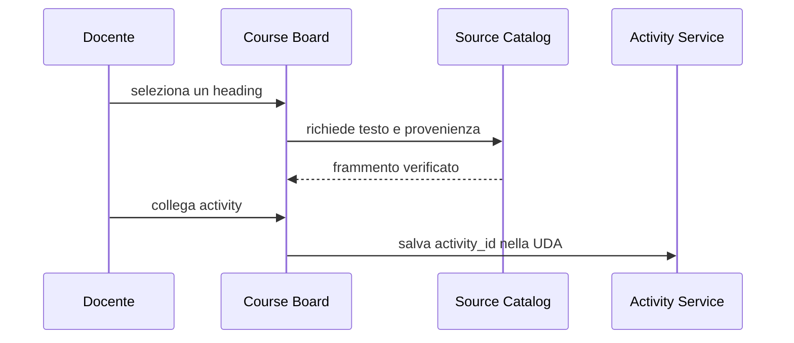

# Documentazione e controllo di versione

<!--
content_id: tpsi4-content-documentazione-versionamento
status: draft
curriculum_reference: tpsi4-curriculum-hoepli-volume-2
transformation: original-course-material
-->

## In questa unità impareremo

Al termine dell'unità lo studente dovrà saper:

- individuare pubblico, scopo e ciclo di vita di un documento software;
- organizzare la documentazione di un piccolo progetto;
- scrivere README, guida di avvio e note architetturali essenziali;
- documentare interfacce, contratti, errori e decisioni;
- distinguere commenti utili da commenti che ripetono il codice;
- usare Git per creare commit intenzionali e branch di lavoro;
- spiegare merge, conflitto, pull request e code review;
- collegare issue, requisiti, modifiche, test e documentazione;
- conservare provenienza e versioni delle fonti didattiche;
- applicare un flusso docs-as-code.

## Prerequisiti

Sono richiesti:

- file e directory;
- uso essenziale del terminale;
- nozioni di requisiti e criteri di accettazione;
- esperienza con un piccolo programma C o Java;
- concetti di repository e commit almeno introduttivi.

## Problema iniziale: il codice funziona, ma nessuno sa usarlo

Un progetto può compilare e superare i test, ma restare inutilizzabile se mancano informazioni come:

- a quale problema risponde;
- come si installa;
- quali dipendenze richiede;
- come si avvia;
- quali dati modifica;
- quali limiti possiede;
- come si eseguono i test;
- quali decisioni architetturali sono state prese;
- come contribuire senza introdurre regressioni.

La documentazione non è una decorazione finale. È parte dell'interfaccia fra persone, codice e tempo.

## Documentare per un pubblico

Prima di scrivere bisogna sapere chi leggerà.

| Pubblico | Domande tipiche |
| --- | --- |
| studente utilizzatore | come avvio il laboratorio? che cosa devo consegnare? |
| docente | come creo, assegno e correggo una activity? |
| sviluppatore | quali moduli modifico? quali contratti devo rispettare? |
| amministratore | come configuro accessi, backup e aggiornamenti? |
| revisore | quali requisiti e rischi copre la modifica? |
| futuro manutentore | perché è stata scelta questa soluzione? |

Un unico documento può servire più pubblici, ma sezioni e linguaggio devono restare riconoscibili.

## Tipi di documentazione del progetto

### README

È il punto di ingresso. Un README efficace risponde rapidamente a:

```text
che cos'è?
per chi è?
che cosa fa?
come si prova?
quali sono i limiti attuali?
dove trovo dettagli e regole?
```

Struttura possibile:

```text
# Nome progetto
## Scopo
## Stato
## Requisiti
## Avvio rapido
## Esempio minimo
## Test
## Struttura repository
## Sicurezza e dati
## Contribuire
## Licenza e provenienza
```

Il README non deve contenere ogni dettaglio. Deve indirizzare ai documenti autorevoli.

### Guida di avvio rapido

Descrive il percorso minimo riproducibile. Deve indicare:

- ambiente supportato;
- prerequisiti;
- comandi esatti;
- output atteso;
- errori comuni;
- come annullare o pulire la prova.

Una guida che funziona soltanto sul computer dell'autore non è ancora una guida verificata.

### Documentazione architetturale

Descrive componenti, responsabilità, confini e flussi.

Esempio:

```text
GUI docente
    -> API locale
        -> service layer
            -> storage
            -> repository provider
            -> grading/AI services
```

È utile indicare anche ciò che un livello **non** deve fare. Un confine negativo impedisce che logica di dominio e persistenza tornino a concentrarsi nella UI o nel server HTTP.

### ADR: Architecture Decision Record

Un ADR registra una decisione significativa.

Template breve:

```text
# ADR-004: usare JSON nell'MVP e preparare storage sostituibile
Stato: accettata
Contesto: serve consegnare presto senza bloccare SQLite futuro
Decisione: servizi dipendono da una porta storage, non da file diretti
Alternative: accesso diretto JSON; SQLite immediato
Conseguenze positive: incremento piccolo, testabile
Conseguenze negative: migrazione futura e doppio livello temporaneo
```

L'ADR conserva il perché. Il codice mostra soprattutto il risultato della decisione.

### Runbook

Un runbook descrive operazioni ripetibili:

- avvio e arresto;
- verifica salute;
- backup;
- aggiornamento;
- recupero da errore;
- rotazione di credenziali;
- pubblicazione di una release.

### Changelog e note di rilascio

Il changelog registra modifiche rilevanti per gli utenti o manutentori. Non deve essere la semplice copia dei messaggi di commit.

## Una fonte autorevole per ogni informazione

La duplicazione crea contraddizioni. Se la versione supportata di Python compare in cinque file, è facile aggiornarne soltanto quattro.

Strategie:

- scegliere una fonte autorevole;
- generare tabelle o pagine derivate quando possibile;
- collegare invece di copiare;
- aggiungere test che rilevano valori incoerenti;
- indicare data o versione del documento.

Nel pacchetto didattico:

- il manifest descrive identità e fonti;
- i Markdown contengono teoria e attività;
- `activity.json` contiene il contratto assegnabile;
- il CourseDesign collega contenuto, UDA e activity;
- i report contengono risultati, non definizioni duplicate.

## Documentazione del codice

La documentazione del codice comprende più livelli.

### Nomi

Un nome utile riduce la necessità di commenti.

```c
int x;                   /* poco informativo */
int active_workers;      /* significato più chiaro */
```

### Contratti

Una funzione dovrebbe rendere comprensibili:

- input;
- output;
- precondizioni;
- errori;
- proprietà della memoria;
- effetti collaterali;
- thread safety;
- unità di misura.

Esempio C:

```c
/**
 * Legge esattamente `size` byte dal descrittore.
 *
 * Restituisce 0 in caso di successo e -1 in caso di EOF prematuro
 * o errore non recuperabile. Il buffer deve avere almeno `size` byte.
 * La funzione ritenta automaticamente quando `read` è interrotta da EINTR.
 */
int read_exact(int fd, void *buffer, size_t size);
```

Esempio Java:

```java
/**
 * Inserisce un elemento, attendendo finché esiste spazio.
 *
 * @param value elemento non nullo da inserire
 * @throws InterruptedException se il thread viene interrotto durante l'attesa
 * @throws NullPointerException se value è null
 */
void put(T value) throws InterruptedException;
```

### Commenti sul perché

Un commento utile spiega una decisione non evidente:

```c
/*
 * Copiamo il payload mentre il mutex è acquisito e svolgiamo l'I/O dopo
 * il rilascio, così un client lento non blocca la coda condivisa.
 */
```

Un commento inutile ripete l'istruzione:

```c
counter++; /* incrementa counter */
```

### Limiti e invarianti

Per codice concorrente è importante documentare:

```text
quale mutex protegge quali campi
ordine globale dei lock
thread proprietario di un oggetto
condizione associata a una wait
operazioni sicure dentro un signal handler
```

Queste informazioni devono essere abbastanza vicine al codice da restare aggiornate.

### Esempi eseguibili

Un esempio che viene compilato o testato in CI è più affidabile di uno snippet mai verificato. Quando possibile:

- conservare l'esempio come file;
- eseguirlo nei test;
- incorporarne l'output nella documentazione tramite generazione;
- evitare output con PID o tempi non deterministici se il confronto è automatico.

## Documentazione delle API e dei dati

Un endpoint o un file JSON deve descrivere:

- metodo o percorso;
- autenticazione e permessi;
- schema della richiesta;
- schema della risposta;
- errori;
- limiti;
- idempotenza;
- esempi;
- versione del contratto.

Esempio di contratto dati:

```json
{
  "schema_version": "1.0",
  "id": "tpsi4-activity-example-001",
  "tipo": "laboratorio",
  "difficolta": "C"
}
```

La presenza di `schema_version` permette al lettore e al software di sapere quale interpretazione applicare.

## Diagrammi come codice

Diagrammi Mermaid, PlantUML o altri formati testuali possono essere versionati insieme al codice.

Esempio:



Il diagramma deve aggiungere comprensione. Se ripete una tabella senza chiarire relazioni, può diventare un costo inutile.

## Controllo di versione con Git

Git conserva una storia di snapshot collegati. Un commit dovrebbe rappresentare una modifica intenzionale e spiegabile.

### Stato di lavoro

```bash
git status -sb
git diff
git diff --staged
```

Prima del commit è necessario capire quali file stanno per essere inclusi.

### Commit

```bash
git add path/del/file
git commit -m "content: add bounded-buffer lab"
```

Un buon commit:

- ha uno scopo coerente;
- non include file estranei;
- lascia il progetto in uno stato comprensibile;
- contiene test o documentazione collegati quando necessari;
- usa un messaggio che descrive il cambiamento.

### Branch

Un branch permette di sviluppare una modifica senza spostare immediatamente il ramo principale.

```bash
git switch -c feature/bounded-buffer-lab
```

Il nome deve comunicare lo scopo. Branch molto lunghi aumentano conflitti e distanza dal ramo principale.

### Merge

Il merge combina storie. Può produrre un commit di merge o un avanzamento lineare, in base alla situazione e alla policy.

### Rebase

Il rebase riposiziona commit su una nuova base e riscrive gli identificatori dei commit interessati. È utile per mantenere una storia lineare, ma non va applicato senza attenzione a commit già condivisi.

## Conflitti

Un conflitto non significa che Git sia guasto. Significa che non può decidere automaticamente come combinare modifiche concorrenti.

Flusso:

1. leggere entrambe le intenzioni;
2. risolvere il contenuto, non soltanto i marcatori;
3. eseguire test e controlli;
4. aggiungere il file risolto;
5. completare merge o rebase;
6. verificare la diff finale.

Scegliere sempre una delle due versioni senza comprenderle può eliminare correzioni valide.

## GitHub, pull request e code review

Una pull request non è soltanto una richiesta di merge. È uno spazio per:

- spiegare obiettivo e impatto;
- collegare issue e requisiti;
- mostrare test;
- discutere alternative;
- eseguire controlli automatici;
- registrare review e decisioni.

### Descrizione di una PR

```text
## Problema
## Soluzione
## Impatto per docente/studente
## Compatibilità e migrazione
## Verifiche
## Rischi e limiti
## Issue collegate
```

### Code review

La review valuta il cambiamento, non la persona.

Un commento utile:

```text
Questo ramo restituisce prima di chiudere il descrittore. Possiamo usare un
cleanup unico o aggiungere una regressione che controlli il caso di errore?
```

Un commento poco utile:

```text
Codice brutto.
```

La review dovrebbe distinguere:

- errore bloccante;
- rischio importante;
- miglioramento suggerito;
- preferenza stilistica.

## Storia e provenienza delle fonti

Per una piattaforma multi-fonte bisogna conservare:

- provider;
- repository o URI;
- ref o versione;
- path;
- digest o snapshot quando disponibile;
- locator del frammento;
- licenza;
- data di acquisizione;
- trasformazioni;
- revisore e stato.

Esempio concettuale:

```json
{
  "source_id": "tpsi4-source-linux-programming",
  "provider": "local",
  "path": "LINUX_PROGRAMMING.md",
  "anchor": "mutex",
  "transformation": "linked-and-extended",
  "review_status": "draft"
}
```

Un contenuto generato con AI deve registrare il modello e il processo di trasformazione, ma non deve trattare l'AI come fonte primaria dei fatti.

## Versionamento dei contenuti didattici

Un contenuto può evolvere senza cambiare identità quando:

- si corregge un refuso;
- si chiarisce una spiegazione;
- si aggiunge un esempio compatibile;
- si aggiorna una fonte mantenendo lo stesso obiettivo.

È opportuno creare una nuova versione incompatibile quando:

- cambiano prerequisiti o obiettivi;
- cambia il significato della valutazione;
- l'activity richiede un formato di consegna diverso;
- la soluzione precedente non è più valida.

Il percorso deve poter scegliere una versione approvata e non dipendere automaticamente dall'ultima bozza.

## Docs-as-code

La documentazione trattata come codice usa:

- file testuali;
- repository;
- branch e pull request;
- lint e test;
- generazione automatica;
- preview;
- review;
- release.

Controlli possibili:

```text
link interni validi
JSON valido
heading univoci
esempi compilabili
comandi aggiornati
versioni coerenti
assenza di segreti
front matter conforme
```

Il vantaggio non è soltanto tecnico: la documentazione entra nello stesso processo di responsabilità del codice.

## Manutenibilità della documentazione

Per evitare documenti obsoleti:

- assegnare un proprietario o area responsabile;
- indicare stato e data quando necessario;
- collegare la modifica documentale alla modifica di codice;
- rimuovere o marcare documenti sostituiti;
- verificare le guide in ambienti puliti;
- evitare screenshot quando un testo o un diagramma versionabile basta;
- non nascondere limiti attuali.

## Errori frequenti

### Documentare soltanto il percorso ideale

Gli utenti incontrano soprattutto errori, prerequisiti mancanti e stati intermedi.

### Scrivere una documentazione senza pubblico

Un testo che mescola guida studente, dettagli interni e runbook diventa difficile da usare.

### Commentare ogni riga

Aumenta il rumore e rende più costosi gli aggiornamenti.

### Inserire segreti negli esempi

Token, password e chiavi non devono comparire in repository, log o screenshot.

### Commit enormi

Modifiche indipendenti in un solo commit rendono review e rollback più difficili.

### Messaggi vaghi

`fix`, `update`, `changes` non spiegano lo scopo.

### Risolvere conflitti senza test

Il file può essere sintatticamente valido ma semanticamente incoerente.

### Copiare una fonte senza conservare provenienza

Perde attribuzione, versione e possibilità di aggiornamento o rimozione.

## Esercizi graduati

### Livello A — esplora

1. Individua pubblico e scopo di cinque documenti del repository.
2. Leggi una diff e scrivi un messaggio di commit adatto.
3. Classifica commenti come utili, ridondanti o obsoleti.
4. Disegna la struttura minima di un README per un laboratorio.

### Livello B — migliora

1. Riscrivi una guida di avvio che dipende da conoscenze non dichiarate.
2. Trasforma un commento che ripete il codice in una spiegazione del perché.
3. Dividi un commit simulato in tre commit coerenti.
4. Aggiungi errori e limiti a una documentazione API incompleta.

### Livello C — produci

1. Scrivi README, guida rapida e troubleshooting per una activity C.
2. Documenta il contratto di una coda concorrente.
3. Crea un ADR per la scelta fra memoria condivisa e messaggi.
4. Crea branch, tre commit e una PR per una modifica didattica.

### Livello D — revisiona

1. Esegui una code review concentrata su sicurezza, errori e test.
2. Risolvi un conflitto che coinvolge due modifiche entrambe valide.
3. Individua documentazione duplicata e scegli una fonte autorevole.
4. Verifica che starter, soluzione e consegna descrivano lo stesso contratto.

### Livello E — mini-progetto

Documenta un servizio locale con:

- panoramica;
- architettura;
- API;
- formato messaggi;
- esempi;
- test;
- errori;
- runbook;
- ADR principale;
- changelog iniziale.

### Livello F — progetto integrato

Organizza un repository di gruppo con:

- issue e milestone;
- branch policy;
- template PR;
- review;
- CI documentale;
- generazione di una guida;
- tracciabilità requisiti/commit/test;
- provenienza delle fonti;
- procedura di rilascio e rollback.

## Laboratorio: documentare e versionare una activity

### Consegna

Partendo da un laboratorio esistente:

1. crea un branch dedicato;
2. aggiungi o migliora `activity.json`;
3. separa starter e soluzione docente;
4. scrivi un README studente;
5. scrivi una nota docente con obiettivi e possibili errori;
6. aggiungi test o una checklist di prova;
7. esegui la validazione;
8. crea commit separati e una PR draft;
9. chiedi una review a un compagno;
10. applica o discuti i commenti con motivazione.

### Criteri di accettazione

- un nuovo studente comprende come iniziare;
- il docente comprende come correggere;
- la soluzione non è nello scaffold studente;
- la storia Git permette di distinguere contenuto, test e documentazione;
- la PR indica verifiche e limiti;
- i riferimenti alle fonti sono presenti.

## Verifica rapida

1. Perché il pubblico deve essere definito prima di scrivere?
2. Quali domande dovrebbe risolvere un README?
3. Che cosa registra un ADR?
4. Quando un commento è più utile di un nome migliore?
5. Che cosa rende un commit intenzionale?
6. Che cosa rappresenta un branch?
7. Perché un conflitto richiede comprensione semantica?
8. Quali informazioni dovrebbe contenere una PR?
9. Che cosa significa docs-as-code?
10. Quali metadati servono per la provenienza di una fonte?

## Sintesi inclusiva

- La documentazione serve a persone diverse e deve dichiarare il proprio pubblico.
- Il README è il punto di ingresso, non l'intero manuale.
- Le decisioni importanti vanno registrate con contesto e conseguenze.
- I nomi spiegano che cosa; i commenti utili spiegano perché, limiti e invarianti.
- Gli esempi testati sono più affidabili.
- Git conserva versioni e storia delle modifiche.
- Un commit deve avere uno scopo chiaro.
- Branch e pull request permettono sviluppo e revisione controllati.
- Un conflitto va risolto comprendendo entrambe le modifiche.
- La provenienza collega contenuto, fonte, versione, licenza e trasformazione.
- Docs-as-code applica review e test anche alla documentazione.

## Collegamento al modulo successivo

Documentare non dimostra che il prodotto sia corretto. Il modulo [Testing e debugging](05_TESTING_DEBUGGING.md) collega requisiti, verifiche statiche, esecuzione, test e ricerca sistematica dei difetti.

## Fonti e note di revisione

- Riferimento curricolare: indice pubblico del volume 2.
- Esempi organizzativi ispirati ai contratti e ai flussi reali del repository, riformulati a scopo didattico.
- Testi, template e snippet sono originali.
- Stato: `draft`; verificare la policy Git effettivamente adottata dalla classe.