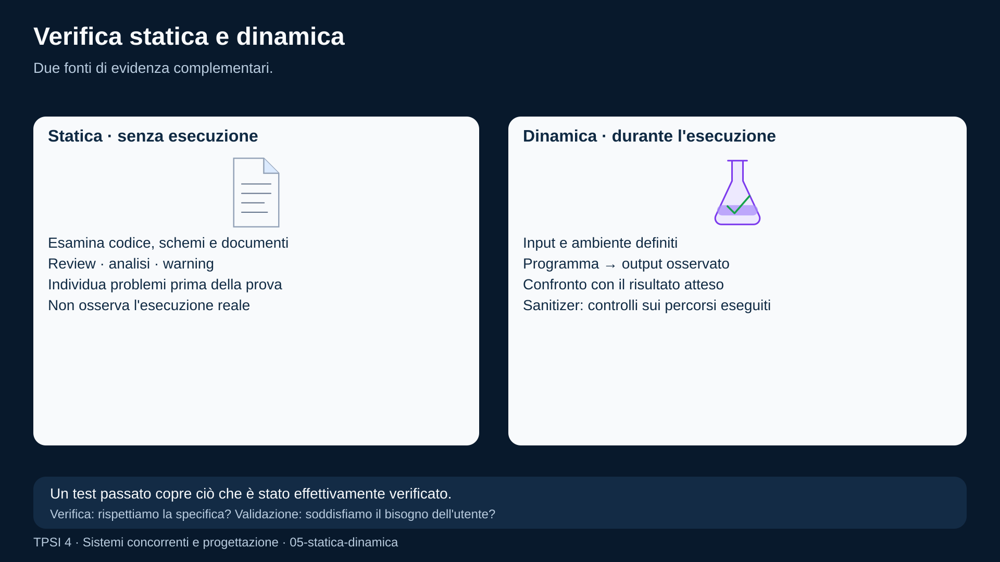
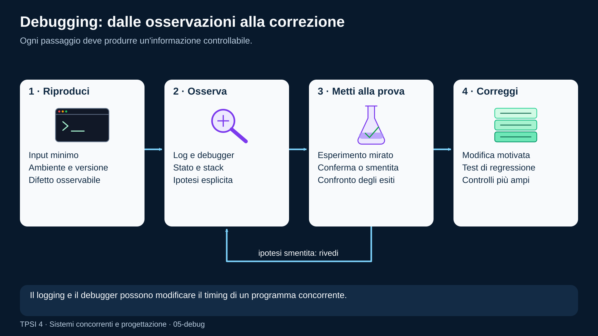

# Testing e debugging

<!--
content_id: tpsi4-content-testing-debugging
status: draft
curriculum_reference: tpsi4-curriculum-hoepli-volume-2
transformation: original-course-material
-->

## In questa unità impareremo

<!-- visual-orientation -->
<table align="center">
<tr>
<td>
<details>
<summary>&#129517; <strong>Orientamento della sezione</strong></summary>

<p align="justify">
<strong><span style="font-size: 1.15em;">&#128506;</span> Contesto:</strong>
Collega requisiti, verifica, validazione, test statici/dinamici, sanitizer, debugger, regressioni, runner e CI.
</p>

<p align="justify">
<strong><span style="font-size: 1.15em;">&#128736;</span> Prerequisiti:</strong>
Requisiti, documentazione, programmi C e concorrenza.
</p>

<p align="justify">
<strong><span style="font-size: 1.15em;">&#127919;</span> Obiettivi:</strong>
Progettare casi di test, interpretare report, riprodurre e correggere difetti con un metodo basato su evidenze.
</p>

<p align="justify">
<strong><span style="font-size: 1.15em;">&#128257;</span> Richiamo:</strong>
Riprendere criteri di accettazione, invarianti e contratti delle activity.
</p>

<p align="justify">
<strong><span style="font-size: 1.15em;">&#128064;</span> Anticipazione:</strong>
Prepara il collaudo del progetto finale e la riflessione su dati, licenze, sicurezza e AI.
</p>

<p align="justify">
<strong><span style="font-size: 1.15em;">&#10145;</span> Prossimo passo:</strong>
Eseguire l&#x27;activity end-to-end, aggiungere una regressione e documentare il risultato.
</p>

<p align="justify">
<strong><span style="font-size: 1.15em;">&#128279;</span> Rimando:</strong>
Modulo originale; validator, runner e report della piattaforma. <a href="#fonti-e-note-di-revisione">Fonti e note della lezione</a>; <a href="COVERAGE.md">matrice di copertura</a>.
</p>

</details>
</td>
</tr>
</table>

<p align="justify">Al termine dell'unità lo studente dovrà saper:</p>

<ul>
  <li>distinguere verifica e validazione;</li>
  <li>collegare test e criteri di accettazione ai requisiti;</li>
  <li>distinguere tecniche statiche e dinamiche;</li>
  <li>progettare casi di test con classi di equivalenza e valori limite;</li>
  <li>riconoscere test unitari, di integrazione, di sistema e di accettazione;</li>
  <li>interpretare warning, errori di compilazione e report del runner;</li>
  <li>usare strumenti di analisi e debugging con un metodo riproducibile;</li>
  <li>costruire test deterministici per programmi C semplici;</li>
  <li>spiegare perché il software concorrente richiede strategie aggiuntive;</li>
  <li>separare test pubblici, nascosti e soluzione docente;</li>
  <li>integrare controlli automatici in Git e CI senza confondere automazione e qualità.</li>
</ul>

## Prerequisiti

<p align="justify">Sono richiesti:</p>

<ul>
  <li>requisiti e criteri di accettazione;</li>
  <li>compilazione C e avvio di programmi;</li>
  <li>funzioni, strutture dati e gestione di file;</li>
  <li>processi, thread e sincronizzazione;</li>
  <li>Git, commit e pull request.</li>
</ul>

## Problema iniziale: «Sul mio computer funziona»

<p align="justify">Questa frase descrive un'osservazione, non una dimostrazione.</p>

<p align="justify">Per valutare il software servono almeno:</p>

<ul>
  <li>specifica del comportamento atteso;</li>
  <li>ambiente e versione degli strumenti;</li>
  <li>input eseguiti;</li>
  <li>output osservati;</li>
  <li>casi limite;</li>
  <li>condizioni di errore;</li>
  <li>possibilità di ripetere la prova;</li>
  <li>criterio che stabilisce successo o fallimento.</li>
</ul>

<p align="justify">Un programma può produrre il risultato giusto per l'input provato e restare errato per molti altri input.</p>

## Verifica e validazione

<table align="center">
<tr><td>
<p align="justify">
<strong><span style="font-size: 1.15em;">&#128214;</span> Definizione:</strong>
Una distinzione utile è:</p>

<ul>
  <li><strong>verifica</strong>: stiamo costruendo il prodotto in modo conforme alla specifica?</li>
  <li><strong>validazione</strong>: stiamo costruendo il prodotto che risponde davvero al bisogno?</li>
</ul>
</td></tr>
</table>

### Esempio

<p align="justify">Requisito:</p>

```text
Il sistema deve impedire allo studente di ricevere i test nascosti.
```

<p align="justify">Verifica:</p>

<ul>
  <li>il filtro degli asset esclude <code>hidden_test</code>;</li>
  <li>i test automatici controllano lo scaffold;</li>
  <li>la review verifica i percorsi di distribuzione.</li>
</ul>

<p align="justify">Validazione:</p>

<ul>
  <li>il flusso reale consente al docente di preparare una prova senza esporre la soluzione;</li>
  <li>lo studente riceve comunque informazioni sufficienti per lavorare;</li>
  <li>la politica è comprensibile e utilizzabile.</li>
</ul>

<p align="justify">Un prodotto può essere verificato rispetto a una specifica sbagliata e quindi non essere validato rispetto al bisogno.</p>

## Piano di verifica

<p align="justify">Prima di eseguire test è utile definire:</p>

```text
oggetto della prova
requisiti coperti
ambiente
strumenti
input e dati
oracolo del test
risultati attesi
criterio di uscita
responsabile
rischi e limiti
```

<p align="justify">L'<strong>oracolo</strong> determina il risultato atteso. Può essere:</p>

<ul>
  <li>una formula;</li>
  <li>una specifica;</li>
  <li>una implementazione indipendente;</li>
  <li>un confronto con dati noti;</li>
  <li>una proprietà o invariante;</li>
  <li>una decisione docente.</li>
</ul>

## Verifica statica

<p align="justify">La verifica statica analizza artefatti senza eseguire il programma nel normale scenario operativo.</p>

<p align="justify">Comprende:</p>

<ul>
  <li>lettura e revisione;</li>
  <li>controllo dei requisiti;</li>
  <li>analisi di diagrammi;</li>
  <li>compilazione e warning;</li>
  <li>lint;</li>
  <li>analisi statica;</li>
  <li>type checking;</li>
  <li>controllo di formati e schemi;</li>
  <li>ricerca di segreti o dipendenze vulnerabili;</li>
  <li>verifica di link e documentazione.</li>
</ul>

### Warning del compilatore

<p align="justify">Per C:</p>

```bash
gcc -Wall -Wextra -Wpedantic -std=c17 main.c -o main
```

<p align="justify">I warning non sono tutti errori, ma vanno compresi. Disabilitarli per ottenere una build verde può nascondere conversioni, variabili non usate o comportamenti dubbi.</p>

### Validazione di schema

```bash
python scripts/validate_activity.py activities/tpsi_quarto
```

<p align="justify">La validazione controlla forma e campi essenziali. Non dimostra che la consegna sia didatticamente corretta o che la soluzione soddisfi i test.</p>

### Code review

<p align="justify">La review statica può cercare:</p>

<ul>
  <li>precondizioni non documentate;</li>
  <li>percorsi di errore incompleti;</li>
  <li>risorse non rilasciate;</li>
  <li>lock acquisiti in ordine incoerente;</li>
  <li>dati sensibili nei log;</li>
  <li>differenze fra requisiti, codice e test;</li>
  <li>codice duplicato;</li>
  <li>nomi o contratti ambigui.</li>
</ul>

<!-- figure:05-statica-dinamica -->
<p align="center">
  
</p>
<p align="center"><em>La verifica statica esamina codice e documenti senza eseguire il programma: review, analisi e warning. La verifica dinamica esegue il programma con input e confronta risultati e comportamento attesi.</em></p>

## Verifica dinamica

<p align="justify">La verifica dinamica esegue il programma o una sua parte.</p>

<p align="justify">Comprende:</p>

<ul>
  <li>test automatici;</li>
  <li>prove manuali;</li>
  <li>profiling;</li>
  <li>sanitizer;</li>
  <li>fuzzing;</li>
  <li>test di carico;</li>
  <li>test di sicurezza;</li>
  <li>collaudo su ambienti reali;</li>
  <li>osservazione di log e metriche.</li>
</ul>

<p align="justify">Un test dinamico esplora soltanto gli scenari eseguiti. L'assenza di fallimenti non dimostra l'assenza di difetti.</p>

## Livelli di test

### Test unitario

<p align="justify">Verifica una piccola unità con dipendenze controllate.</p>

<p align="justify">Esempio: funzione che valida un identificatore o normalizza un output.</p>

### Test di integrazione

<p align="justify">Verifica collaborazione tra componenti.</p>

<p align="justify">Esempio: servizio activity + storage + generazione scaffold.</p>

### Test di sistema

<p align="justify">Verifica il prodotto completo in un ambiente rappresentativo.</p>

<p align="justify">Esempio: docente crea activity, la assegna, lo studente esegue il runner e il report appare nella dashboard.</p>

### Test di accettazione

<p align="justify">Verifica requisiti e bisogni concordati con gli stakeholder.</p>

<p align="justify">Esempio: il docente riesce a collegare più fonti alla stessa UDA conservando la provenienza.</p>

<p align="justify">I livelli non sono separati rigidamente, ma aiutano a scegliere scopo e costo della prova.</p>

## Progettare casi di test

### Classi di equivalenza

<p align="justify">Gli input vengono raggruppati quando si prevede un comportamento equivalente.</p>

<p align="justify">Esempio: funzione che accetta un voto da 0 a 10.</p>

<ul>
  <li>valori validi: <code>0..10</code>;</li>
  <li>sotto il minimo;</li>
  <li>sopra il massimo;</li>
  <li>formato non numerico.</li>
</ul>

<p align="justify">Non serve provare ogni intero possibile, ma ogni classe significativa.</p>

### Valori limite

<p align="justify">Molti errori compaiono vicino ai confini:</p>

```text
-1, 0, 1, 9, 10, 11
```

<p align="justify">Per un buffer di capacità <code>N</code>:</p>

```text
0, 1, N-1, N, N+1
```

### Tabella decisionale

<p align="justify">Utile quando più condizioni influenzano l'esito.</p>

<table align="center">
<thead>
<tr>
<th>autenticato</th>
<th>ruolo docente</th>
<th>activity valida</th>
<th>esito</th>
</tr>
</thead>
<tbody>
<tr>
<td>no</td>
<td>—</td>
<td>—</td>
<td>rifiuto</td>
</tr>
<tr>
<td>sì</td>
<td>no</td>
<td>—</td>
<td>rifiuto</td>
</tr>
<tr>
<td>sì</td>
<td>sì</td>
<td>no</td>
<td>errore di validazione</td>
</tr>
<tr>
<td>sì</td>
<td>sì</td>
<td>sì</td>
<td>salvataggio</td>
</tr>
</tbody>
</table>

### Transizioni di stato

<p align="justify">Per oggetti con ciclo di vita:</p>

```text
draft -> reviewed -> approved -> assigned -> closed
```

<p align="justify">I test devono coprire transizioni valide e tentativi non ammessi.</p>

### Test basati su proprietà

<p align="justify">Invece di elencare soltanto esempi, si verifica una proprietà generale.</p>

<p align="justify">Esempio per una funzione di ordinamento:</p>

```text
l'output è ordinato
l'output contiene gli stessi elementi dell'input
ordinare due volte non cambia il risultato
```

## Test deterministici stdin/stdout

<p align="justify">Il runner C corrente può compilare un file e confrontare output normalizzato.</p>

<p align="justify">Activity semplificata:</p>

```json
{
  "linguaggio": "c",
  "test_cases": [
    {
      "name": "caso positivo",
      "stdin": "5\n",
      "expected_stdout": "Risultato: 25\n"
    }
  ]
}
```

<p align="justify">Per rendere il test stabile:</p>

<ul>
  <li>non stampare PID o timestamp se non sono normalizzati;</li>
  <li>evitare messaggi di debug su stdout;</li>
  <li>definire formato, spazi e newline;</li>
  <li>usare stderr per diagnostica;</li>
  <li>applicare un timeout;</li>
  <li>non dipendere dall'ordine non deterministico dei thread.</li>
</ul>

## Test pubblici e test nascosti

### Test pubblico

<p align="justify">Aiuta lo studente a comprendere il contratto e verificare progressi.</p>

### Test nascosto

<p align="justify">Controlla casi aggiuntivi senza fornire direttamente la soluzione. Non deve però introdurre requisiti assenti dalla consegna.</p>

<p align="justify">Una buona prova combina:</p>

<ul>
  <li>esempi chiari nella consegna;</li>
  <li>test pubblici rappresentativi;</li>
  <li>test nascosti coerenti;</li>
  <li>rubrica per aspetti non facilmente automatizzabili;</li>
  <li>feedback che non riveli il codice della soluzione.</li>
</ul>

<p align="justify">Nascondere tutti i criteri rende la prova arbitraria. Rendere pubblica la soluzione annulla l'attività. Serve equilibrio.</p>

## Test di errori e casi negativi

<p align="justify">Non basta provare input corretti.</p>

<p align="justify">Per un programma con pipe:</p>

<ul>
  <li><code>fork</code> fallisce;</li>
  <li><code>pipe</code> fallisce;</li>
  <li>lettura termina prima del messaggio completo;</li>
  <li>il figlio esce con errore;</li>
  <li>l'input non è valido;</li>
  <li>il risultato supera il tipo scelto;</li>
  <li>un descrittore non viene chiuso;</li>
  <li>il processo non termina entro il timeout.</li>
</ul>

<p align="justify">Alcuni errori sono difficili da provocare in modo portabile. Si possono isolare le dipendenze o introdurre adapter controllabili nei test.</p>

## Sanitizer

<p align="justify">Gli sanitizer aggiungono controlli runtime.</p>

### AddressSanitizer e UndefinedBehaviorSanitizer

```bash
gcc -Wall -Wextra -Wpedantic -std=c17 \
  -fsanitize=address,undefined -fno-omit-frame-pointer \
  main.c -o main_asan
./main_asan
```

<p align="justify">Possono individuare:</p>

<ul>
  <li>accessi fuori limite;</li>
  <li>use-after-free;</li>
  <li>alcuni leak;</li>
  <li>overflow o operazioni indefinite controllate da UBSan;</li>
  <li>errori di puntatori.</li>
</ul>

<p align="justify">Non sostituiscono i test: osservano problemi soltanto nei percorsi eseguiti.</p>

### ThreadSanitizer

<p align="justify">Per alcuni programmi thread e toolchain:</p>

```bash
gcc -Wall -Wextra -std=c17 -pthread \
  -fsanitize=thread main.c -o main_tsan
```

<p align="justify">Può rilevare data race, ma non dimostra assenza di deadlock o correttezza del protocollo. Compatibilità e costo vanno verificati nell'ambiente.</p>

## Debugging come ciclo di ipotesi

<p align="justify">Il debugging efficace è un processo scientifico:</p>

<ol>
  <li>riproduci il difetto;</li>
  <li>riduci il caso;</li>
  <li>raccogli evidenze;</li>
  <li>formula una ipotesi;</li>
  <li>progetta una prova che distingue ipotesi diverse;</li>
  <li>applica la correzione minima;</li>
  <li>aggiungi una regressione;</li>
  <li>esegui controlli più ampi;</li>
  <li>documenta causa e impatto.</li>
</ol>

<p align="justify">Modificare codice casualmente finché il problema scompare non identifica la causa.</p>

<!-- figure:05-debug -->
<p align="center">
  
</p>
<p align="center"><em>Riproduci e riduci il difetto, raccogli evidenze, formula un&#x27;ipotesi e mettila alla prova. Se è smentita, formula una nuova ipotesi; se confermata, correggi e aggiungi una regressione.</em></p>

## Riproducibilità

<p align="justify">Un bug report utile contiene:</p>

```text
versione o commit
sistema operativo e toolchain
comando eseguito
input
output atteso
output reale
frequenza
log essenziali
passi minimi
```

<p align="justify">Per problemi concorrenti aggiungere:</p>

<ul>
  <li>numero di thread/processi;</li>
  <li>carico;</li>
  <li>timeout;</li>
  <li>sequenza di eventi disponibile;</li>
  <li>eventuale seed;</li>
  <li>dump o stack dei thread.</li>
</ul>

## Debugger

<p align="justify">Con GDB:</p>

```bash
gcc -g -O0 -Wall -Wextra main.c -o main
gdb ./main
```

<p align="justify">Comandi essenziali:</p>

```text
break main
run
next
step
print variable
backtrace
continue
info threads
thread <id>
```

<p align="justify">Compilare con simboli e ottimizzazione bassa semplifica l'osservazione, ma il bug può dipendere dall'ottimizzazione. In tal caso bisogna confrontare configurazioni senza assumere che il debugger riproduca sempre lo stesso comportamento.</p>

## Logging

<p align="justify">Un log utile è:</p>

<ul>
  <li>strutturato;</li>
  <li>dotato di livello;</li>
  <li>correlabile;</li>
  <li>privo di segreti;</li>
  <li>limitato;</li>
  <li>coerente con il ciclo di vita.</li>
</ul>

<p align="justify">Per concorrenza, includere un ID di operazione o richiesta è spesso più utile del solo thread ID.</p>

```text
ts=... level=INFO request=42 worker=2 event=received
```

<p align="justify">Il logging può alterare il timing e far sparire un bug concorrente. È un effetto da considerare.</p>

## Debugging di processi

<p align="justify">Strumenti e domande:</p>

```bash
ps -e -o pid,ppid,state,command
pstree -p
strace -f ./programma
```

<ul>
  <li>Il figlio viene creato?</li>
  <li>Quale ramo esegue?</li>
  <li>Chi mantiene aperta una pipe?</li>
  <li>Il padre esegue <code>waitpid</code>?</li>
  <li>Quale codice di uscita viene raccolto?</li>
  <li>Una <code>exec</code> fallisce e il processo continua nel ramo sbagliato?</li>
</ul>

## Debugging di thread

<p align="justify">Domande:</p>

<ul>
  <li>Quale stato è condiviso?</li>
  <li>Quale lock lo protegge?</li>
  <li>Tutti i percorsi rilasciano il lock?</li>
  <li>La condizione viene verificata in <code>while</code>?</li>
  <li>L'ordine dei lock è coerente?</li>
  <li>Un thread può terminare mentre possiede risorse?</li>
  <li>Esiste starvation?</li>
  <li>L'arresto è cooperativo?</li>
</ul>

<p align="justify">Un test che esegue il programma una sola volta è debole. Si possono usare ripetizioni, carico variabile, scheduler stress e sanitizer, senza confonderli con una prova matematica.</p>

## Debugging Java

<p align="justify">Strumenti e concetti:</p>

<ul>
  <li>stack trace;</li>
  <li>breakpoint e debugger IDE;</li>
  <li><code>jstack</code> o thread dump;</li>
  <li>nomi dei thread;</li>
  <li>eccezioni non gestite;</li>
  <li>stato <code>BLOCKED</code>, <code>WAITING</code>, <code>TIMED_WAITING</code>;</li>
  <li><code>InterruptedException</code>;</li>
  <li>lock e condition;</li>
  <li>future non completate.</li>
</ul>

<p align="justify">Un'interruzione non equivale alla terminazione forzata. Il codice deve decidere come reagire e ripristinare lo stato di interruzione quando appropriato.</p>

## Regression test

<p align="justify">Ogni bug corretto dovrebbe produrre, quando possibile, un test che falliva prima e passa dopo.</p>

<p align="justify">Il test deve rappresentare la causa, non soltanto l'esempio accidentale.</p>

<p align="justify">Esempio:</p>

```text
Bug: output Windows CRLF confrontato con LF fallisce.
Regressione: il normalizzatore deve trattare CRLF e LF come equivalenti.
```

## Continuous Integration

<p align="justify">La CI esegue controlli su eventi come push o pull request.</p>

<p align="justify">Può includere:</p>

<ul>
  <li>validazione JSON;</li>
  <li>test unitari;</li>
  <li>test di integrazione;</li>
  <li>compilazione C;</li>
  <li>build Docker;</li>
  <li>lint;</li>
  <li>controlli di sicurezza;</li>
  <li>generazione documentale.</li>
</ul>

<p align="justify">Una pipeline verde significa che i controlli configurati sono passati. Non dimostra che tutti i requisiti siano coperti.</p>

### Controlli rapidi e controlli costosi

<p align="justify">È utile separare:</p>

<ul>
  <li>controlli rapidi a ogni commit/PR;</li>
  <li>test più costosi o dipendenti dall'ambiente;</li>
  <li>prove manuali guidate;</li>
  <li>collaudi su hardware reale.</li>
</ul>

## Testing della piattaforma multi-fonte

<p align="justify">Casi importanti:</p>

<ul>
  <li>source ID duplicato;</li>
  <li>path con <code>..</code>;</li>
  <li>symlink che esce dalla root;</li>
  <li>file assente;</li>
  <li>file troppo grande;</li>
  <li>ref remota non sicura;</li>
  <li>fonte remota dichiarata <code>ready</code> senza adapter;</li>
  <li>heading spostato;</li>
  <li>digest cambiato durante la lettura;</li>
  <li>item che punta a fonte o riga obsolete;</li>
  <li>contenuti da due snapshot diversi combinati nella stessa operazione.</li>
</ul>

<p align="justify">Questi test proteggono provenienza e confini, non soltanto l'interfaccia.</p>

## Testing delle activity

<p align="justify">Controlli strutturali:</p>

```text
schema_version
campi obbligatori
tipo e difficoltà ammessi
asset con path sicuri
visibilità corretta
rubrica valida
metriche valide
```

<p align="justify">Controlli semantici:</p>

```text
consegna coerente con test
starter compilabile o intenzionalmente incompleto
soluzione che supera i test
hidden test non distribuiti
output e timeout ragionevoli
rubrica coerente con obiettivi
modalità di aiuto applicabile
```

## Errori frequenti

### Scrivere test dopo aver visto soltanto l'implementazione

<p align="justify">I test rischiano di confermare il codice invece di verificare il requisito.</p>

### Usare un solo input

<p align="justify">Non copre classi, confini e casi negativi.</p>

### Test dipendenti dal tempo

<p align="justify"><code>sleep(1)</code> non garantisce che un evento sia avvenuto. Usare sincronizzazione o polling con deadline controllata.</p>

### Condividere test nascosti nello scaffold

<p align="justify">Annulla il confine docente/studente.</p>

### Ignorare l'ambiente

<p align="justify">Una prova dipendente da Linux, versione del compilatore o locale deve dichiararlo.</p>

### Correggere senza regressione

<p align="justify">Il difetto può tornare.</p>

### Debug tramite stampe casuali

<p align="justify">Le stampe possono cambiare timing e aumentano rumore. Formulare prima un'ipotesi.</p>

### Test concorrenti non isolati

<p align="justify">Un processo o container rimasto attivo può influenzare prove successive.</p>

### Confondere copertura e qualità

<p align="justify">Una percentuale alta di righe eseguite non garantisce buoni oracoli o casi significativi.</p>

## Esercizi graduati

### Livello A — riconosci

<ol>
  <li>Classifica dieci attività come verifica statica o dinamica.</li>
  <li>Distingui test unitario, integrazione, sistema e accettazione.</li>
  <li>Individua valori limite per cinque funzioni.</li>
  <li>Leggi un warning C e spiega il rischio.</li>
</ol>

### Livello B — completa

<ol>
  <li>Aggiungi tre casi limite a una activity con un solo test.</li>
  <li>Scrivi una regressione per un bug descritto.</li>
  <li>Migliora un bug report incompleto.</li>
  <li>Separa stdout diagnostico e output contrattuale.</li>
</ol>

### Livello C — progetta

<ol>
  <li>Deriva casi di test da requisiti di una coda limitata.</li>
  <li>Crea una tabella decisionale per ruoli e permessi.</li>
  <li>Scrivi test stdin/stdout per un programma C.</li>
  <li>Definisci una checklist semantica per activity e asset.</li>
</ol>

### Livello D — debug

<ol>
  <li>Individua un use-after-free con AddressSanitizer.</li>
  <li>Analizza un deadlock usando thread dump o debugger.</li>
  <li>Trova perché il padre non osserva EOF su una pipe.</li>
  <li>Correggi un test intermittente che usa <code>sleep</code>.</li>
</ol>

### Livello E — mini-progetto

<p align="justify">Costruisci una suite per un programma C che comprende:</p>

<ul>
  <li>test normali;</li>
  <li>valori limite;</li>
  <li>input non valido;</li>
  <li>timeout;</li>
  <li>sanitizer;</li>
  <li>script di esecuzione;</li>
  <li>report leggibile;</li>
  <li>regressione per un difetto reale.</li>
</ul>

### Livello F — progetto integrato

<p align="justify">Progetta la strategia di qualità di un modulo 2cornot2c:</p>

<ul>
  <li>requisiti e rischi;</li>
  <li>test unitari/integrati/end-to-end;</li>
  <li>fonti di test;</li>
  <li>ambienti Linux e Windows;</li>
  <li>Docker;</li>
  <li>controlli di sicurezza;</li>
  <li>prova manuale docente/studente;</li>
  <li>criteri di rilascio;</li>
  <li>rollback.</li>
</ul>

## Laboratorio 1 — activity C end-to-end

<p align="justify">Usa <code>tpsi4-activity-c-fork-pipe-square-001</code>.</p>

<p align="justify">Passi:</p>

<ol>
  <li>valida <code>activity.json</code>;</li>
  <li>genera lo scaffold;</li>
  <li>compila lo starter dopo il completamento;</li>
  <li>esegui i test normali e limite;</li>
  <li>prova un errore intenzionale;</li>
  <li>verifica il report;</li>
  <li>confronta con la soluzione docente senza distribuirla allo studente;</li>
  <li>aggiungi un caso di regressione.</li>
</ol>

## Laboratorio 2 — bug concorrente

<p align="justify">Prepara due versioni di un contatore:</p>

<ul>
  <li>non sincronizzata;</li>
  <li>sincronizzata.</li>
</ul>

<p align="justify">Esegui molte ripetizioni e osserva che l'assenza di fallimento in una corsa non dimostra correttezza. Usa, se disponibile, ThreadSanitizer e confronta il tipo di evidenza fornita.</p>

## Laboratorio 3 — debugging con GDB

<p align="justify">Parti da un programma con:</p>

<ul>
  <li>accesso fuori limite;</li>
  <li>valore non inizializzato;</li>
  <li>ramo di errore incompleto.</li>
</ul>

<p align="justify">Riproduci, crea breakpoint, osserva stack e variabili, correggi e aggiungi test.</p>

## Laboratorio 4 — CI del pacchetto didattico

<p align="justify">Configura o simula una pipeline che esegue:</p>

```text
validazione manifest JSON
validazione activity
controllo link Markdown
generazione percorso
compilazione esempio C
smoke test del runner
```

<p align="justify">Spiega quali controlli restano manuali e perché.</p>

## Verifica rapida

<ol>
  <li>Qual è la differenza tra verifica e validazione?</li>
  <li>Che cos'è un oracolo del test?</li>
  <li>Fornisci due esempi di verifica statica.</li>
  <li>Qual è la differenza fra test unitario e di sistema?</li>
  <li>Perché i valori limite sono importanti?</li>
  <li>Che cosa distingue un test pubblico da uno nascosto?</li>
  <li>Quali problemi può rilevare AddressSanitizer?</li>
  <li>Quali passaggi compongono il ciclo di debugging?</li>
  <li>Perché il logging può cambiare un bug concorrente?</li>
  <li>Che cosa significa una pipeline CI verde?</li>
</ol>

## Sintesi inclusiva

<ul>
  <li>Verificare significa controllare la conformità; validare significa controllare l'utilità rispetto al bisogno.</li>
  <li>I test derivano dai requisiti e hanno un risultato atteso.</li>
  <li>La verifica statica non richiede la normale esecuzione del programma.</li>
  <li>La verifica dinamica esegue codice e scenari.</li>
  <li>I valori limite rivelano molti errori.</li>
  <li>I test pubblici aiutano lo studente; quelli nascosti coprono casi aggiuntivi senza introdurre regole segrete.</li>
  <li>Sanitizer e debugger producono evidenze, ma non sostituiscono una buona suite.</li>
  <li>Il debugging usa riproduzione, ipotesi, prova, correzione e regressione.</li>
  <li>Il software concorrente richiede ripetizioni, osservabilità e strumenti specifici.</li>
  <li>La CI automatizza controlli noti; non garantisce da sola la qualità totale.</li>
</ul>

## Collegamento al modulo successivo

<p align="justify">Qualità e tecnologia hanno conseguenze sociali, legali e organizzative. Il modulo <a href="06_CITTADINANZA_DIGITALE.md">Cittadinanza digitale</a> affronta licenze, privacy, sicurezza, collaborazione e uso responsabile dell'AI.</p>

## Fonti e note di revisione

<ul>
  <li>Riferimento curricolare: indice pubblico del volume 2.</li>
  <li>Esempi tecnici collegati ai runner, ai contratti e alle pratiche presenti nel repository, riformulati a scopo didattico.</li>
  <li>Testi, esercizi e snippet sono originali.</li>
  <li>Stato: <code>draft</code>; eseguire i comandi nell'ambiente didattico prima della pubblicazione.</li>
</ul>
