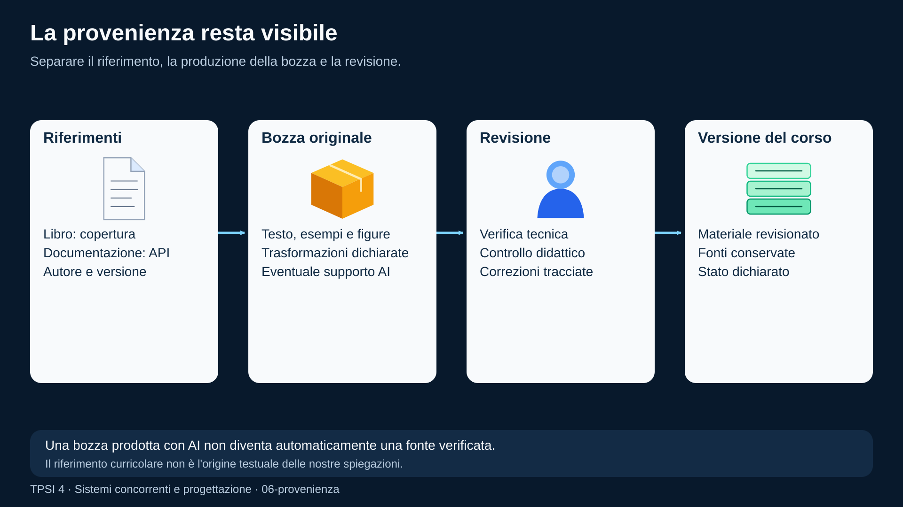
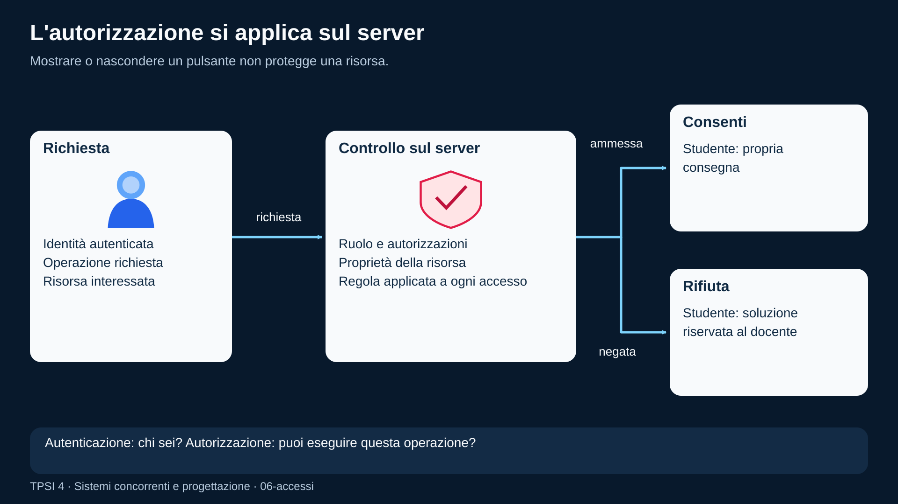
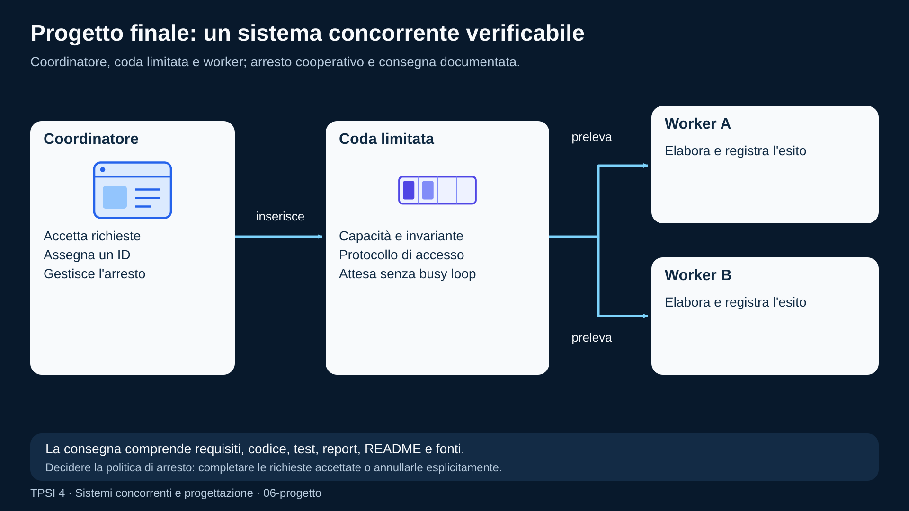

# Cittadinanza digitale per chi progetta software

<!--
content_id: tpsi4-content-cittadinanza-digitale
status: draft
curriculum_reference: tpsi4-curriculum-hoepli-volume-2
transformation: original-course-material
-->

## In questa unità impareremo

<!-- visual-orientation -->
<table align="center">
<tr>
<td>
<details>
<summary>&#129517; <strong>Orientamento della sezione</strong></summary>

<p align="justify">
<strong><span style="font-size: 1.15em;">&#128506;</span> Contesto:</strong>
Integra licenze, provenienza, privacy, segreti, supply chain, accessibilita, valutazione e uso responsabile dell&#x27;AI nel progetto finale.
</p>

<p align="justify">
<strong><span style="font-size: 1.15em;">&#128736;</span> Prerequisiti:</strong>
Tutti i moduli precedenti e un progetto di gruppo in corso.
</p>

<p align="justify">
<strong><span style="font-size: 1.15em;">&#127919;</span> Obiettivi:</strong>
Applicare responsabilita tecnica e digitale a fonti, dati, repository, review, dipendenze, AI e valutazione.
</p>

<p align="justify">
<strong><span style="font-size: 1.15em;">&#128257;</span> Richiamo:</strong>
Riprendere provenienza, ruoli, test, documentazione e policy di aiuto.
</p>

<p align="justify">
<strong><span style="font-size: 1.15em;">&#128064;</span> Anticipazione:</strong>
Conclude con demo, relazione, evidenze e valutazione del progetto integrato.
</p>

<p align="justify">
<strong><span style="font-size: 1.15em;">&#10145;</span> Prossimo passo:</strong>
Completare un progetto concorrente documentato, testato e accompagnato da manifest di fonti e policy.
</p>

<p align="justify">
<strong><span style="font-size: 1.15em;">&#128279;</span> Rimando:</strong>
Modulo originale; manifest del pacchetto e policy della piattaforma. <a href="#fonti-e-note-di-revisione">Fonti e note della lezione</a>; <a href="COVERAGE.md">matrice di copertura</a>.
</p>

</details>
</td>
</tr>
</table>

<p align="justify">Al termine dell'unità lo studente dovrà saper:</p>

<ul>
  <li>distinguere accesso a una risorsa e diritto di copiarla o redistribuirla;</li>
  <li>registrare autore, fonte, licenza, versione e trasformazioni;</li>
  <li>applicare minimizzazione, separazione dei ruoli e protezione dei dati scolastici;</li>
  <li>riconoscere segreti, dati personali e informazioni che non devono entrare nei repository;</li>
  <li>collaborare con issue, review e segnalazioni rispettose;</li>
  <li>usare strumenti AI dichiarando limiti, verifiche e responsabilità umana;</li>
  <li>ragionare su sicurezza della supply chain, dipendenze e artefatti;</li>
  <li>progettare contenuti accessibili e inclusivi;</li>
  <li>valutare l'impatto di automazione e metriche sugli studenti.</li>
</ul>

## Prerequisiti

<p align="justify">Sono utili:</p>

<ul>
  <li>fonti, repository e controllo di versione;</li>
  <li>ruoli docente/studente/amministratore;</li>
  <li>activity, test e report;</li>
  <li>concetti di autenticazione, autorizzazione e log;</li>
  <li>capacità di distinguere fatti, ipotesi e decisioni.</li>
</ul>

## Problema iniziale: posso copiare tutto se il repository è privato?

<p align="justify">No. La privacy del repository controlla chi può accedere tramite la piattaforma, ma non modifica automaticamente copyright, licenze o condizioni d'uso della fonte.</p>

<p align="justify">Bisogna distinguere:</p>

<ul>
  <li><strong>possesso o accesso</strong>: posso leggere la risorsa;</li>
  <li><strong>uso personale</strong>: posso usarla entro certi limiti;</li>
  <li><strong>riproduzione</strong>: posso crearne copie;</li>
  <li><strong>modifica</strong>: posso produrre opere derivate;</li>
  <li><strong>redistribuzione</strong>: posso consegnarla ad altri;</li>
  <li><strong>pubblicazione</strong>: posso renderla disponibile a un pubblico;</li>
  <li><strong>uso commerciale</strong>: posso incorporarla in un prodotto o servizio a pagamento.</li>
</ul>

<p align="justify">Le autorizzazioni possono essere diverse per ciascuna azione. In caso di dubbio si conserva soltanto il riferimento e si produce materiale originale.</p>

<p align="justify">Questa unità offre criteri didattici e tecnici; non sostituisce una consulenza legale o le condizioni specifiche della licenza.</p>

## Copyright, licenza e pubblico dominio

<!-- definition -->
<table align="center">
<tr><td>
&#10071; <strong>Importante</strong>
<p align="justify">Il <strong>copyright</strong> protegge automaticamente molte opere creative. Una <strong>licenza</strong> concede alcuni diritti secondo condizioni definite.</p>
</td></tr>
</table>
<!-- /definition -->

<p align="justify">Domande da porre prima di importare una risorsa:</p>

<ol>
  <li>Chi è l'autore o titolare?</li>
  <li>Qual è la licenza?</li>
  <li>La licenza copre copia, modifica e redistribuzione?</li>
  <li>Richiede attribuzione?</li>
  <li>Impone di condividere con la stessa licenza?</li>
  <li>Limita uso commerciale o opere derivate?</li>
  <li>La risorsa contiene elementi con licenze diverse?</li>
  <li>La piattaforma di accesso aggiunge condizioni contrattuali?</li>
  <li>La versione è identificabile?</li>
  <li>Possiamo rimuovere o aggiornare la risorsa se cambia lo stato?</li>
</ol>

<p align="justify">L'assenza di una licenza esplicita non significa libertà di riuso.</p>

## Provenienza

<!-- definition -->
<table align="center">
<tr><td>
&#10071; <strong>Importante</strong>
<p align="justify">
La <strong>provenienza</strong> descrive da dove deriva un'informazione e come è stata trasformata.</p>
</td></tr>
</table>
<!-- /definition -->

<p align="justify">Campi utili:</p>

```text
source_id
autore o organizzazione
titolo
provider
URI o repository
ref/versione
data di acquisizione
path/anchor/pagina
licenza
trasformazione
revisore
stato
```

### Quattro ruoli distinti

<p align="justify">Nel pacchetto TPSI:</p>

<ul>
  <li>il libro adottato è riferimento curricolare;</li>
  <li><a href="https://github.com/TheBitPoets/2cornot2c/blob/main/LINUX_PROGRAMMING.md#linux-programming">LINUX_PROGRAMMING.md nel repository 2cornot2c</a> è fonte tecnica remota;</li>
  <li>i nuovi moduli sono elaborazione originale;</li>
  <li>il docente è revisore e responsabile della pubblicazione alla classe.</li>
</ul>

<p align="justify">Dichiarare questa distinzione evita di attribuire al libro un testo che non contiene e di presentare un contenuto AI come fonte primaria.</p>

<!-- figure:06-provenienza -->
<p align="center">
  
</p>
<p align="center"><em>Libro e documentazione sono riferimenti dichiarati. La bozza originale conserva le fonti; il docente verifica e revisiona; la versione consegnata conserva l&#x27;identità e la storia della revisione.</em></p>

## Citare non significa copiare integralmente

<p align="justify">Una citazione breve e pertinente può servire a commentare o discutere. Una raccolta sistematica di estratti che ricostruisce l'opera può diventare una riproduzione sostanziale.</p>

<p align="justify">Strategia sicura per il corso:</p>

<ul>
  <li>salvare il riferimento bibliografico;</li>
  <li>indicare capitolo o pagina per il docente;</li>
  <li>scrivere la spiegazione con parole e struttura proprie;</li>
  <li>creare esempi e tracce nuove;</li>
  <li>collegare eventuali risorse ufficiali senza incorporarle quando la licenza non è chiara;</li>
  <li>conservare nel manifest il tipo di relazione con la fonte.</li>
</ul>

## Dati personali nella scuola

<!-- definition -->
<table align="center">
<tr><td>
&#10071; <strong>Importante</strong>
<p align="justify">Un <strong>dato personale</strong> può identificare direttamente o indirettamente una persona.</p>
</td></tr>
</table>
<!-- /definition -->

<p align="justify">In un contesto scolastico possono essere coinvolti:</p>

<ul>
  <li>nome e account;</li>
  <li>email;</li>
  <li>classe;</li>
  <li>risultati;</li>
  <li>tentativi;</li>
  <li>errori;</li>
  <li>richieste di aiuto;</li>
  <li>tempi di lavoro;</li>
  <li>feedback;</li>
  <li>bisogni educativi;</li>
  <li>indirizzi IP o identificatori tecnici.</li>
</ul>

<p align="justify">Non tutti i dati hanno lo stesso livello di sensibilità, ma devono essere raccolti con uno scopo definito.</p>

## Minimizzazione dei dati

<p align="justify">Principio pratico:</p>

```text
raccogli soltanto ciò che serve
per il tempo necessario
con accesso limitato
```

<p align="justify">Domande:</p>

<ul>
  <li>Serve davvero il nome completo o basta un ID?</li>
  <li>Il prompt di aiuto deve contenere dati personali?</li>
  <li>Quanto tempo conserviamo i report?</li>
  <li>Chi può vedere i dettagli dei test?</li>
  <li>I log contengono file o token?</li>
  <li>I dati possono essere aggregati o pseudonimizzati?</li>
</ul>

<p align="justify">Una funzionalità tecnicamente possibile non è automaticamente necessaria.</p>

## Ruoli e autorizzazioni

<!-- definition -->
<table align="center">
<tr><td>
&#10071; <strong>Importante</strong>
<p align="justify"><strong>Autenticazione</strong> e <strong>autorizzazione</strong> sono diverse:</p>
<ul>
  <li>autenticazione: chi sei?</li>
  <li>autorizzazione: che cosa puoi fare?</li>
</ul>
</td></tr>
</table>
<!-- /definition -->

<p align="justify">Esempio di matrice:</p>

<table align="center">
<thead>
<tr>
<th>Operazione</th>
<th>Studente</th>
<th>Docente</th>
<th>Amministratore</th>
</tr>
</thead>
<tbody>
<tr>
<td>leggere propria consegna</td>
<td>sì</td>
<td>sì</td>
<td>secondo ruolo</td>
</tr>
<tr>
<td>leggere soluzione docente</td>
<td>no</td>
<td>sì</td>
<td>secondo necessità</td>
</tr>
<tr>
<td>modificare activity</td>
<td>no</td>
<td>sì</td>
<td>secondo policy</td>
</tr>
<tr>
<td>vedere risultati di altri studenti</td>
<td>no</td>
<td>classe assegnata</td>
<td>secondo policy</td>
</tr>
<tr>
<td>configurare provider</td>
<td>no</td>
<td>limitato</td>
<td>sì</td>
</tr>
</tbody>
</table>

<p align="justify">La UI nascosta non è un controllo di autorizzazione. Il server deve applicare la regola.</p>

<!-- figure:06-accessi -->
<p align="center">
  
</p>
<p align="center"><em>La richiesta porta un&#x27;identità al server. Il server verifica ruolo, operazione e risorsa: può consentire la lettura della propria consegna oppure rifiutare l&#x27;accesso dello studente alla soluzione docente.</em></p>

## Segreti

<p align="justify">Sono segreti:</p>

<ul>
  <li>password;</li>
  <li>token API;</li>
  <li>chiavi private;</li>
  <li>cookie di sessione;</li>
  <li>codici temporanei;</li>
  <li>credenziali cloud;</li>
  <li>stringhe di connessione sensibili.</li>
</ul>

<p align="justify">Non devono comparire in:</p>

<ul>
  <li>repository;</li>
  <li>issue;</li>
  <li>screenshot;</li>
  <li>log;</li>
  <li>prompt inviati senza necessità;</li>
  <li>file di esempio realistici;</li>
  <li>report pubblici.</li>
</ul>

<p align="justify">Se un segreto viene pubblicato, cancellarlo dall'ultimo commit non basta. Va revocato o ruotato e può essere necessario rimuoverlo dalla storia.</p>

## Supply chain del software

<p align="justify">Un progetto dipende da:</p>

<ul>
  <li>librerie;</li>
  <li>immagini container;</li>
  <li>compilatori;</li>
  <li>action CI;</li>
  <li>plugin;</li>
  <li>repository;</li>
  <li>pacchetti di sistema;</li>
  <li>modelli e provider AI.</li>
</ul>

<p align="justify">Rischi:</p>

<ul>
  <li>dipendenza compromessa;</li>
  <li>versione non riproducibile;</li>
  <li>pacchetto con nome simile;</li>
  <li>script di installazione non verificato;</li>
  <li>action referenziata da un tag modificabile;</li>
  <li>artefatto diverso da quello testato;</li>
  <li>licenza incompatibile.</li>
</ul>

<p align="justify">Contromisure:</p>

<ul>
  <li>versioni e digest;</li>
  <li>fonti ufficiali;</li>
  <li>aggiornamenti intenzionali;</li>
  <li>revisione delle dipendenze;</li>
  <li>privilegi minimi;</li>
  <li>separazione fra build non fidata e pubblicazione;</li>
  <li>prova dell'artefatto che verrà distribuito;</li>
  <li>possibilità di rollback.</li>
</ul>

## Responsabilità nella code review

<p align="justify">La review protegge utenti e progetto. Deve essere:</p>

<ul>
  <li>specifica;</li>
  <li>basata su evidenze;</li>
  <li>rispettosa;</li>
  <li>proporzionata al rischio;</li>
  <li>tracciabile;</li>
  <li>aperta alla discussione.</li>
</ul>

<p align="justify">Esempio:</p>

```text
Il test nascosto viene copiato perché visibility non è controllata in questo
ramo. Questo può esporre la soluzione agli studenti. Propongo una regressione
sullo scaffold prima del merge.
```

<p align="justify">La persona non coincide con il difetto. Correggere il codice non richiede umiliare l'autore.</p>

## Segnalazione responsabile delle vulnerabilità

<p align="justify">Quando si individua una vulnerabilità:</p>

<ul>
  <li>non pubblicare dettagli sfruttabili senza necessità;</li>
  <li>raccogliere evidenze minime;</li>
  <li>contattare il canale previsto;</li>
  <li>non accedere a dati altrui per dimostrare il problema;</li>
  <li>descrivere impatto e condizioni;</li>
  <li>collaborare alla verifica della correzione;</li>
  <li>rispettare leggi e policy.</li>
</ul>

<p align="justify">In un laboratorio scolastico, le prove devono usare dati e ambienti predisposti.</p>

## Uso responsabile dell'AI

<p align="justify">Un modello AI può aiutare a:</p>

<ul>
  <li>proporre esercizi;</li>
  <li>spiegare un errore;</li>
  <li>generare una bozza;</li>
  <li>confrontare soluzioni;</li>
  <li>creare test da revisionare;</li>
  <li>adattare il linguaggio.</li>
</ul>

<p align="justify">Non deve essere trattato come:</p>

<ul>
  <li>fonte automatica di fatti;</li>
  <li>giudice infallibile;</li>
  <li>sostituto della revisione docente;</li>
  <li>autorizzazione a copiare contenuti protetti;</li>
  <li>luogo in cui inviare segreti o dati personali senza base e protezioni.</li>
</ul>

## Provenienza delle trasformazioni AI

<p align="justify">Registrare almeno:</p>

```text
provider/modello
versione o data
prompt o obiettivo sintetico
fonti fornite
output selezionato
revisioni umane
test eseguiti
stato di approvazione
```

<p align="justify">Il docente deve poter distinguere:</p>

<ul>
  <li>contenuto originale verificato;</li>
  <li>bozza AI non approvata;</li>
  <li>estratto da fonte;</li>
  <li>soluzione docente;</li>
  <li>feedback automatico.</li>
</ul>

## Policy di aiuto allo studente

<p align="justify">Possibili modalità:</p>

<ul>
  <li>senza aiuto;</li>
  <li>sola teoria/dispense;</li>
  <li>feedback tecnico su compilazione e test;</li>
  <li>suggerimento graduato;</li>
  <li>AI assisted entro budget e con registrazione;</li>
  <li>studio guidato.</li>
</ul>

<p align="justify">La policy deve essere visibile prima dell'attività. Un aiuto autorizzato non deve diventare una penalizzazione nascosta.</p>

## Valutazione e automazione

<p align="justify">Un punteggio automatico misura ciò che il test osserva. Può non misurare:</p>

<ul>
  <li>comprensione;</li>
  <li>qualità della progettazione;</li>
  <li>collaborazione;</li>
  <li>chiarezza;</li>
  <li>originalità;</li>
  <li>correttezza in scenari non coperti.</li>
</ul>

<p align="justify">La rubrica integra i test. Il docente mantiene responsabilità e possibilità di revisione.</p>

<p align="justify">Attenzione alle metriche:</p>

<ul>
  <li>tempo online non equivale a impegno;</li>
  <li>numero di tentativi non equivale a incompetenza;</li>
  <li>richieste di aiuto non equivalgono a scorrettezza;</li>
  <li>velocità non equivale a comprensione.</li>
</ul>

## Accessibilità e inclusione

<p align="justify">Un contenuto accessibile dovrebbe:</p>

<ul>
  <li>usare heading gerarchici;</li>
  <li>avere testo alternativo per immagini;</li>
  <li>non affidarsi soltanto al colore;</li>
  <li>usare linguaggio chiaro;</li>
  <li>offrire sintesi e mappe;</li>
  <li>rendere copiabili comandi e codice;</li>
  <li>dichiarare prerequisiti;</li>
  <li>evitare animazioni o tempi non necessari;</li>
  <li>funzionare da tastiera;</li>
  <li>mantenere contrasto e dimensioni leggibili.</li>
</ul>

<p align="justify">L'adattamento non consiste nel ridurre sempre gli obiettivi. Può offrire modalità diverse per raggiungerli e dimostrarli.</p>

## Affidabilità delle informazioni

<p align="justify">Prima di usare una fonte tecnica:</p>

<ol>
  <li>identifica autore e organizzazione;</li>
  <li>controlla data e versione;</li>
  <li>preferisci documentazione ufficiale o fonte primaria;</li>
  <li>confronta affermazioni importanti;</li>
  <li>separa fatti, opinioni e inferenze;</li>
  <li>verifica esempi nel contesto reale;</li>
  <li>registra ciò che resta incerto.</li>
</ol>

<p align="justify">Un articolo popolare può essere utile per orientarsi, ma una specifica o documentazione ufficiale è più adatta per un contratto preciso.</p>

## Impatto ambientale e uso delle risorse

<p align="justify">Anche il software usa energia, hardware, rete e storage.</p>

<p align="justify">Scelte da valutare:</p>

<ul>
  <li>ricostruzioni CI inutili;</li>
  <li>immagini container enormi;</li>
  <li>dati conservati senza scopo;</li>
  <li>modelli AI sproporzionati al compito;</li>
  <li>dispositivi sostituiti prematuramente;</li>
  <li>ambienti di laboratorio sempre accesi;</li>
  <li>duplicazione di artefatti.</li>
</ul>

<p align="justify">Ottimizzare non significa sacrificare sicurezza o accessibilità. Significa misurare e ridurre sprechi senza spostare il costo sugli utenti.</p>

## Errori frequenti

### «È online, quindi è libero»

<p align="justify">La disponibilità pubblica non equivale a licenza di copia.</p>

### «È per la scuola, quindi posso redistribuire tutto»

<p align="justify">Le eccezioni e licenze hanno limiti. Va verificato il caso concreto.</p>

### «Tolgo il nome e il dato non è più personale»

<p align="justify">Altri campi possono rendere la persona identificabile.</p>

### «Il token è in un repository privato»

<p align="justify">Resta un segreto condiviso, copiabile, loggabile e potenzialmente esposto.</p>

### «La CI è verde, quindi è sicuro»

<p align="justify">Sono passati soltanto i controlli configurati.</p>

### «Lo ha detto l'AI»

<p align="justify">Serve una fonte o una verifica indipendente.</p>

### «Più dati migliorano sempre la didattica»

<p align="justify">Dati inutili aumentano rischio e possono produrre interpretazioni scorrette.</p>

### «Accessibilità significa materiale più facile»

<p align="justify">Significa rimuovere barriere e offrire modalità adeguate, non necessariamente ridurre la competenza attesa.</p>

## Esercizi graduati

### Livello A — riconosci

<ol>
  <li>Classifica dieci elementi come dato personale, segreto, dato pubblico o informazione da verificare.</li>
  <li>Individua licenza e autore di tre risorse open source.</li>
  <li>Trova dati sensibili in un log simulato.</li>
  <li>Distingui autenticazione e autorizzazione.</li>
</ol>

### Livello B — correggi

<ol>
  <li>Riscrivi un esempio che contiene una chiave API reale.</li>
  <li>Aggiungi provenienza a una lezione senza fonti.</li>
  <li>Migliora una activity che non dichiara la policy di aiuto.</li>
  <li>Rendi accessibile una pagina che usa soltanto colori e immagini senza testo alternativo.</li>
</ol>

### Livello C — progetta

<ol>
  <li>Costruisci una matrice ruoli/permessi per dashboard docente e studente.</li>
  <li>Definisci una retention policy per report e richieste di aiuto.</li>
  <li>Crea un manifest di fonti con licenza, versione e stato.</li>
  <li>Progetta un flusso di segnalazione responsabile per una vulnerabilità.</li>
</ol>

### Livello D — analizza

<ol>
  <li>Valuta rischi di una dipendenza non fissata a versione.</li>
  <li>Analizza un prompt che contiene dati scolastici e proponi minimizzazione.</li>
  <li>Individua bias possibili in una metrica di valutazione automatica.</li>
  <li>Verifica se una copia di materiali editoriali può essere sostituita da contenuto originale e locator.</li>
</ol>

### Livello E — mini-progetto

<p align="justify">Esegui un audit di un piccolo repository:</p>

<ul>
  <li>fonti e licenze;</li>
  <li>segreti;</li>
  <li>dati personali;</li>
  <li>dipendenze;</li>
  <li>permessi;</li>
  <li>accessibilità;</li>
  <li>policy AI;</li>
  <li>retention;</li>
  <li>rischi e azioni prioritarie.</li>
</ul>

### Livello F — progetto integrato

<p align="justify">Progetta la governance di un knowledge hub didattico federato:</p>

<ul>
  <li>ruoli;</li>
  <li>provider;</li>
  <li>provenienza;</li>
  <li>versioni;</li>
  <li>licenze;</li>
  <li>revisione;</li>
  <li>rimozione;</li>
  <li>privacy;</li>
  <li>audit;</li>
  <li>uso AI;</li>
  <li>pubblicazione e rollback.</li>
</ul>

## Laboratorio 1 — audit di provenienza

<p align="justify">Scegli una lezione e costruisci una tabella:</p>

<table align="center">
<thead>
<tr>
<th>Blocco</th>
<th>Fonte</th>
<th>Tipo di relazione</th>
<th>Licenza</th>
<th>Trasformazione</th>
<th>Stato</th>
</tr>
</thead>
<tbody>
<tr>
<td>definizione</td>
<td>documentazione ufficiale</td>
<td>sintesi</td>
<td>verificata</td>
<td>parafrasi</td>
<td>reviewed</td>
</tr>
<tr>
<td>esempio</td>
<td>originale</td>
<td>nuova creazione</td>
<td>progetto</td>
<td>nessuna</td>
<td>draft</td>
</tr>
<tr>
<td>immagine</td>
<td>sito esterno</td>
<td>collegamento</td>
<td>da verificare</td>
<td>nessuna</td>
<td>blocked</td>
</tr>
</tbody>
</table>

<p align="justify">Sostituisci o blocca ogni elemento privo di base chiara.</p>

## Laboratorio 2 — repository senza segreti

<p align="justify">In un repository di prova:</p>

<ol>
  <li>configura file <code>.env.example</code> senza valori reali;</li>
  <li>ignora <code>.env</code>;</li>
  <li>usa secret del sistema CI;</li>
  <li>simula un segreto pubblicato;</li>
  <li>descrivi revoca, rotazione e pulizia della storia;</li>
  <li>aggiungi un controllo automatico.</li>
</ol>

<p align="justify">Non usare credenziali reali.</p>

## Laboratorio 3 — policy AI per una verifica

<p align="justify">Definisci:</p>

<ul>
  <li>aiuti ammessi;</li>
  <li>aiuti vietati;</li>
  <li>dati che non devono essere inviati;</li>
  <li>budget;</li>
  <li>tracciamento;</li>
  <li>feedback visibile;</li>
  <li>responsabilità docente;</li>
  <li>procedura in caso di errore del provider.</li>
</ul>

<p align="justify">Applica la policy a una activity e verifica che studente e docente vedano informazioni coerenti.</p>

## Laboratorio 4 — accessibilità del contenuto

<p align="justify">Valuta un modulo Markdown con una checklist:</p>

<ul>
  <li>heading;</li>
  <li>link descrittivi;</li>
  <li>alternative testuali;</li>
  <li>tabelle leggibili;</li>
  <li>codice copiabile;</li>
  <li>sintesi;</li>
  <li>prerequisiti;</li>
  <li>contrasto nella preview;</li>
  <li>navigazione da tastiera;</li>
  <li>linguaggio.</li>
</ul>

<p align="justify">Proponi modifiche senza alterare gli obiettivi disciplinari.</p>

## Verifica rapida

<ol>
  <li>Perché un repository privato non risolve automaticamente il copyright?</li>
  <li>Quali informazioni descrivono la provenienza?</li>
  <li>Qual è la differenza tra autenticazione e autorizzazione?</li>
  <li>Che cosa significa minimizzazione dei dati?</li>
  <li>Perché un token non deve entrare nei log?</li>
  <li>Che cos'è la supply chain del software?</li>
  <li>Come si formula una review rispettosa e utile?</li>
  <li>Perché l'AI non è una fonte primaria?</li>
  <li>Quali limiti ha una valutazione automatica?</li>
  <li>Quali caratteristiche rendono accessibile un contenuto?</li>
</ol>

## Sintesi inclusiva

<ul>
  <li>Avere accesso a una risorsa non significa poterla copiare o distribuire.</li>
  <li>La licenza stabilisce gli usi concessi.</li>
  <li>La provenienza collega contenuto, autore, versione, licenza e trasformazioni.</li>
  <li>Raccogliere meno dati riduce rischi.</li>
  <li>Autenticare significa riconoscere l'utente; autorizzare significa controllare le operazioni.</li>
  <li>Password e token non devono comparire in repository o log.</li>
  <li>Dipendenze e action fanno parte della sicurezza del progetto.</li>
  <li>La review riguarda il cambiamento, non il valore della persona.</li>
  <li>L'AI produce bozze da verificare e non sostituisce fonti e responsabilità.</li>
  <li>Test e metriche non descrivono tutta la competenza di uno studente.</li>
  <li>Accessibilità significa rimuovere barriere mantenendo obiettivi chiari.</li>
</ul>

## Progetto finale suggerito

<p align="justify">Integra i moduli del percorso in un progetto di gruppo:</p>

```text
sistema concorrente o servizio locale
+ requisiti e casi d'uso
+ documentazione e Git
+ test e debugging
+ manifest di fonti
+ privacy, licenze e policy AI
+ demo e relazione finale
```

<p align="justify">Il progetto viene valutato su correttezza, processo, evidenze, chiarezza, responsabilità e capacità di motivare le scelte.</p>

<!-- figure:06-progetto -->
<p align="center">
  
</p>
<p align="center"><em>Un coordinatore distribuisce richieste attraverso una coda limitata a più worker. Ogni richiesta ha un&#x27;identità e un esito tracciabile; requisiti, test e documentazione accompagnano il sistema.</em></p>

## Fonti e note di revisione

<ul>
  <li>Riferimento curricolare: schede di cittadinanza digitale previste dall'indice pubblico del volume 2.</li>
  <li>Norme e licenze concrete devono essere verificate su fonti ufficiali aggiornate prima di una decisione operativa.</li>
  <li>Scenari, esercizi e testi sono originali.</li>
  <li>Stato: <code>draft</code>; revisione docente e, per aspetti legali o privacy reali, verifica con i referenti competenti.</li>
</ul>
