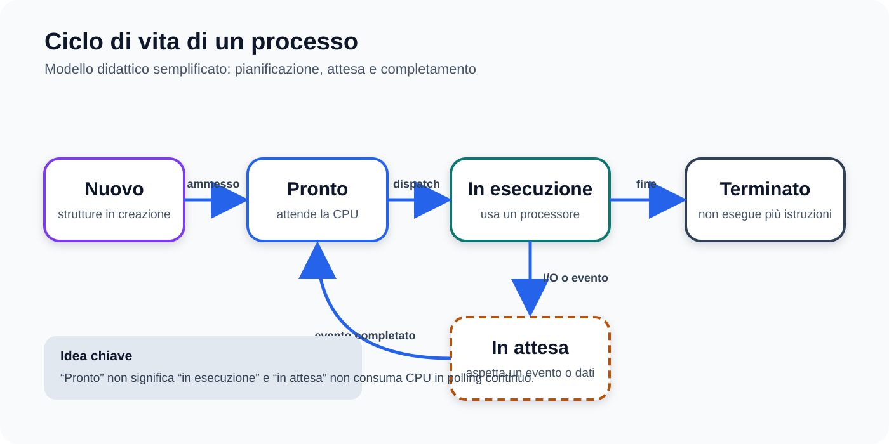
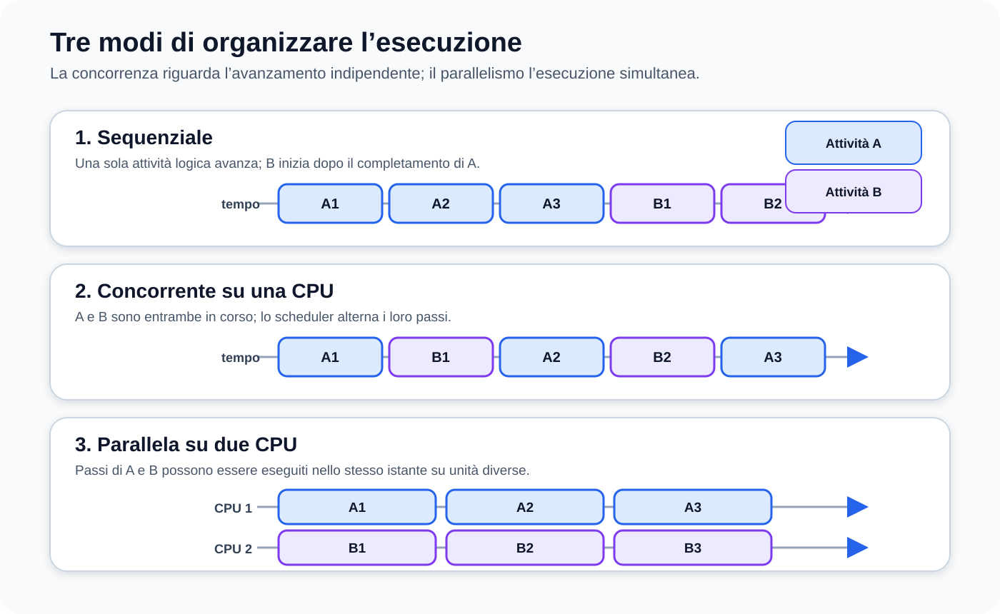
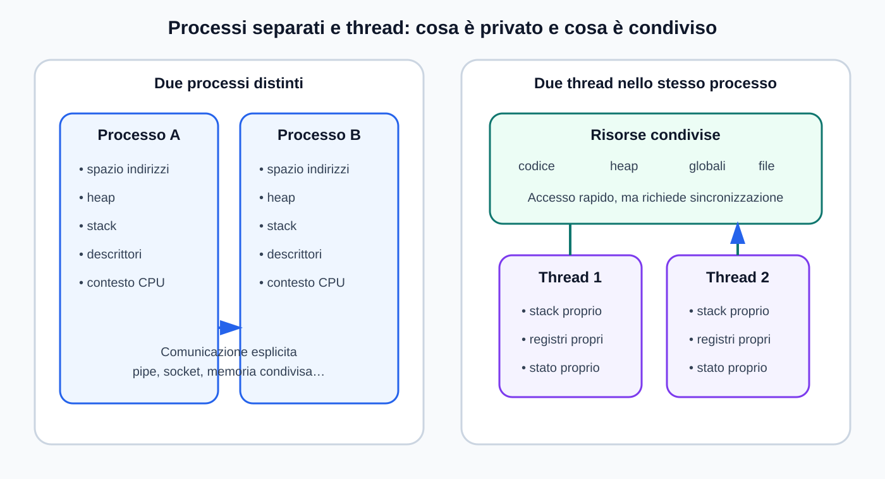
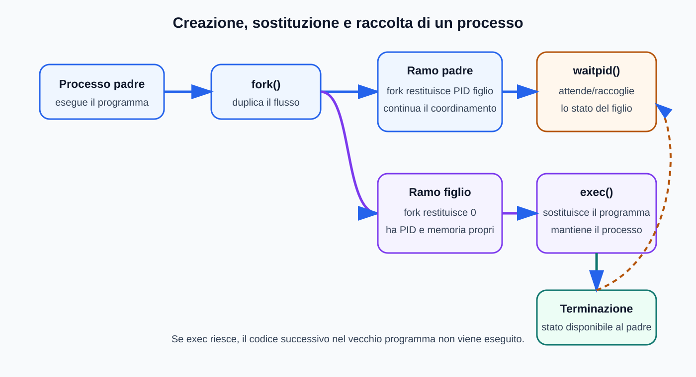
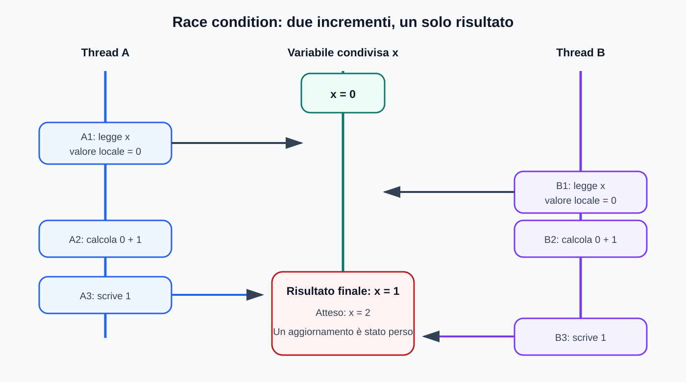

# Mappe visive — Processi, thread e concorrenza

Questa guida affianca [`01_PROCESSI_E_CONCORRENZA.md`](../01_PROCESSI_E_CONCORRENZA.md). I diagrammi sono originali e non derivano dalle immagini del libro adottato.

## Ciclo di vita di un processo

## Modelli di esecuzione

## Risorse private e condivise

## `fork`, `exec` e `waitpid`

## Incremento perso

## Uso didattico

- osservare prima il diagramma;
- ricostruire il flusso con parole proprie;
- confrontarlo con gli esempi C e Java del modulo;
- usare le versioni testuali presenti nel capitolo per esercizi e modifiche.
