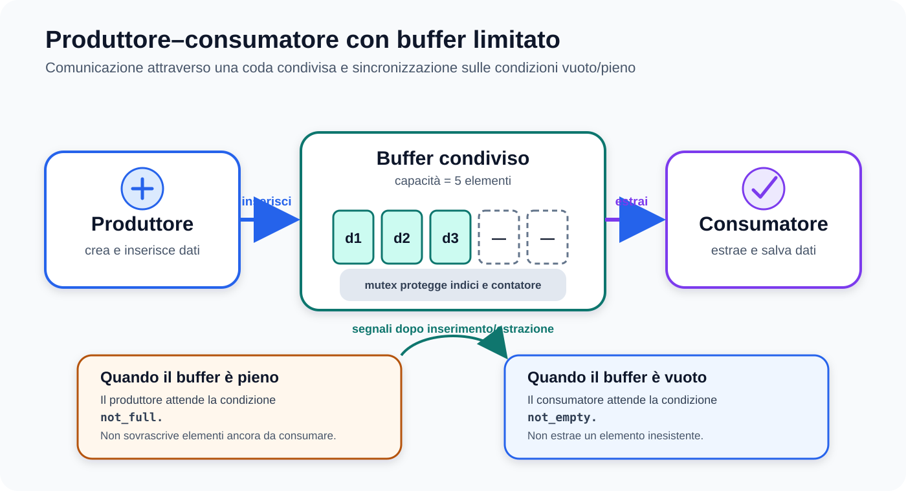
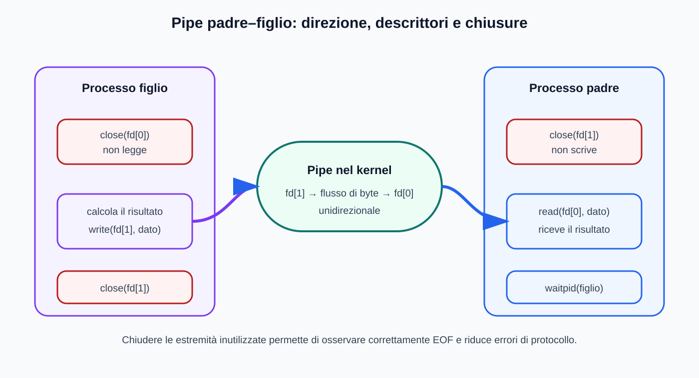
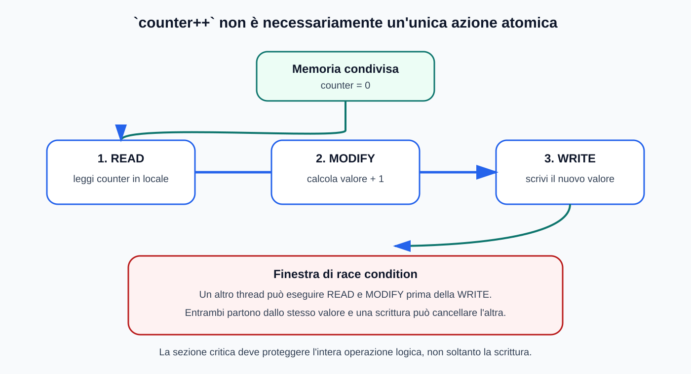
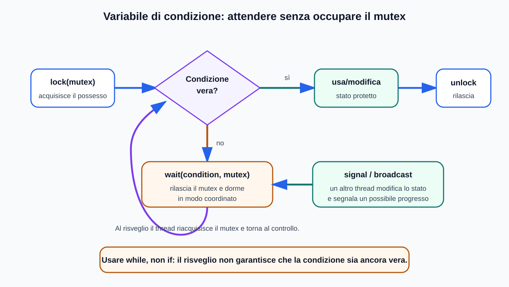
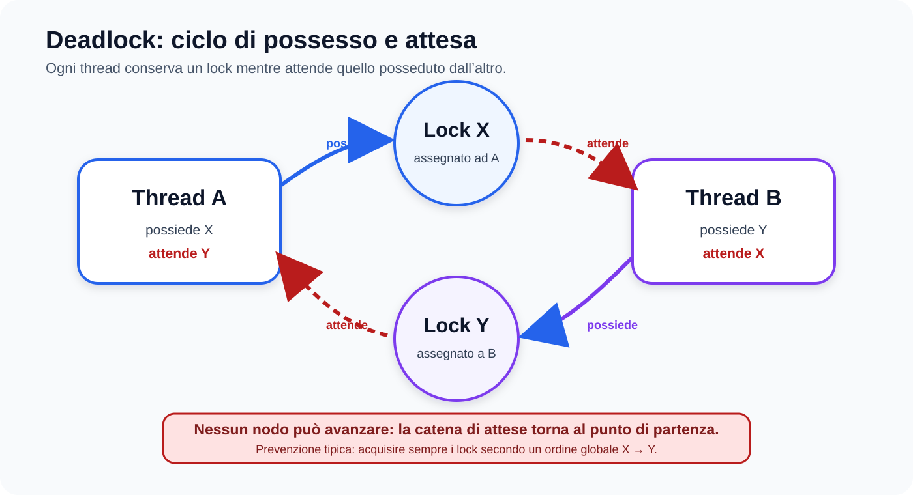
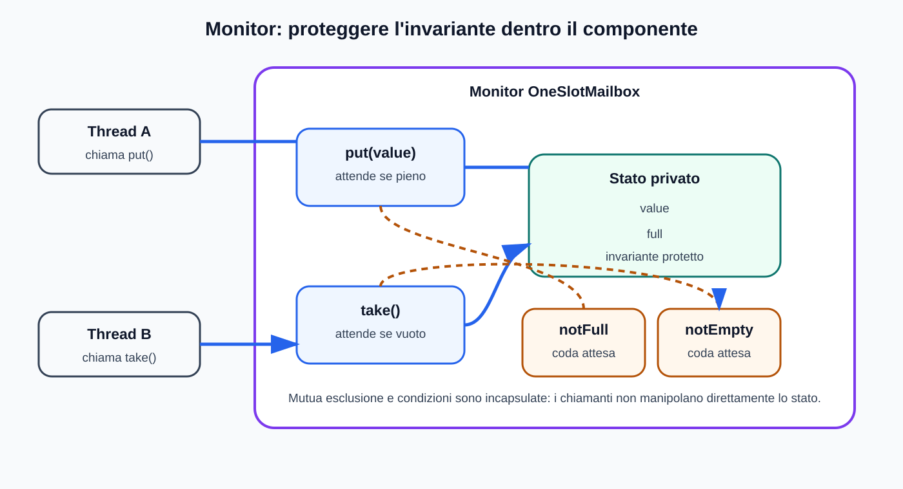
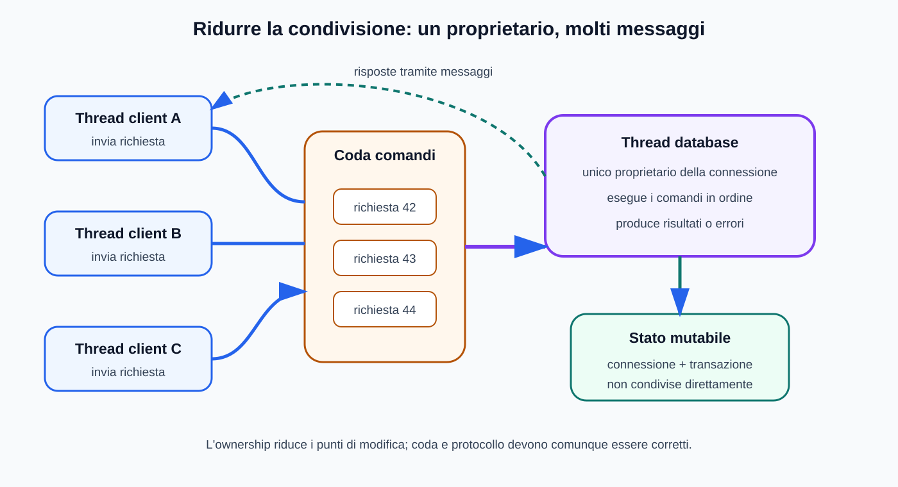

# Mappe visive — Comunicazione e sincronizzazione

Questa guida affianca [`02_COMUNICAZIONE_E_SINCRONIZZAZIONE.md`](../02_COMUNICAZIONE_E_SINCRONIZZAZIONE.md). Pseudocodice e primitive restano nel modulo in forma copiabile.

## Produttore, buffer e consumatore

## Pipe padre–figlio

## Read–modify–write

## Variabile di condizione

## Deadlock

## Monitor

## Proprietario unico

## Uso didattico

I diagrammi chiariscono struttura e responsabilità. Per implementare gli algoritmi, usare il pseudocodice e gli esempi POSIX/Java del modulo principale.
