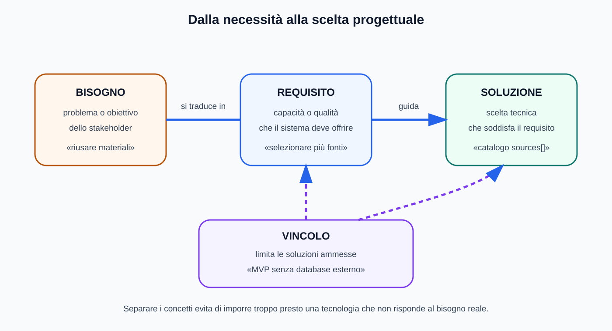
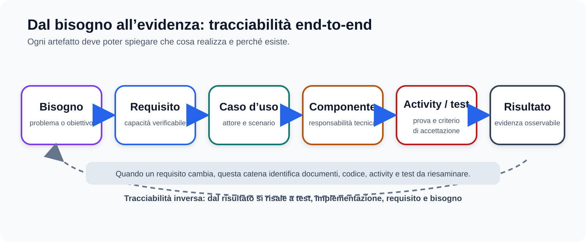

# Mappe visive — Requisiti software

Questa guida affianca [`03_REQUISITI_SOFTWARE.md`](../03_REQUISITI_SOFTWARE.md). Template, criteri Given/When/Then e casi d'uso restano testuali per poter essere copiati e modificati.

## Bisogno, requisito, soluzione e vincolo

## Tracciabilità

## Diagramma di contesto

Il diagramma di contesto TheBitLab resta in Mermaid nel modulo principale, perché è già testuale, versionabile e facile da aggiornare.

## Uso didattico

- distinguere i quattro concetti prima di scegliere tecnologie;
- seguire la tracciabilità in avanti per progettare e all'indietro per motivare una modifica;
- collegare ogni requisito ad almeno un criterio osservabile.
