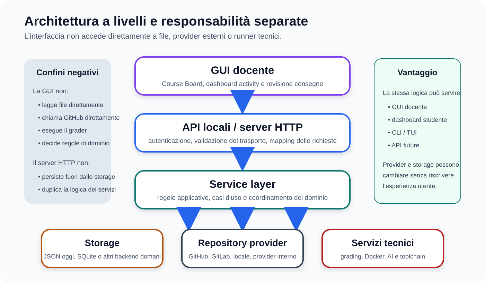
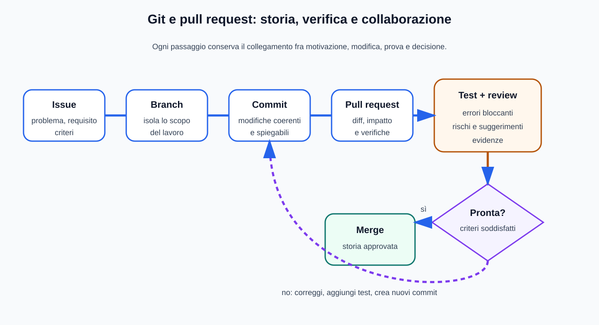
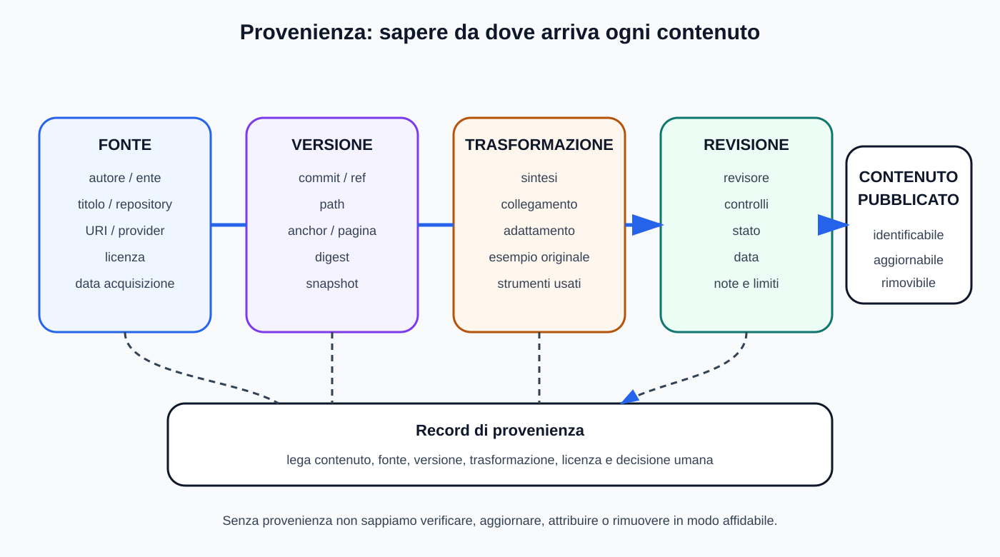

# Mappe visive — Documentazione e controllo di versione

Questa guida affianca [`04_DOCUMENTAZIONE_VERSIONAMENTO.md`](../04_DOCUMENTAZIONE_VERSIONAMENTO.md). Comandi Git, template ADR e descrizioni di PR restano in testo copiabile.

## Architettura a livelli

## Flusso Git e pull request

## Provenienza delle fonti

## Diagrammi come codice

Il sequence diagram Course Board–Source Catalog–Activity Service resta in Mermaid nel modulo principale per conservarne la modificabilità.

## Uso didattico

- associare ogni livello a una responsabilità;
- usare la PR come spazio di evidenze e decisioni, non soltanto come pulsante di merge;
- registrare provenienza e versione prima di riusare una fonte.
