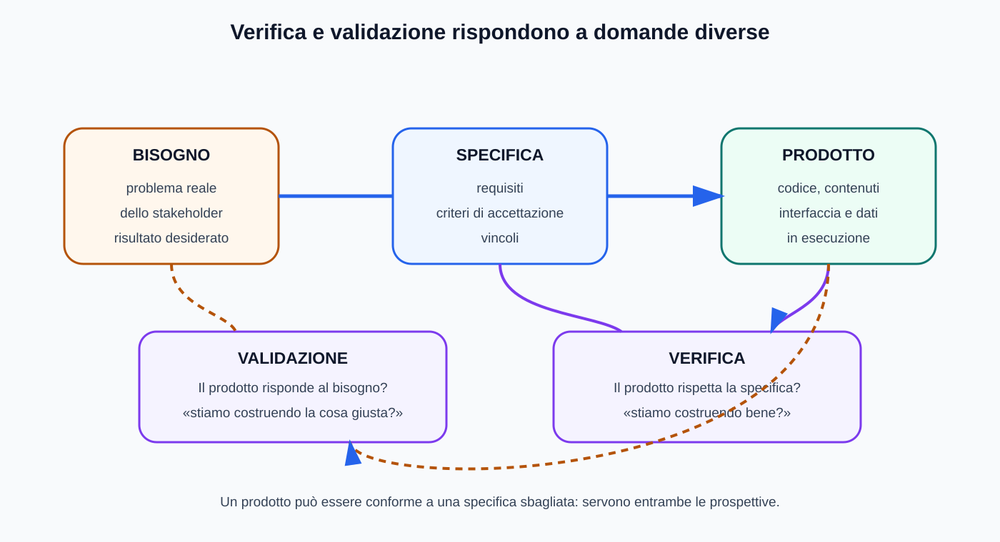
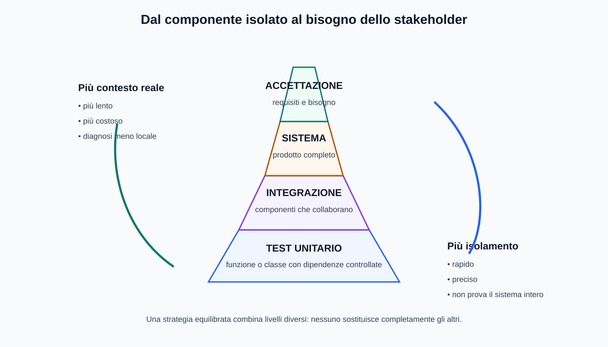
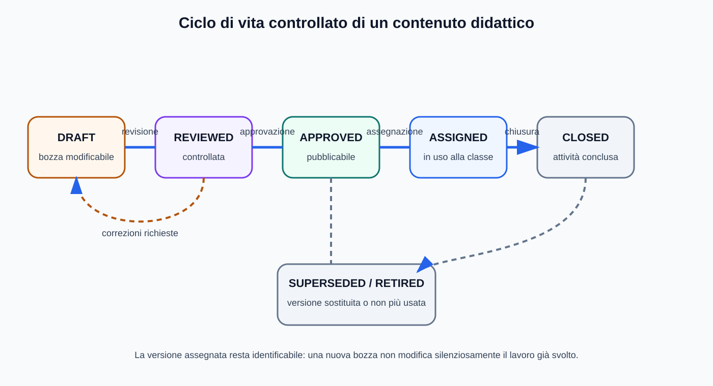
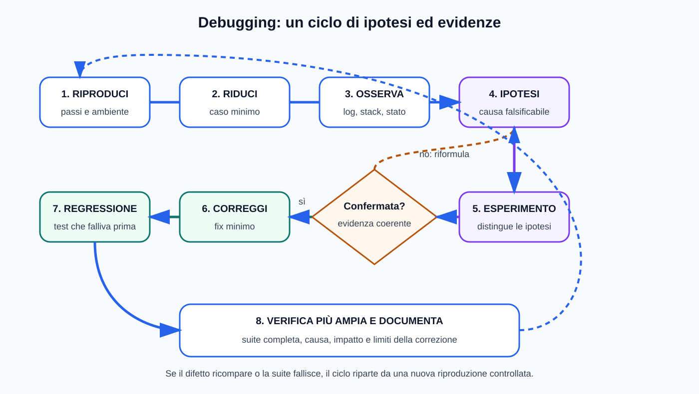
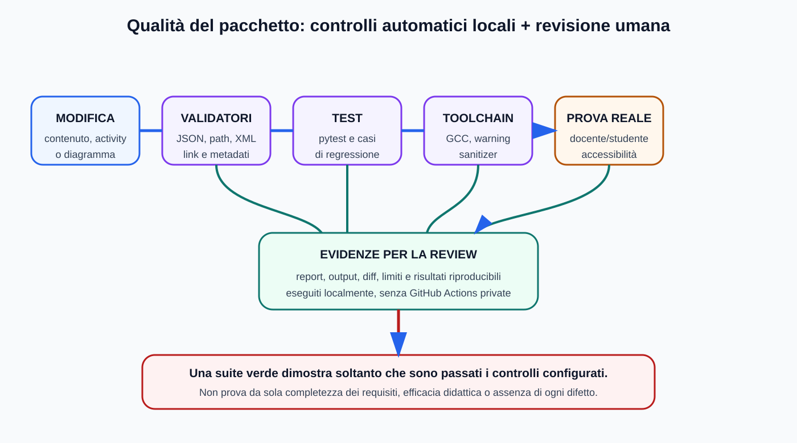

# Mappe visive — Testing e debugging

Questa guida affianca [`05_TESTING_DEBUGGING.md`](../05_TESTING_DEBUGGING.md). Comandi, output, bug report e casi di test restano in testo copiabile.

## Verifica e validazione

## Livelli di test

## Ciclo di vita dei contenuti

## Ciclo del debugging

## Pipeline di qualità locale

## Uso didattico

- derivare i test dai requisiti;
- scegliere il livello adatto alla domanda;
- correggere soltanto dopo aver raccolto evidenze;
- ricordare che una suite verde non dimostra l'assenza di ogni difetto.
