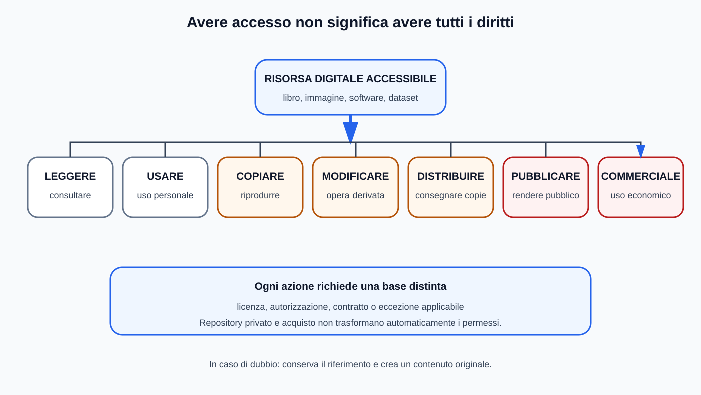
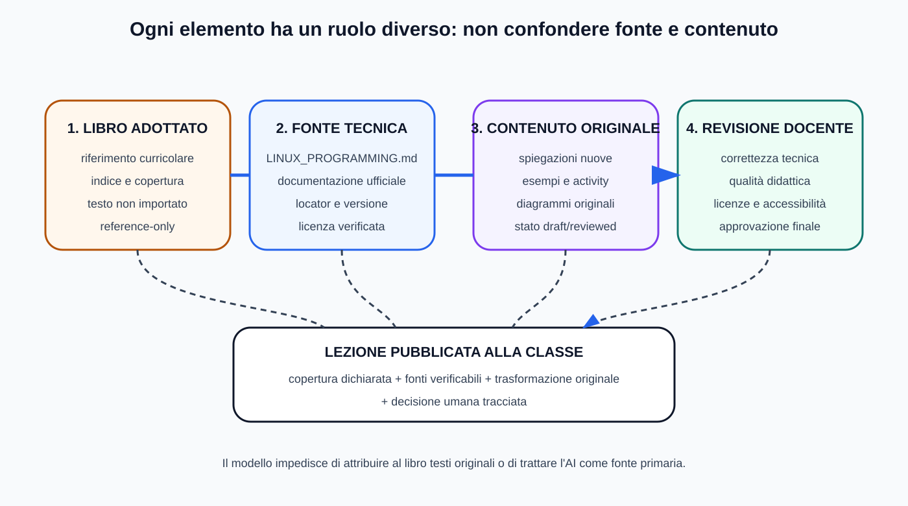
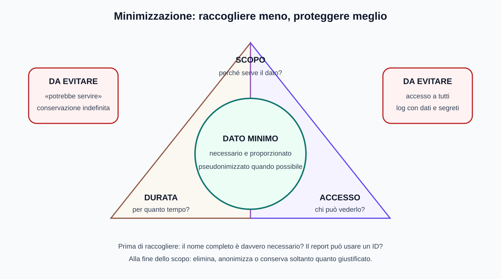
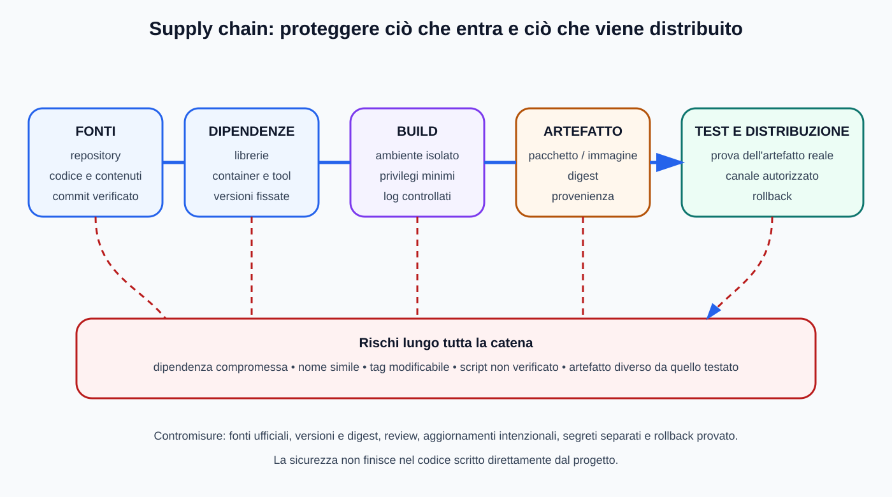
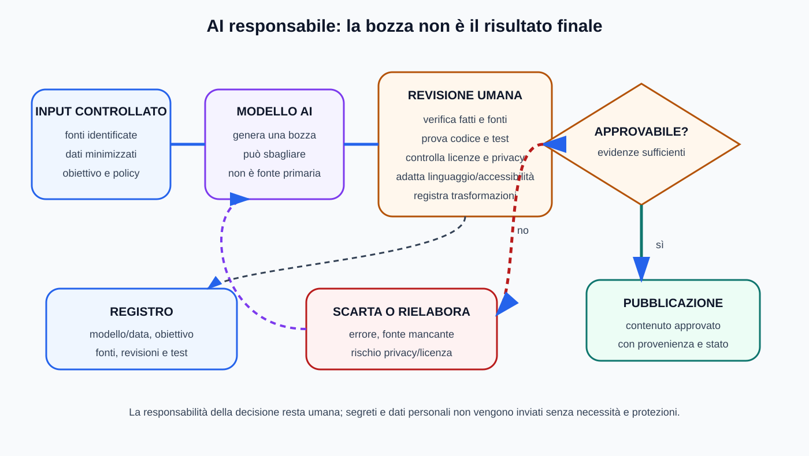

# Mappe visive — Cittadinanza digitale

Questa guida affianca [`06_CITTADINANZA_DIGITALE.md`](../06_CITTADINANZA_DIGITALE.md). Matrici dei ruoli, checklist e policy restano testuali per poter essere adattate alla classe.

## Diritti distinti su una risorsa

## Ruoli della provenienza

## Minimizzazione dei dati

## Supply chain

## Uso responsabile dell'AI

## Uso didattico

- verificare sempre la licenza prima del riuso;
- raccogliere solo dati necessari;
- controllare dipendenze e artefatti, non soltanto il codice scritto direttamente;
- trattare l'output AI come bozza da verificare e documentare.
